# ARCHITECTURE.md — Modular Harbor (2D Port Tycoon)

> Záväzný technický návrh. Zmeny len cez ADR v `docs/DECISIONS.md`.
> Číslovanie sekcií (§) je referencované z `CLAUDE.md` a `IMPLEMENTATION_PLAN.md` — nemeň ho.

---

## 1. Zhrnutie GDD → technické dôsledky

| Požiadavka GDD | Technický dôsledok |
|---|---|
| Top-down, grid, statické pobrežie | Mapa = JSON s terénom; `Grid` je nemenný okrem vrstiev postavených hráčom (moduly, cesty, koľaje) |
| Modulárne stavanie so snappingom | `ModuleDef` s footprintom, pravidlami umiestnenia a **konektormi** (prístupové bunky); validácia v `PlaceModuleCommand` |
| Žiadna teleportácia tovaru | `CargoUnit` + `CargoLocation` + `CargoLedger` s povolenými prechodmi; vozidlá s pathfindingom; apron buffer |
| Kamióny / vlaky s bránami, stojiskami, rampami | „Landside" reťazec: `TruckGate → WaitingArea → LoadingRamp → RoadPortal`; `RailStation → RailPortal` |
| Kontrakty s SLA a pokutami | `Contract` stavový automat; demurrage (zdržanie lode) + late penalty; tlak na bottlenecky |
| XP a tech tree | `TechSystem` s efektmi `unlock*` a `statModifier` cez `StatResolver` |
| Metriky, heatmapy, vyťaženosť | `MetricsSystem`: ring buffery, per-cell traffic counter, busy/idle ticky |
| Jedna mena | `Ledger` v celých centoch (`bigint` nie je potrebný — `number` do 2^53 stačí) |
| Rozšírenia ako dedičné triedy | Abstraktné `Module`, `StorageModule`, `CraneModule`, `LandExportModule`, `Carrier` + `ModuleRegistry` |

---

## 2. Vrstvy a závislosti

```
┌──────────────────────────────────────────────────────────────┐
│ src/app  — GameLoop, SimBridge, InputController, SaveLoad     │
│   ├── volá world.tick()  ├── číta snapshot/events  ├── dispatch(Command) │
├──────────────────────────┬───────────────────────────────────┤
│ src/render (PixiJS)      │ src/ui (React)                    │
│ svet, sprity, overlays   │ HUD, panely, grafy                │
├──────────────────────────┴───────────────────────────────────┤
│ src/sim — ČISTÝ TS, bez DOM/Pixi/React. Jediný zdroj pravdy.  │
│ World → Systems → Entities → Defs (JSON)                      │
└──────────────────────────────────────────────────────────────┘
```

Pravidlá toku dát:
- **Dole → hore iba čítanie.** Render/UI dostávajú `WorldSnapshot` (read-only view) a `SimEvent[]` za tick.
- **Hore → dole iba príkazy.** `Command` objekty, validované simom.
- `src/sim` nesmie importovať nič mimo `src/sim` a `data/` typov. Hranica je trojvrstvová: (1) kompilátor — `src/sim/tsconfig.json` s `lib: ["ES2023"]`, `types: []` a aliasmi len `@sim/*`, `@data/*` (DOM/Node globály = chyba `pnpm typecheck`); (2) ESLint — allowlist importov (`@sim/…`, `@data/…`, relatívne cesty, ktoré neopustia `src/sim`, najviac 5× `../`, vzdialenejšie cez `@sim/…`), zákazy globálov a obchvatov nedeterminizmu, `noInlineConfig`, zákaz `@ts-*` komentárov; (3) test, že `src/sim/**` obsahuje len súbory `.ts` (ADR-007).
- Sim je pripravený bežať v Web Workeri (všetko je serializovateľné) — implementácia je ADR kandidát (§18).

---

## 3. Časový model

| Konštanta (`data/defs/time.json`) | Hodnota | Význam |
|---|---|---|
| `tickGameSeconds` | 10 | 1 tick = 10 herných sekúnd |
| `ticksPerRealSecond` | 10 | pri rýchlosti 1× |
| `speeds` | `[0, 1, 2, 4, 8]` | 0 = pauza |
| `maxTicksPerFrame` | 64 | strop tickov za jeden render frame v `GameLoop` (ADR-013) |
| Odvodené | 6 tickov = 1 herná minúta; 360 = hodina; 8 640 = deň; 259 200 = mesiac (30 dní) | |
| Reálny čas | 1 herný deň ≈ 14,4 min pri 1×, 3,6 min pri 4× | tycoon pacing |

- `SimClock { tick, speed }`; odvodené `gameMinute/Hour/Day/Month`. `clock.advance()` vráti uzavreté hranice a `World` v kroku 1 (§6) emituje `TickAdvanced`, potom `HourClosed`, `DayClosed`, `MonthClosed` (ADR-013).
- `GameLoop` (app): každý frame najprv `world.applyPending()` (príkazy sa aplikujú aj počas pauzy), potom akumulátor `acc += dt × speed`; vykoná `n = min(floor(acc / tickDuration), time.maxTicksPerFrame)` tickov (64, proti spirále smrti; pri zásahu limitu sa `acc` oreže na najviac `tickDuration`); prezentácia interpoluje polohy medzi `prevTick` a `currTick` pomocou `alpha = acc / tickDuration` (ADR-013).
- Všetky trvania v defoch sú **v tickoch** (nie v sekundách).

---

## 4. Dátové definície (`data/defs/*.json`)

Každý súbor má `schemaVersion`. Konfiguračné defy (`time`, `economy`, `infrastructure`, `logistics`) sú jeden objekt parametrov; katalógové defy (`cargo_types`, `modules`, `ships`, `vehicles`, `tech_tree`, `contract_templates`, …) majú `items: [...]` s `id` (snake_case) a rozhrania v §4.1–§4.5 opisujú jednu položku (ADR-009). Načítava `DefRegistry` (typované gettery, fail-fast pri chybe). Schémy v `data/schemas/*.schema.json`, validácia `pnpm validate:defs`.

### 4.1 `cargo_types.json`
```ts
interface CargoTypeDef {
  id: string;                 // 'container_teu', 'grain', 'crude_oil', 'cng', 'car'
  category: 'container' | 'bulk' | 'liquid' | 'gas' | 'roro';
  unitName: string;           // 'TEU', 't', 'm³', 'm³', 'ks'
  unitsPerBatch: number;      // koľko "jednotiek" tvorí jedna CargoUnit (kontajner = 1, sypké = 25 t)
  basePricePerUnitCents: number;  // odmena za jednotku (referenčná)
  xpPerUnit: number;
  colorToken: string;         // 'cargo-container' → viď DESIGN_BRIEF tokeny
}
```
> Sypké/tekuté/plynné komodity sa diskretizujú do `CargoUnit` s `quantity = unitsPerBatch`. Jedna CargoUnit = jeden „úchop" žeriava = jedna dávka pre vozidlo. Zachováva „žiadnu teleportáciu" bez miliónov entít.

### 4.2 `modules.json`
```ts
interface ModuleDef {
  id: string;
  kind: 'berth' | 'crane' | 'storage' | 'gate' | 'waiting_area' | 'ramp' | 'depot'
      | 'rail_station' | 'pipeline';
  displayName: string;
  footprint: { w: number; h: number };        // v bunkách, pri rotácii 0°
  placement: {
    requiredTerrain: TerrainType[];           // napr. ['quay'] pre berth, ['land','quay'] pre sklad
    waterSide?: 'north';                      // berth: dlhá hrana musí susediť s vodou (pri rot 0 = sever)
    requiresParcelOwnership: boolean;         // vždy true — cesty nie sú moduly (ADR-006), pravidlo pre cesty viď §5.2 (ADR-008)
    mustAttachTo?: ModuleKind[];              // crane → ['berth']; ramp → nič (cesta stačí)
  };
  connectors: { x: number; y: number; type: 'road' | 'rail' | 'pipe' | 'berth_edge' }[];
  costCents: number;
  maintenancePerDayCents: number;
  techRequired?: string;                      // id uzla tech tree
  params: Record<string, number | string>;    // typ-špecifické (capacityUnits, cycleTicks, bays, docks…)
}
```
Konektory sú **jediné bunky, cez ktoré vozidlá vchádzajú/vychádzajú** z modulu. Vnútorný pohyb v module je abstrahovaný na `internalTicks` (viď §7.3).

### 4.3 `ships.json`
```ts
interface ShipClassDef {
  id: 'feeder' | 'handy' | 'panamax' | 'mega' | string;
  lengthCells: number;   // 6 / 10 / 14 / 20
  widthCells: number;    // 2 / 2 / 3 / 3
  draftClass: 1 | 2 | 3; // kotvisko musí mať depthClass >= draftClass
  capacityUnits: number; // 120 / 300 / 700 / 1500 (v CargoUnit)
  speedCellsPerTick: number; // 0.15
  cargoCategories: CargoCategory[];
  berthAllowanceTicks: number;  // koľko smie stáť bez demurrage (napr. 2 dni = 17 280)
  techRequired?: string;
}
```

### 4.4 `vehicles.json` (interné vozidlá)
```ts
interface VehicleDef {
  id: 'straddle_carrier' | 'forklift' | 'agv' | 'bulk_shuttle' | 'tanker_shuttle' | string;
  capacityUnits: number;          // v CargoUnit (straddle 1, agv 2, bulk_shuttle 1)
  speedCellsPerTick: number;      // 0.4 / 0.3 / 0.5
  loadTicks: number; unloadTicks: number;   // 3 / 3, za jednotku, sekvenčne po internalTicks (§7.3, ADR-011)
  cargoCategories: CargoCategory[];
  purchaseCents: number; wagePerDayCents: number;
  techRequired?: string;
}
```

### 4.5 `tech_tree.json`
```ts
interface TechNodeDef {
  id: string; branch: 'cargo' | 'efficiency' | 'infrastructure';
  displayName: string; xpCost: number; prerequisites: string[];
  effects: TechEffect[];
}
type TechEffect =
  | { type: 'unlockModule'; moduleId: string }
  | { type: 'unlockCargoType'; cargoTypeId: string }
  | { type: 'unlockShipClass'; shipClassId: string }
  | { type: 'unlockVehicle'; vehicleId: string }
  | { type: 'statModifier'; target: 'crane' | 'vehicle' | 'gate' | 'ramp' | 'storage';
      targetId?: string; stat: string; op: 'mul' | 'add'; value: number };
```

### 4.6 `contract_templates.json`, `economy.json`, `time.json`
- `contract_templates`: `cargoTypeId, volumeUnitsRange, slaDaysRange, shipClassIds[], weight, minTier`.
- `economy`: `startingCashCents, demurrageRateOfRewardPerHour (0.005), latePenaltyRateOfRewardPerDay (0.05), failAfterDaysLate (3), leaseMonthlyRateOfPrice (0.015), bankruptcyDays (30), offersPerDay (6), offerExpiryDays (2), removalRefundRate (0.5)` — `removalRefundRate` je podiel ceny vrátený pri odstránení modulu (§8 bod 8) aj cesty/koľaje (ADR-012) (ADR-013).
- `time`: viď §3, vrátane `maxTicksPerFrame (64)` — strop tickov za frame v `GameLoop` (ADR-013).
- `infrastructure` (`data/defs/infrastructure.json`, konfiguračný, vznikne vo F1): `road: { costPerCellCents (200 000), maintenancePerDayCents (0) }`, `rail: { costPerCellCents (600 000), maintenancePerDayCents (0) }` (ADR-010).
- `logistics` (`data/defs/logistics.json`, konfiguračný, vznikne vo F3): `defaultInternalTicks (6)` — modul ho môže prepísať `params.internalTicks`; `congestion: { trafficDecayPerHour (0.9), slowdownPerExtraVehicle (0.25), penaltyTrafficDivisor (200), penaltyMax (3) }` — použité vo F3/F11 (§7.6) (ADR-010).

### 4.7 Mapa (`data/maps/*.json`)
```ts
interface MapDef {
  id: string; width: number; height: number;
  terrain: string[];   // riadky; znaky: '~' deep water, '=' shallow water, 'Q' quay, '.' land, '#' blocked
  depth: Record<string, 1|2|3>;  // depthClass pre quay bunky podľa zóny (default 1)
  parcels: { id: string; rect: Rect; priceCents: number; leasable: boolean; startOwned?: boolean }[];
  roadPortals: { id: string; cell: Cell }[];   // vstup/výstup kamiónov na okraji
  railPortals: { id: string; cell: Cell }[];
  seaLane: Cell[];                             // polyline od okraja k anchorage
  anchorage: Cell[];                           // čakacie pozície lodí
  starter: { modules: PlacedModuleSpec[]; roads: Cell[] };  // predpostavený Root modul atď.
}
```

---

## 5. Doménový model

```mermaid
classDiagram
  class World { +clock: SimClock +grid: Grid +parcels +modules +cargo: CargoLedger +ships +vehicles +trucks +trains +contracts +economy +tech +metrics +events: EventBus +rng: Rng +tick() }
  class Module { <<abstract>> id defId origin rotation cells parcelId +onTick() }
  class BerthModule { lengthCells depthClass groupId dockedShipId cranes apron: ApronBuffer }
  class CraneModule { craneType berthId state cycleTicks }
  class StorageModule { <<abstract>> category capacityUnits slots +reserve() +store() +take() }
  class ContainerYard
  class Silo
  class TankFarm
  class GasHolder
  class VehicleLot
  class LandExportModule { <<abstract>> }
  class TruckGate { processTicks queue }
  class WaitingArea { bays }
  class LoadingRamp { docks category loadTicksPerUnit }
  class RailStation { tracks trainCapacity }
  class VehicleDepot { capacity }
  class Pipeline { flowPerTick }
  Module <|-- BerthModule
  Module <|-- CraneModule
  Module <|-- StorageModule
  Module <|-- LandExportModule
  Module <|-- VehicleDepot
  Module <|-- Pipeline
  StorageModule <|-- ContainerYard
  StorageModule <|-- Silo
  StorageModule <|-- TankFarm
  StorageModule <|-- GasHolder
  StorageModule <|-- VehicleLot
  LandExportModule <|-- TruckGate
  LandExportModule <|-- WaitingArea
  LandExportModule <|-- LoadingRamp
  LandExportModule <|-- RailStation
  class Carrier { <<abstract>> id capacity cargoUnitIds }
  Carrier <|-- Ship
  Carrier <|-- Vehicle
  Carrier <|-- Truck
  Carrier <|-- Train
  class CargoUnit { id typeId contractId quantity location: CargoLocation }
  class Contract { id cargoTypeId volumeUnits rewardCents slaDeadlineTick state shipId }
```



### 5.1 Grid
```ts
type TerrainType = 'deep_water' | 'shallow_water' | 'quay' | 'land' | 'blocked';
interface Cell {
  terrain: TerrainType; depthClass: 0|1|2|3; parcelId: string | null;
  moduleId: EntityId | null;          // obsadenie footprintom
  road: 'none' | 'road' | 'rail';     // vrstva dopravy (hráč stavia po bunkách)
  traffic: number;                    // heatmap akumulátor (decay)
}
```
- `Grid` má `width, height, cells: Cell[]` (row-major), helpery `inBounds, at, neighbors4, rect`.
- **Cesty a koľaje nie sú moduly** — sú vrstva na bunke, stavajú ich príkazy `PlaceRoad`/`PlaceRail` (a `RemoveRoad`/`RemoveRail`, §12.2), cena za bunku z `infrastructure.json` (ADR-010). Nesmú byť na vode ani cez footprint modulu; koľaj a cesta sa v MVP nekrižujú (level crossing = backlog).
- Pobrežie: bunky `quay` sú jediné, kde môže stáť `BerthModule`. Loď zaberá `shallow_water/deep_water` bunky priľahlé k dlhej hrane kotviska.

### 5.2 Parcely
`Parcel { id, rect, priceCents, leasable, ownership: 'none' | 'owned' | 'leased' }`. Moduly možno stavať len na vlastnej/prenajatej parcele (celý footprint); cesty a koľaje aj na verejných bunkách (`parcelId === null`), nie však na parcele s `ownership: 'none'` (na predaj); `startOwned` parcela je vlastnená od začiatku (ADR-008). Prenájom účtuje `priceCents * leaseMonthlyRate / 30` denne (kategória `parcel_lease`). Kúpa = CAPEX jednorazovo. Hráč môže prenájom kedykoľvek ukončiť, ak na parcele nie sú moduly.

### 5.3 Moduly — rozmery a parametre (počiatočné hodnoty, podliehajú balansu)
| id | kind | footprint | kľúčové params | cena | údržba/deň |
|---|---|---|---|---|---|
| `berth_standard` | berth | 8×3 (dlhá hrana k vode) | `depthClass 1`, `apronSlots 4` | 400k | 1 200 |
| `berth_deepwater` | berth | 8×3 | `depthClass 3`, `apronSlots 6` | 900k | 2 000 |
| `crane_container_gantry` | crane | 2×3 (na berth) | `cycleTicks 12` (2 min), `category container` | 600k | 900 |
| `crane_bulk_grab` | crane | 2×3 | `cycleTicks 18`, `bulk` | 450k | 700 |
| `crane_liquid_arm` | crane | 1×2 | `flowUnitsPerTick 0.5`, `liquid` | 350k | 500 |
| `crane_gas_arm` | crane | 1×2 | `flowUnitsPerTick 0.3`, `gas` | 500k | 600 |
| `roro_ramp` | crane | 3×3 | `cycleTicks 4`, `roro` (autá schádzajú samy) | 300k | 400 |
| `container_yard_small` | storage | 4×4 | `capacityUnits 64` | 150k | 300 |
| `container_yard_medium` | storage | 6×6 | `180` (tech) | 320k | 600 |
| `container_yard_large` | storage | 8×8 | `384` (tech) | 600k | 1 000 |
| `silo_small` | storage | 3×3 | `600 t` = 24 units | 200k | 350 |
| `tank_farm_small` | storage | 4×4 | `2000 m³` = 80 units | 350k | 500 |
| `gas_holder_small` | storage | 3×3 | `1500 m³` = 60 units | 400k | 550 |
| `vehicle_lot_small` | storage | 6×6 | `72 ks` | 120k | 200 |
| `truck_gate` | gate | 2×2 | `processTicks 18` (3 min/kamión) | 80k | 150 |
| `truck_waiting_area` | waiting_area | 4×3 | `bays 6` | 60k | 100 |
| `loading_ramp_container` | ramp | 4×2 | `docks 2`, `loadTicksPerUnit 6` | 100k | 200 |
| `vehicle_depot` | depot | 3×3 | `capacity 6` vozidiel | 90k | 150 |
| `rail_station_small` | rail_station | 12×4 | `tracks 1`, `trainCapacity 60`, `loadTicksPerUnit 2` | 1.2M | 2 500 |
| cesta / koľaj | vrstva | 1×1 | — | 2k / 6k za bunku (`infrastructure.json`, ADR-010) | 0 |

Root modul zo štartovej mapy = `berth_standard` + `crane_container_gantry` predpostavené na `starter` parcele.

### 5.4 Kotviská a skupiny (BerthGroup)
- Kotviská s **dotýkajúcimi sa krátkymi hranami na tom istom pobreží** tvoria `BerthGroup { berthIds[], totalLength, minDepth }`. Prepočet pri každom place/remove.
- Loď potrebuje skupinu s `totalLength ≥ ship.lengthCells` a `minDepth ≥ ship.draftClass` a aspoň jeden kompatibilný žeriav v skupine. Loď, ktorá zaberá viac kotvísk, je obsluhovaná **všetkými žeriavmi na obsadených kotviskách** (motivácia stavať viac žeriavov).
- `ApronBuffer` = per-berth FIFO slotov na quay, kam žeriav ukladá jednotky; vozidlá ich vyzdvihujú. Odpája takt žeriava od dostupnosti vozidiel.

---

## 6. Tick pipeline (`World.tick()`) — poradie je záväzné

```
1. clock.advance()                       // tick++, emit TickAdvanced, potom HourClosed/DayClosed/MonthClosed (ADR-013)
2. contractSystem.tick()                 // refresh poolu (denne), spawn lodí pre prijaté kontrakty, SLA kontrola, penalizácie
3. shipSystem.tick()                     // pohyb po sea lane, alokácia kotviska, docking/undocking, demurrage
4. craneSystem.tick()                    // cyklus žeriavov: loď → apron (import) / apron → loď (export, neskôr)
5. dispatcher.tick()                     // generovanie TransportJob, rezervácie skladov, priradenie vozidiel
6. vehicleSystem.tick()                  // FSM vozidiel, pohyb po ceste, load/unload, traffic++
7. flowSystem.tick()                     // pipelines (liquid/gas): presun quantity po linkách
8. landsideSystem.tick()                 // brány, stojiská, rampy, spawn/pohyb kamiónov, vlaky, export z mapy
9. economySystem.tick()                  // pri DayClosed: údržba, mzdy, prenájmy; pri MonthClosed: report
10. techSystem.tick()                    // len spracovanie čakajúcich unlockov (efekty sú okamžité pri príkaze)
11. metricsSystem.tick()                 // utilization sample, decay traffic (pri HourClosed), fill %
12. cargo.assertConservation()           // v DEV/testoch: každá jednotka má presne 1 lokáciu; súčet = konstantný
13. events.flush() → SimBridge           // udalosti za tick sú k dispozícii prezentácii
```
Príkazy (`Command`) sa aplikujú **pred krokom 1** z fronty `pendingCommands` v poradí vloženia: každý sa validuje nad aktuálnym stavom (vidí účinok predchádzajúcich), pri úspechu sa aplikuje, inak `World` emituje `CommandRejected` a stav sa nemení; príkaz zaradený počas `apply` čaká na ďalšie kolo (ADR-013). Rovnakú príkazovú časť bez posunu času vykoná `World.applyPending()` (stavba počas pauzy; `applyPending(); tick()` ≡ `tick()`, replay ekvivalentný) (ADR-013). Udalosti ticku idú v poradí vzniku: udalosti príkazov → `TickAdvanced` → `HourClosed` → `DayClosed` → `MonthClosed` → udalosti krokov 2–12 (ADR-013).

---

## 7. Logistika — detailná logika

### 7.1 Životný cyklus nákladu (`CargoLocation` + povolené prechody)
```ts
type CargoLocation =
  | { kind: 'on_ship'; shipId }            // v nákladovom priestore
  | { kind: 'in_crane'; craneId }          // počas cyklu
  | { kind: 'on_apron'; berthId; slot }    // buffer na quay
  | { kind: 'in_vehicle'; vehicleId }
  | { kind: 'in_storage'; moduleId; slot }
  | { kind: 'in_pipeline'; pipelineId }    // liquid/gas
  | { kind: 'at_ramp'; rampId; dock }      // pripravené na nakládku kamiónu/vlaku
  | { kind: 'in_truck'; truckId }
  | { kind: 'in_train'; trainId }
  | { kind: 'exported' }                   // opustilo mapu — konečný stav
```
Povolené prechody (import): `on_ship → in_crane → on_apron → in_vehicle → in_storage → in_vehicle → at_ramp → in_truck | in_train → exported`. Pre liquid/gas: `on_ship → in_pipeline → in_storage → in_pipeline → at_ramp …`. Pre RoRo: autá sú zároveň `CargoUnit` aj dočasné `Vehicle` (`selfPropelled: true`) — `on_ship → in_vehicle(self) → in_storage(lot) → in_vehicle(self) → at_ramp → in_truck(car transporter) → exported`.
`CargoLedger.move()` vyhodí chybu pri nepovolenom prechode. Každý pohyb emituje `CargoMoved { unitId, from, to, tick }`.

### 7.2 Žeriav — stavový automat
```
idle → grabbing(cycleTicks/2) → swinging → placing(cycleTicks/2) → idle
podmienky: loď dokovaná & má jednotky kompatibilnej kategórie & apron má voľný slot
blocked: apron plný (→ utilization počíta 'blocked'), emit CraneBlocked(reason) max 1× za hodinu
```
`cycleTicks` prechádza cez `StatResolver.resolve('crane', craneDefId, 'cycleTicks')`, ktorý aplikuje tech modifikátory.

### 7.3 Dispatcher a TransportJob
```ts
interface TransportJob { id; cargoUnitIds: EntityId[]; from: CargoLocation; to: CargoLocation;
  vehicleId?: EntityId; state: 'open' | 'assigned' | 'picking' | 'moving' | 'dropping' | 'done'; createdTick }
```
Algoritmus každý tick (O(n) nad malými zoznamami, bez alokácií v hot path):
1. **Inbound**: pre každú jednotku `on_apron` bez jobu → `StorageAllocator.reserve(cargoType, 1)` → vyber sklad s kompatibilnou kategóriou, voľnou kapacitou, **najbližší podľa cache vzdialenosti** od kotviska (predpočítaná matica konektor→konektor, invalidovaná pri zmene ciest). Ak žiadny sklad: job sa nevytvorí, emit `NoStorageAvailable` (throttled).
2. **Outbound**: pre kontrakt v stave `exporting` a jednotku `in_storage` → ak existuje rampa kompatibilnej kategórie s voľným `dock` (alebo rezervovateľným) → job `storage → at_ramp`. Prioritizuj kontrakty podľa najbližšieho SLA.
3. **Priradenie**: pre každý `open` job vyber voľné vozidlo (`idle`), kompatibilnú kategóriu, minimalizuj `pathCost(vehicle.cell, job.from)`. Vozidlo s kapacitou > 1 môže zobrať viac jobov s rovnakým `to`.
4. **Vozidlo pri vstupe do konektora** modulu je „vnútri": čaká `internalTicks` (`params.internalTicks` modulu, inak `logistics.defaultInternalTicks` = 6 z `logistics.json`), potom vykoná load/unload sekvenčne po jednotkách — každá trvá `loadTicks`/`unloadTicks` vozidla (§4.4) a `CargoLedger.move` jednotky nastane až po dokončení jej load/unload; pobyt = `internalTicks + k × loadTicks` (resp. `unloadTicks`). Vnútorný pohyb sa nemodeluje — zámerná abstrakcia (ADR-004, ADR-010, ADR-011).

### 7.4 Pathfinding
- A* na 4-susednosti nad bunkami `road === 'road'` + cieľový konektor. Heuristika Manhattan, cena bunky `1 + congestionPenalty(cell)` (§7.6). Implementácia s binárnou haldou a znovupoužiteľnými poľami (`Int32Array` open/closed), bez alokácií na volanie.
- `PathCache: Map<key(fromCell,toCell), Cell[]>`, invalidácia pri `RoadChanged`. Vozidlá si držia index na ceste; pri invalidácii preplánujú z aktuálnej bunky.
- Kamióny: A* od `RoadPortal` k `TruckGate.connector` (povinný waypoint), potom k `WaitingArea`, potom k `LoadingRamp`, späť cez `TruckGate` k portálu. Vlaky: A* po `rail` bunkách od `RailPortal` k `RailStation`.
- Lode: **nie A***, pohybujú sa po `seaLane` polyline → anchorage → priama cesta k pozícii pri kotvisku (voda je otvorená). Loď rotuje podľa segmentu.

### 7.5 Landside reťazec (kamióny)
```
TruckSpawner: pre každý dock rampy s jednotkami 'at_ramp' >= truckCapacity(1 TEU pre kontajner, 1 batch pre bulk)
  a s voľným bay v niektorej WaitingArea na tej istej cestnej sieti → spawn Truck na RoadPortal
Truck FSM: spawned → to_gate → gate_queue(processTicks, FIFO za bránu) → to_bay → waiting(bay) → to_dock
           → loading(loadTicksPerUnit * units) → to_gate_out → gate_queue → to_portal → exit → units 'exported'
```
- Bez `TruckGate` na ceste medzi portálom a rampou je rampa **neplatná** (validácia pri stavaní: existuje cesta portál→brána→rampa). Bez `WaitingArea` sa kamióny nespawnujú → notifikácia.
- Priepustnosť brány = tvrdý bottleneck (1 kamión / `processTicks`). Fronta pred bránou je „virtuálna" (mimo mapy) → nikdy nevznikne gridlock.
- Vlaky (fáza 10): `RailStation` s `tracks`; vlak príde, keď `stagedUnits >= 0.6 * trainCapacity` alebo keď SLA kontraktu hrozí; loaduje `loadTicksPerUnit * units`, odchádza.

### 7.6 Soft kongescia (bez fyzických kolízií)
- Každý tick, kým vozidlo stojí na bunke: `cell.traffic += 1`. Pri `HourClosed`: `traffic *= trafficDecayPerHour` (0.9).
- Rýchlosť vozidla na bunke: `speed * 1 / (1 + slowdownPerExtraVehicle * max(0, vehiclesOnCell - 1))` (0.25; fáza 11). Pathfinding pridáva `congestionPenalty = clamp(traffic / penaltyTrafficDivisor, 0, penaltyMax)` (200, 3).
- Konštanty sú v `logistics.json` → `congestion` (§4.6) (ADR-010).
- Heatmapa v UI = normalizované `traffic` per bunka. Žiadne deadlocky, žiadna fyzika.

### 7.7 Skladovanie
- `StorageModule.slots: (EntityId | null)[]` (kontajnery: sloty = stack pozície, kapacita = w*h*stackHeight); `Silo/Tank/GasHolder`: `storedUnits: number` + zoznam id (kontinuálne módy sa počítajú v units).
- `reserve(n)` blokuje kapacitu pre prichádzajúce joby (`reserved`), `store()` mení rezerváciu na skutočnú, `take()` uvoľňuje. Fill % = `(stored + reserved) / capacity` pre alokátor, `stored / capacity` pre UI.
- Politika modulu (UI): `acceptAnyContract | reservedForContractId` (fáza 12).

### 7.8 Prevencia deadlockov — invarianty
1. Apron buffer je jediné miesto, kde žeriav čaká — čaká len na slot, nie na vozidlo.
2. Vozidlo nikdy nečaká na inú entitu na bunke (soft kongescia).
3. Kamión sa spawnuje iba, ak má garantovaný bay; fronta pred bránou je neobmedzená.
4. Ak sklad chýba/je plný, žeriav sa zablokuje → loď stojí → demurrage. **To je zámerný herný tlak**, nie bug — UI to musí jasne oznámiť.

---

## 8. Pravidlá umiestňovania (`PlaceModuleCommand.validate`)
Vracia `ValidationResult { ok: boolean; reasons: ValidationReason[]; cells: CellCoord[]; costCents: number }` — rovnaký tvar ako všetky príkazy; UI ho používa na farbu ghostu a `costCents` je cena, ktorú by `apply` strhol (záporná = príjem) (ADR-013).
1. Všetky footprint bunky `inBounds`, terén ∈ `requiredTerrain`, `moduleId === null`, `road === 'none'`.
2. Parcela vlastnená/prenajatá pre všetky bunky (ak `requiresParcelOwnership`).
3. `berth`: všetky bunky dlhej hrany (po rotácii) susedia s vodou; vodné bunky pred kotviskom voľné od iných lodí/berthov.
4. `crane`: footprint musí ležať celý v bunkách nejakého `berth` (`mustAttachTo`); berth môže mať max `params.maxCranes` (default 2 na 8 buniek).
5. `ramp`, `gate`, `waiting_area`, `depot`, `storage`: aspoň jeden konektor typu `road` musí susediť s bunkou `road` **alebo** byť voľný (sklad postavený skôr než cesta je OK — dispatcher ho ignoruje, kým nie je pripojený; UI zobrazí „nepripojené").
6. Tech: `techRequired` odomknutý. Peniaze: pri `costCents > 0` musí platiť `cash >= costCents` (inak `insufficient_funds`, ghost stále zelený s ikonou $); bezplatné akcie a refundácie (`costCents ≤ 0`) prejdú aj pri zápornej hotovosti (ADR-013).
7. Rotácia: 0/90/180/270 — footprint a konektory sa transformujú `rotate(cell, rotation)`.
8. `RemoveModuleCommand`: modul nesmie obsahovať náklad (`stored > 0`), nesmie mať dokovanú loď, ani prebiehajúce joby; vráti `economy.removalRefundRate` (0.5 = 50 %) ceny (ADR-013).

---

## 9. Kontrakty a ekonomika

### 9.1 Kontrakt
```ts
type ContractState = 'offered' | 'accepted' | 'ship_en_route' | 'unloading' | 'exporting' | 'completed' | 'failed' | 'expired';
interface Contract { id; templateId; cargoTypeId; volumeUnits; rewardCents; xpReward;
  offeredTick; offerExpiresTick; acceptedTick?; shipClassId; shipArrivalTick?; slaDeadlineTick?;
  unitsUnloaded; unitsExported; penaltiesCents; state }
```
- **Pool**: pri `DayClosed` doplní ponuky do `offersPerDay`; vyberá šablóny váhovo podľa odomknutých kategórií a `minTier` (tier = počet dokončených kontraktov / 10). Objem sa škáluje na `[0.4, 1.2] × capacityHint`, kde `capacityHint = min(sum berth capacity per day, sum storage capacity)` — ponuky sú vždy realistické, ale horná hranica tlačí na expanziu.
- **Odmena**: `reward = volumeUnits × basePricePerUnit × urgency`, `urgency = 1 + 0.6 × (1 − slaDays / maxSlaDays)`.
- **Prijatie**: `shipArrivalTick = now + rng.range(0.5, 2) dní`; `slaDeadlineTick = shipArrivalTick + slaDays`.
- **Penalizácie**:
  - Demurrage: za každú hodinu státia lode nad `berthAllowanceTicks`: `reward × demurrageRatePerHour` (0,5 %).
  - Late export: za každý deň po `slaDeadlineTick`: `reward × latePenaltyRatePerDay` (5 %).
  - Fail: `daysLate > failAfterDaysLate` → `failed`, odmena prepadá, penalizácie zostávajú, reputácia −5.
- **Dokončenie**: `unitsExported === volumeUnits` → `completed`, `cash += reward − penalties`, `xp += xpReward × (onTime ? 1 : 0.5)`.
- Loď odpláva, keď `unitsUnloaded === volumeUnits` (nezávisle od exportu).

### 9.2 Ledger a účtovné obdobia
```ts
type LedgerCategory = 'contract_revenue' | 'penalty' | 'module_capex' | 'module_sale' | 'road_capex' | 'road_sale'
  | 'parcel_purchase' | 'parcel_lease' | 'maintenance' | 'wages' | 'vehicle_capex' | 'vehicle_sale';  // road_sale (ADR-012)
interface LedgerEntry { tick; amountCents; category; refId?: string }
```
- `Economy { cashCents, entries: RingBuffer<LedgerEntry>(50k), daily: DaySummary[365], monthly: MonthSummary[36] }`.
- `DayClosed`: `maintenance = Σ module.maintenancePerDay`, `wages = Σ vehicle.wagePerDay + Σ crane.params.wagePerDay`, `lease = Σ leased parcel price × 0.015 / 30`. Zapíš `DaySummary { income by category, expense by category, cashEnd }`.
- `MonthClosed`: agreguj `MonthSummary`, emit `MonthlyReport` (UI modal).
- Bankrot: `cash < 0` po `bankruptcyDays` (30) za sebou → `GameOver`. (Pôžičky = backlog.)
- Štart: `startingCashCents = 1 200 000 00`, Root modul predpostavený, 1 parcela vlastnená.

### 9.3 Reputácia (fáza 12)
`0–100`, štart 50; `+2` za včasný kontrakt, `−5` za fail. Váha šablón s vyšším `basePrice` rastie s reputáciou.

---

## 10. Progresia — XP a tech tree
- XP získava len `ContractCompleted`. `StatResolver` drží `modifiers: Modifier[]` a `resolve(target, id, stat)` = `base` → aplikuj `add` → aplikuj `mul` (poradie záväzné). Výsledky cache-uje do `TechChanged`.
- Vetvy (počiatočný obsah `tech_tree.json`):
  - **cargo**: `bulk_handling` (silo, grab crane, bulk_shuttle, grain) → `liquid_handling` (tank, arm, tanker_shuttle, pipeline, crude_oil) → `gas_handling` → `roro_handling`.
  - **efficiency**: `crane_speed_1` (×0.85 cycleTicks) → `crane_speed_2` (×0.85) ; `vehicle_capacity_1` (agv) ; `autonomous_vehicles` (−50 % wages AGV) ; `gate_fast_lane` (×0.7 processTicks); `yard_medium` → `yard_large`.
  - **infrastructure**: `rail_link` (rail_station, koľaje) → `rail_station_large`; `deepwater_berth` (berth_deepwater, ship mega); `logistics_hub` (depot capacity ×2, dispatcher „lookahead": rezervácie 2 joby dopredu).
- `ResearchTechCommand.validate`: prerequisites splnené, `xp >= xpCost`. `apply`: `xp -= cost`, aplikuj efekty, emit `TechUnlocked`.

---

## 11. Metriky (`MetricsSystem`)
- **Finance**: z `Economy.daily/monthly` (nie duplicitne).
- **Utilization**: per žeriav a vozidlo `busyTicks/blockedTicks/idleTicks` v hodinovom ring bufferi (24 h) + celkové; `utilization = busy / (busy+idle+blocked)`.
- **Storage**: per modul `fill%`, `reserved%`, `throughputUnitsPerDay` (in/out).
- **Traffic heatmap**: `cell.traffic` (§7.6); snapshot exportuje `Float32Array(width*height)` normalizovanú `0..1` len keď je overlay zapnutý.
- **Contracts**: on-time rate, avg berth time, avg dwell time (apron→exported).
- **Bottleneck hint** (fáza 11): jednoduchá heuristika — ak `crane.blocked% > 30` → „sklad plný", ak `vehicle.idle% < 10 & apron plný` → „málo vozidiel", ak `gate queue avg > 3` → „brána".

---

## 12. Udalosti a príkazy

### 12.1 `SimEvent` (výber)
`TickAdvanced, HourClosed, DayClosed, MonthClosed, ContractOffered, ContractAccepted, ContractCompleted, ContractFailed, ShipSpawned, ShipDocked, ShipDeparted, CraneCycleDone, CraneBlocked, CargoMoved, JobCreated, JobAssigned, JobDone, VehicleStateChanged, TruckSpawned, TruckExited, TrainArrived, TrainDeparted, ModulePlaced, ModuleRemoved, RoadChanged, ParcelOwnershipChanged, MoneyChanged, PenaltyApplied, TechUnlocked, NoStorageAvailable, NoVehicleAvailable, GameOver`.
Udalosti sú `readonly` DTO; `EventBus` ich zbiera do poľa za tick; prezentácia ich číta a nikdy nemení.

### 12.2 `Command`
`PlaceModule, RemoveModule, PlaceRoad, RemoveRoad, PlaceRail, RemoveRail, BuyParcel, LeaseParcel, ReleaseParcel, AcceptContract, DeclineContract, BuyVehicle, SellVehicle, ResearchTech, SetGameSpeed, SetStoragePolicy`.
Každý `Command` má `type`, payload, `validate(world)`, `apply(world)`; serializovateľný do JSON → základ **replay** (`data/scenarios/*.json` = zoznam `{ atTick, command }`).

---

## 13. Snapshot pre prezentáciu
`SimBridge.snapshot(): WorldSnapshot` — **plytký read-only view** (žiadne kopírovanie veľkých polí každý frame):
- `clock, cash, xp, reputation`, `modules: Iterable<ModuleView>`, `entities` s `prevPos/currPos` pre interpoláciu, `contracts`, `metrics`, `grid` (referencia, immutable rozhranie).
- Render si udržuje `Map<EntityId, PixiView>`; vytvára/ničí podľa `ShipSpawned/ShipDeparted`, `ModulePlaced/Removed` atď., a každý frame volá `view.sync(entity, alpha)`.
- UI (React) číta cez `useSimSnapshot(selector, throttleMs = 100)` — panely sa neprekresľujú každý frame.

---

## 14. Save/Load
- `SaveGame { version: 1, createdAt, seed, tick, world: WorldState }` — `WorldState` je čistý JSON (bez tried): `World.serialize()` / `World.deserialize(defs, map, state)`; v1 = `{ version: 1, mapId, seed, rng, clock, ids, cashCents, roads, parcels }`, terén ani geometria a ceny parciel sa neukladajú (dodá ich `LoadedMap` s `id === mapId`) a `serialize()` s neprázdnou frontou príkazov vyhodí chybu (fronta nie je súčasťou v1) (ADR-013).
- Uložiť do `localStorage` (autosave každý herný deň) + export/import ako `.json` súbor. Migrácie `migrate(save, fromVersion)`.
- Test: `World.deserialize(defs, map, w.serialize())` po 1000 tickoch ≡ `w` po 1000 tickoch (hash `serialize()`; determinizmus + roundtrip) (ADR-013).

---

## 15. Prezentačná vrstva

### 15.1 Render (PixiJS, `src/render/`)
```
WorldRenderer
 ├─ TerrainLayer     (RenderTexture / tilemap; kreslí sa raz, prekreslí pri load mapy)
 ├─ ParcelLayer      (obrysy, na predaj / vlastnené / prenajaté)
 ├─ RoadLayer        (autotile: straight/corner/t/cross/end podľa susedov; prekreslí pri RoadChanged)
 ├─ ModuleLayer      (ModuleView: base sprite + state overlay (fill 0/25/50/75/100) + connector markers v build mode)
 ├─ EntityLayer      (ShipView, VehicleView, TruckView, TrainView, CargoSprite na palube/vozidle)
 ├─ CraneLayer       (CraneView: base + rotujúci boom + trolley podľa fázy cyklu)
 ├─ OverlayLayer     (heatmap: 1 Sprite s texture width×height, nearest filter, škálovaný na 64 px/bunku)
 └─ BuildLayer       (ghost footprint + validácia farba + konektory + rotácia)
Camera: pan (drag/WASD), zoom 0.25–2.0 (wheel, pivot pod kurzorom), clamp na mapu. 1 bunka = 64 px @ zoom 1.
```
- Sprity z `assets/manifest.json` (id → súbor, footprint, stavy). Atlas generuje `tools/gen-atlas.ts` (PNG @1x/@2x).
- Interpolácia: `pos = lerp(prev, curr, alpha)`; rotácia vozidla = smer segmentu cesty.
- Výkon: PixiJS `ParticleContainer`/`Container` s cullingom podľa kamery; texty len v UI vrstve.

### 15.2 UI (React, `src/ui/`)
- Layout podľa `DESIGN_BRIEF.md` §6: `TopHUD` (cash, denný delta, dátum/čas, speed), `BuildBar` (kategórie → moduly s cenou/tech stavom), pravý `SidePanel` (kontextový: `ModuleInspector`, `ContractsPanel`, `FinancePanel`, `TechTree`, `StatsPanel`), `Toasts`, modály (`MonthlyReport`, `GameOver`, `Settings`).
- Grafy: vlastné SVG komponenty (`StackedBars`, `LineChart`, `Donut`) s tokenmi; dáta z `Economy.daily/monthly`.
- Input: `InputController` rozhoduje, či udalosť patrí UI (DOM) alebo svetu (canvas). Klávesy: `B` build, `R` rotácia, `Esc` zrušiť, `Space` pauza, `1-4` rýchlosť, `H` heatmap.

---

## 16. Testovacia stratégia
| Úroveň | Nástroj | Čo |
|---|---|---|
| Unit | Vitest | Grid/rotácia/footprint, A* (cesty, neexistujúca cesta, cache invalidácia), StorageAllocator, Crane FSM, Vehicle FSM, Ledger, Contract vzorce, StatResolver, ship berth allocation |
| Invarianty | Vitest | `assertCargoConservation` po každom ticku v scenároch; „žiadna jednotka v dvoch lokáciách", „súčet units konstantný", „exported je konečný" |
| Scenáre | Vitest + `simrun` | `data/scenarios/*.json` (replay príkazov) → asercie: cash, exported units, on-time, žiadne `CraneBlocked` > X; **golden**: uložený report, diff pri zmene balansu je zámerný |
| Determinizmus | Vitest | dva svety s rovnakým seedom & scenárom → identický hash stavu po N tickoch; save/load roundtrip |
| E2E | Playwright | načíta `pnpm dev`, vykoná klik-flow (build yard, accept contract), spraví screenshot; overí, že HUD zobrazuje cash a že po X sekundách existuje aspoň jedna `CargoMoved` udalosť (cez `window.__sim` debug hook v dev móde) |

---

## 17. Rozšíriteľnosť — checklist „nový typ nákladu" (`/new-cargo`)
1. `cargo_types.json`: nový `CargoTypeDef` + `colorToken` (a token do `design/tokens.css`).
2. `modules.json`: sklad (`extends StorageModule`), žeriav/arm (`extends CraneModule` alebo `FlowLink`), rampa variant, prípadne špecifické `params`.
3. `vehicles.json`: interné vozidlo (ak kategória vyžaduje) + kamión variant v `trucks.json`.
4. `ships.json`: pridaj kategóriu do `cargoCategories` tried lodí, ktoré ju vozia.
5. Kód: nové triedy v `src/sim/modules/<category>/`, registrácia v `ModuleRegistry.register(kind, defId → class)`. **Žiadne úpravy v Dispatcher/CraneSystem** — tie pracujú cez abstraktné rozhrania (`ICraneStrategy`, `IStorage`, `ILandExport`).
6. `contract_templates.json`: šablóny s `minTier` a `techRequired`.
7. `tech_tree.json`: uzol s `unlockCargoType` + `unlockModule`.
8. Testy: scenár `data/scenarios/<category>_flow.json` prechádzajúci celým reťazcom do `exported`.
9. Assety: podľa `DESIGN_BRIEF.md` §5 + záznam v `assets/manifest.json`.

---

## 18. Otvorené rozhodnutia (kandidáti na ADR)
- **ADR-001** Stack TS + PixiJS + React (rozhodnuté v CLAUDE.md; zapísať dôvody).
- **ADR-002** Tick = 10 herných sekúnd, 10 tickov/s (§3).
- **ADR-003** Sypké/tekuté komodity diskretizované do `CargoUnit` batchov (§4.1).
- **ADR-004** Vnútorný pohyb v moduloch abstrahovaný na `internalTicks` (§7.3).
- **ADR-005** Soft kongescia namiesto kolízií (§7.6).
- **ADR-006** Cesty/koľaje ako vrstva bunky, nie moduly (§5.1).
- Otvorené: sim v Web Workeri (áno, ak tick > 8 ms pri 8×); export kontrakty (land → ship) vo fáze 12; pôžičky; level crossing; kontajnerové stacky ako 3D vizualizácia zaplnenosti vs. 5 stavov spritu.
