# ARCHITECTURE.md — Modular Harbor (2D Port Tycoon)

> Záväzný technický návrh. Zmeny len cez ADR v `docs/DECISIONS.md`.
> Číslovanie sekcií (§) je referencované z `CLAUDE.md` a `IMPLEMENTATION_PLAN.md` — nemeň ho.

---

## 1. Zhrnutie GDD → technické dôsledky

| Požiadavka GDD | Technický dôsledok |
|---|---|
| Top-down, grid, statické pobrežie | Mapa = JSON s terénom; `Grid` je nemenný okrem vrstiev postavených hráčom (moduly, cesty, koľaje) |
| Modulárne stavanie so snappingom | `ModuleDef` s footprintom, pravidlami umiestnenia a **konektormi** (prístupové bunky); validácia v `PlaceModuleCommand` |
| Žiadna teleportácia tovaru | `CargoUnit` + `CargoLocation` + `CargoLedger` s povolenými prechodmi; vozidlá s pathfindingom; apron buffer |
| Kamióny / vlaky s bránami, stojiskami, rampami | „Landside" reťazec: `TruckGate → WaitingArea → LoadingRamp → RoadPortal`; `RailStation → RailPortal` |
| Kontrakty s SLA a pokutami | `Contract` stavový automat; demurrage (zdržanie lode) + late penalty; tlak na bottlenecky |
| XP a tech tree | `TechSystem` s efektmi `unlock*` a `statModifier` cez `StatResolver` |
| Metriky, heatmapy, vyťaženosť | `MetricsSystem`: ring buffery, per-cell traffic counter, busy/idle ticky |
| Jedna mena | `Ledger` v celých centoch (`bigint` nie je potrebný — `number` do 2^53 stačí) |
| Rozšírenia ako dedičné triedy | Abstraktné `Module`, `StorageModule`, `CraneModule`, `LandExportModule`, `Carrier` + `ModuleRegistry` |

---

## 2. Vrstvy a závislosti

```
┌──────────────────────────────────────────────────────────────┐
│ src/app  — GameLoop, SimBridge, InputController, SaveLoad     │
│   ├── volá world.tick()  ├── číta snapshot/events  ├── dispatch(Command) │
├──────────────────────────┬───────────────────────────────────┤
│ src/render (PixiJS)      │ src/ui (React)                    │
│ svet, sprity, overlays   │ HUD, panely, grafy                │
├──────────────────────────┴───────────────────────────────────┤
│ src/sim — ČISTÝ TS, bez DOM/Pixi/React. Jediný zdroj pravdy.  │
│ World → Systems → Entities → Defs (JSON)                      │
└──────────────────────────────────────────────────────────────┘
```

Pravidlá toku dát:
- **Dole → hore iba čítanie.** Render/UI dostávajú `WorldSnapshot` (read-only view) a `SimEvent[]` za tick.
- **Hore → dole iba príkazy.** `Command` objekty, validované simom.
- `src/sim` nesmie importovať nič mimo `src/sim` a `data/` typov. Hranica je trojvrstvová: (1) kompilátor — `src/sim/tsconfig.json` s `lib: ["ES2023"]`, `types: []` a aliasmi len `@sim/*`, `@data/*` (DOM/Node globály = chyba `pnpm typecheck`); (2) ESLint — allowlist importov (`@sim/…`, `@data/…`, relatívne cesty, ktoré neopustia `src/sim`, najviac 5× `../`, vzdialenejšie cez `@sim/…`), zákazy globálov a obchvatov nedeterminizmu, `noInlineConfig`, zákaz `@ts-*` komentárov; (3) test, že `src/sim/**` obsahuje len súbory `.ts` (ADR-007).
- Sim je pripravený bežať v Web Workeri (všetko je serializovateľné) — implementácia je ADR kandidát (§18).

---

## 3. Časový model

| Konštanta (`data/defs/time.json`) | Hodnota | Význam |
|---|---|---|
| `tickGameSeconds` | 10 | 1 tick = 10 herných sekúnd |
| `ticksPerRealSecond` | 10 | pri rýchlosti 1× |
| `speeds` | `[0, 1, 2, 4, 8]` | 0 = pauza |
| `maxTicksPerFrame` | 64 | strop tickov za jeden render frame v `GameLoop` (ADR-013) |
| Odvodené | 6 tickov = 1 herná minúta; 360 = hodina; 8 640 = deň; 259 200 = mesiac (30 dní) | |
| Reálny čas | 1 herný deň ≈ 14,4 min pri 1×, 3,6 min pri 4× | tycoon pacing |

- `SimClock { tick, speed }` — stav do save `getState()` / `fromState()`, `setSpeed()`; odvodené konštanty `ticksPerMinute/Hour/Day/Month` z `tickGameSeconds` (musí deliť 60). Dve sady odvodených hodnôt, obe 0-based: **celkové počty** od začiatku hry `gameMinute`, `gameHour`, `gameDay`, `gameMonth` (napr. throttle `CraneBlocked` podľa `gameHour`, ADR-016) a **kalendárne zložky** pre HUD `minuteOfHour` (0–59), `hourOfDay` (0–23), `dayOfMonth` (0–29; herný mesiac má vždy 30 dní — kalendár je konštanta v kóde, nie def). Nová hra začína pri `INITIAL_SPEED` = 1, ktorá musí byť v `time.speeds` (overuje `World.create`). `clock.advance()` vráti uzavreté hranice a `World` v kroku 1 (§6) emituje `TickAdvanced`, potom `HourClosed`, `DayClosed`, `MonthClosed` (ADR-013).
- `GameLoop` (app): každý frame najprv `world.applyPending()` (príkazy sa aplikujú aj počas pauzy), potom akumulátor `acc += dt × speed`; vykoná `n = min(floor(acc / tickDuration), time.maxTicksPerFrame)` tickov (64, proti spirále smrti; pri zásahu limitu sa `acc` oreže na najviac `tickDuration`); prezentácia interpoluje polohy medzi `prevTick` a `currTick` pomocou `alpha = acc / tickDuration` (ADR-013).
- Všetky trvania v defoch sú **v tickoch** (nie v sekundách).

---

## 4. Dátové definície (`data/defs/*.json`)

Každý súbor má `schemaVersion`. Konfiguračné defy (`time`, `economy`, `infrastructure`, `logistics`) sú jeden objekt parametrov; katalógové defy (`cargo_types`, `modules`, `ships`, `vehicles`, `tech_tree`, `contract_templates`, …) majú `items: [...]` s `id` (snake_case) a rozhrania v §4.1–§4.5 opisujú jednu položku (ADR-009). Načítava `DefRegistry` (typované gettery, fail-fast pri chybe). Schémy v `data/schemas/*.schema.json`, validácia `pnpm validate:defs`.

### 4.1 `cargo_types.json`
```ts
interface CargoTypeDef {
  id: string;                 // 'container_teu', 'grain', 'crude_oil', 'cng', 'car'
  category: 'container' | 'bulk' | 'liquid' | 'gas' | 'roro';
  unitName: string;           // 'TEU', 't', 'm³', 'm³', 'ks'
  unitsPerBatch: number;      // koľko "jednotiek" tvorí jedna CargoUnit (kontajner = 1, sypké = 25 t)
  basePricePerUnitCents: number;  // odmena za jednotku (referenčná)
  xpPerUnit: number;
  colorToken: string;         // 'cargo-container' → viď DESIGN_BRIEF tokeny
}
```
> Sypké/tekuté/plynné komodity sa diskretizujú do `CargoUnit` s `quantity = unitsPerBatch`. Jedna CargoUnit = jeden „úchop" žeriava = jedna dávka pre vozidlo. Zachováva „žiadnu teleportáciu" bez miliónov entít.

### 4.2 `modules.json`
```ts
type ModuleKind = 'berth' | 'crane' | 'storage' | 'gate' | 'waiting_area' | 'ramp' | 'depot' | 'rail_station' | 'pipeline';
type Side = 'n' | 'e' | 's' | 'w';
interface ModuleDef {
  id: string;
  kind: ModuleKind;
  displayName: string;                        // 'Kotvisko', 'Kontajnerový žeriav' (BuildBar, inspector)
  footprint: { w: number; h: number };        // v bunkách, pri rotácii 0°
  placement: {
    requiredTerrain: TerrainType[];           // napr. ['quay'] pre berth, ['land','quay'] pre sklad
    waterSide?: 'north';                      // berth (povinné): dlhá hrana pri vode pri rot 0; po rotácii `waterSideOf` (ADR-014)
    requiresParcelOwnership: boolean;         // vždy true — cesty nie sú moduly (ADR-006), pravidlo pre cesty viď §5.2 (ADR-008)
    mustAttachTo?: ModuleKind[];              // crane → ['berth']: stojí na bunkách hostiteľa (ADR-014, ADR-015); ramp → nič
  };
  connectors: { x: number; y: number; side: Side; type: 'road' | 'rail' | 'pipe' }[];  // bunka footprintu pri rot 0 + strana vstupu
  costCents: number;
  maintenancePerDayCents: number;
  techRequired?: string;                      // id uzla tech tree
  params: Readonly<Record<string, number | string>>;   // tvar podľa `kind` = MODULE_PARAM_SPECS (nižšie)
}
interface BerthParams { depthClass: 1 | 2 | 3; apronSlots: number; maxCranes: number; frontWaterCells: number }
interface CraneParams { cycleTicks: number /* ≥ 2: dve fázy po ≥ 1 tick */; category: CargoCategory;
  wagePerDayCents: number /* F5: mzda obsluhy, krok 9 */ }
interface StorageParams { capacityUnits: number; category: CargoCategory; internalTicks?: number }   // F3
interface DepotParams { capacity: number; internalTicks?: number }                                   // F3
interface GateParams { processTicks: number /* ≥ 1 */; internalTicks?: number }                     // F4
interface WaitingAreaParams { bays: number; internalTicks?: number }                                 // F4
interface RampParams { docks: number; stagingPerDock: number; loadTicksPerUnit: number /* ≥ 1 */;
  category: CargoCategory; internalTicks?: number }                                                  // F4
```
- Typované parametre podľa `kind` sú v tabuľke `MODULE_PARAM_SPECS: { [K in ModuleKind]: SpecTable<ModuleParamsByKind[K]> }` (nie switch): berth vyžaduje `BerthParams`, crane `CraneParams`, storage `StorageParams`, depot `DepotParams`, gate `GateParams`, waiting_area `WaitingAreaParams`, ramp `RampParams`, `rail_station` a `pipeline` zatiaľ `{}`; nový druh s parametrami = nový typ v `ModuleParamsByKind` + riadok tabuľky. Sim číta parametre len cez typované gettery `berthParams` / `craneParams` / `storageParams` / `depotParams` / `gateParams` / `waitingAreaParams` / `rampParams` (nikdy `params['x'] as number`) a laditeľné štatistiky (`cycleTicks`) cez `StatResolver` (§7.2, §10).
- **Pozemné moduly** (F4, T04-01; ADR-022, ADR-024): `truck_gate` (konektory `(0,0,n)` a `(0,1,s)` tvoria priechod), `truck_waiting_area` (`(0,2,w)` a `(3,2,e)`), `loading_ramp_container` (`(1,1,s)` a `(2,1,s)`). `validate:defs` krížovo overí `params.bays` = počet `stalls` a `params.docks` = počet `docks` v manifeste. Význam `internalTicks`: pri bráne sa pripočíta k `processTicks` a chýbajúci = **0** (priepustnosť určuje `processTicks`, ADR-024 bod 5); pri stojisku je to pobyt kamióna v bayi, chýbajúci = `logistics.defaultInternalTicks`; pri rampe len pobyt interného vozidla (§7.3 bod 4) — kamión nakladá `loadTicksPerUnit × units` (ADR-024 bod 7). `DefRegistry` je fail-fast (`DefError` s cestou): duplicitné id, neznámy kľúč, zlý typ alebo rozsah parametra, neznámy druh v `mustAttachTo` či terén v `requiredTerrain`, berth bez `waterSide`, konektor mimo footprintu (T02-01).
- Konektory sú **jediné bunky, cez ktoré vozidlá vchádzajú/vychádzajú** z modulu; `side` je strana bunky, ktorou sa vchádza. Kanonický zdroj je `assets/manifest.json` (`sprites.*.connectors`); vo svete ich po rotácii dáva `connectorsOf(def, x, y, rotation)` (`rotateLocalCell` + `rotateSide`, ADR-015). Vnútorný pohyb v module je abstrahovaný na `internalTicks` (viď §7.3).
- Typ konektora `berth_edge` z pôvodného návrhu sa **nepoužíva**: hranu kotviska pri vode určuje `placement.waterSide` otočená o rotáciu (`edgeCells`) a miesto lode pás `BerthModule.frontWaterBand` (`params.frontWaterCells` riadkov vody pred hranou). Loď nie je vozidlo, nevchádza cez bunku konektora a hrana kotviska nie je jedna bunka (ADR-014, ADR-015; T02-01).

**`trucks.json`** (katalóg `defs.trucks`, F4, T04-01):
```ts
interface TruckDef {
  id: string;                       // 'truck_container' = entities.<id> v manifeste (1×2 bunky)
  displayName: string;              // 'Kamión kontajnerový'
  capacityUnits: number;            // 1 (v CargoUnit)
  speedCellsPerTick: number;        // 0.6; na úseku × speedFactor typu cieľovej bunky (§7.4)
  cargoCategories: CargoCategory[]; // ['container']
}
```
- Kamión sa nekupuje a nemá mzdu — spawnuje ho krok 8 (§7.5). Rampa dostane prvý kamión v poradí `trucks.json`, ktorý vozí jej kategóriu (`truckDefFor`); ak taký nie je, kamióny pre ňu nevznikajú. Krížová kontrola (dodatok ADR-024): `DefRegistry` (fail-fast) vyžaduje pre tento kamión `capacityUnits ≤ stagingPerDock` rampy (inak by sa dock nikdy nenaplnil), `validate:defs` navyše vyžaduje v zabalených dátach kamión pre každú kategóriu rampy. Čas nakládky určuje rampa (`loadTicksPerUnit`). Schéma `trucks.schema.json`, `validate:defs` krížovo overí `entities[id]` v manifeste (ADR-024).

### 4.3 `ships.json`
```ts
interface ShipClassDef {
  id: 'feeder' | 'handy' | 'panamax' | 'mega' | string;
  displayName: string;   // 'Feeder', 'Handysize' (UI, inspector)
  lengthCells: number;   // 6 / 10 / 14 / 20 — zhodné s entities.ship_<id>.footprint.h v manifeste
  widthCells: number;    // 2 / 2 / 3 / 3 — zhodné s footprint.w; musí sa zmestiť do frontWaterCells kotviska
  draftClass: 1 | 2 | 3; // každé obsadené kotvisko musí mať (efektívnu, §5) depthClass >= draftClass
  capacityUnits: number; // 120 / 300 / 700 / 1500 (v CargoUnit)
  speedCellsPerTick: number; // 0.15
  cargoCategories: CargoCategory[];
  berthAllowanceTicks: number;  // koľko smie stáť bez demurrage (napr. 2 dni = 17 280)
  techRequired?: string;
}
```

### 4.4 `vehicles.json` (interné vozidlá)
```ts
interface VehicleDef {
  id: 'straddle_carrier' | 'forklift' | 'agv' | 'bulk_shuttle' | 'tanker_shuttle' | string;
  displayName: string;            // 'Straddle carrier' (BuildBar Logistika, inšpektor depa)
  capacityUnits: number;          // v CargoUnit (straddle 1, agv 2, bulk_shuttle 1)
  speedCellsPerTick: number;      // 0.4 / 0.3 / 0.5; na úseku × speedFactor typu cieľovej bunky (§7.4, ADR-020)
  loadTicks: number; unloadTicks: number;   // 3 / 3, za jednotku, sekvenčne po internalTicks (§7.3, ADR-011)
  cargoCategories: CargoCategory[];
  purchaseCents: number; wagePerDayCents: number;   // straddle 4 800 000 / 18 000
  techRequired?: string;
}
```
- Katalóg `defs.vehicles` (F3: `straddle_carrier` { capacity 1, speed 0.4, load/unload 3, `[container]` }), schéma `vehicles.schema.json`; `validate:defs` krížovo overí, že každé vozidlo má `entities.<id>` v `assets/manifest.json` (T03-01). `techRequired` sa zatiaľ nevyhodnocuje (tech strom príde neskôr); mzdy vozidiel (`wagePerDayCents`) strháva od F5 krok 9 pri `DayClosed` (§6, §9.2; ADR-025).
- Kamióny nie sú interné vozidlá — majú vlastný katalóg `trucks.json` (§4.2).

### 4.5 `tech_tree.json`
```ts
interface TechNodeDef {
  id: string; branch: 'cargo' | 'efficiency' | 'infrastructure';
  displayName: string; xpCost: number; prerequisites: string[];
  effects: TechEffect[];
}
type TechEffect =
  | { type: 'unlockModule'; moduleId: string }
  | { type: 'unlockCargoType'; cargoTypeId: string }
  | { type: 'unlockShipClass'; shipClassId: string }
  | { type: 'unlockVehicle'; vehicleId: string }
  | { type: 'statModifier'; target: 'crane' | 'vehicle' | 'gate' | 'ramp' | 'storage';
      targetId?: string; stat: string; op: 'mul' | 'add'; value: number };
```

### 4.6 `contract_templates.json`, `economy.json`, `time.json`, `infrastructure.json`, `logistics.json`
- `contract_templates` (katalóg `defs.contractTemplates`, F5): `id, cargoTypeId, volumeUnitsRange [min, max] (celé ≥ 1), slaDaysRange [min, max] (celé dni od príchodu lode), shipClassIds[], weight, minTier`. `DefRegistry` (fail-fast) krížovo overí, že náklad a triedy lodí existujú, každá loď šablóny vozí kategóriu nákladu a `volumeUnitsRange[1]` sa zmestí do najmenšej lode šablóny. Zabalené šablóny: `container_feeder_express` (12–48 TEU, SLA 2–3 dni, feeder, váha 3), `container_feeder_standard` (24–96, 3–5, feeder, 5), `container_handy_run` (60–240, 5–8, handy, 2, `minTier 1`). Filter „odomknutých kategórií“ a `techRequired` šablón pribudne s tech stromom (F8). Použitie: pool §9.1 (ADR-026, dodatok ADR-027).
- `economy`: `startingCashCents (120 000 000), demurrageRateOfRewardPerHour (0.005), latePenaltyRateOfRewardPerDay (0.05), failAfterDaysLate (3), leaseMonthlyRateOfPrice (0.015), bankruptcyDays (30), offersPerDay (6), offerExpiryDays (2), removalRefundRate (0.5)` — `removalRefundRate` je podiel ceny vrátený pri odstránení modulu (§8 bod 8) aj cesty/koľaje (ADR-012) (ADR-013), počítaný celočíselne v bázických bodoch (`refundCents`, ADR-015). Od F5 (T05-01; ADR-025, ADR-026) navyše `urgencyFactor (0.6)` (urgency odmeny), `arrivalDaysRange ([0.5, 2])` (dni od prijatia po príchod lode), `volumeScaleRange ([0.4, 1.2])` (násobok `capacityHint` pri objeme ponuky), `minCapacityHint (24)` (dolná hranica `capacityHint`, aby ponuky na prázdnom prístave nemali objem 0), `contractsPerTier (10)`, `xpMultiplier (1)`, `lateXpFactor (0.5)` (XP pri splnení po SLA) a `ledgerEntriesKept (2 000)` (kapacita knihy pohybov v pamäti a v save; §9.2 pôvodne 50k). Sadzby sa v sime raz prevedú na celé bázické body (`economy/basis-points.ts`) a peniaze sa počítajú v celých centoch nadol (§9.1). `leaseMonthlyRateOfPrice` sa zatiaľ nepoužíva (prenájmy F7).
- Súvisiace polia iných defov z F5: `cargo_types.basePricePerUnitCents` a `xpPerUnit` (odmena a XP kontraktu), `ships.berthAllowanceTicks` (demurrage), `CraneParams.wagePerDayCents` (mzda žeriavu, §4.2).
- `time`: viď §3, vrátane `maxTicksPerFrame (64)` — strop tickov za frame v `GameLoop` (ADR-013).
- `infrastructure` (`data/defs/infrastructure.json`, konfiguračný, vznikne vo F1): `road: { costPerCellCents (200 000), maintenancePerDayCents (0) }`, `rail: { costPerCellCents (600 000), maintenancePerDayCents (0) }` (ADR-010) a od F3 `roadKinds: { two_lane: { costPerCellCents 200 000, speedFactor 1 }, one_lane: { 120 000, 0.7 }, one_way: { 150 000, 1 } }` — cena za novú alebo prestavanú bunku a rýchlostný faktor typu cesty (§5.1, §7.4; ADR-020). Schéma a `DefRegistry` vyžadujú všetky tri typy a `0 < speedFactor ≤ 1`; `road.costPerCellCents` je **alias** ceny `two_lane` (spätná kompatibilita prezentácie, `DefRegistry` vyžaduje zhodu) — sim číta cenu cesty len z `roadKinds`, údržba ostáva `road.maintenancePerDayCents`.
- `logistics` (`data/defs/logistics.json`, konfiguračný, vznikne vo F3): `defaultInternalTicks (6)` — pobyt vozidla v module pred load/unload, modul ho môže prepísať `params.internalTicks` (§7.3 bod 4); `repathIntervalTicks (30)` — po koľkých tickoch skúsi vozidlo v `no_path` cestu znova (ADR-019); `congestion: { trafficDecayPerHour (0.9), slowdownPerExtraVehicle (0.25), penaltyTrafficDivisor (200), penaltyMax (3) }` — `trafficDecayPerHour` používa krok 11 od F3, ostatné F11 (§7.6) (ADR-010). Od F4 platí `defaultInternalTicks` aj pre pobyt kamióna v stojisku bez `params.internalTicks` (pre bránu nie — tam chýbajúci `internalTicks` = 0) a `repathIntervalTicks` aj pre kamión v `no_path` a pre kamión, ktorému pri odchode zo stojiska chýba okruh k rampe (§7.5, ADR-024). Od F6 (T06-07, ADR-031) navyše `shipNavigation: { approachMarginCells (1), sweepStepCells (0.5), turnManeuvers (1), sidewaysManeuvers (1) }` (`ShipNavigationDef`, schéma `logistics.schema.json`, `DefRegistry`) — štruktúrne konštanty lodnej navigácie (§7.4), nie balans: `approachMarginCells` (celé ≥ 1) je rezerva za bodom priblíženia v páse pred kotviskami, ktorú anchorage nesmie zasiahnuť, a na otočenie v bunke bodu priblíženia; `sweepStepCells` (0,1–1) je krok vzorkovania šikmého úseku v `sweepRoute`; `turnManeuvers` a `sidewaysManeuvers` (celé 0–100) sú ceny otočenia na mieste a kroku bokom v manévroch lexikografickej ceny A* po vode (strop drží cenu v bezpečných celých číslach). Pri hodnotách z tabuľky sú trasy aj hashe rovnaké ako pred presunom konštánt z kódu do defu.

### 4.7 Mapa (`data/maps/*.json`)
```ts
interface MapDef {
  schemaVersion: 1;                            // jediná podporovaná verzia formátu mapy (T02-01)
  id: string; width: number; height: number;
  terrain: string[];   // riadky; znaky: '~' deep water, '=' shallow water, 'Q' quay, '.' land, '#' blocked
  depth: Record<string, 1|2|3>;  // kľúč "x,y,w,h" = zóna nábrežia → depthClass; Q mimo zón má 1
  parcels: { id: string; rect: Rect; priceCents: number; leasable: boolean; startOwned?: boolean }[];
  roadPortals: { id: string; cell: Cell }[];   // vstup/výstup kamiónov na okraji
  railPortals: { id: string; cell: Cell }[];   // road a rail portál nesmú zdieľať bunku (ADR-006)
  seaLane: Cell[];                             // polyline od okraja k anchorage
  anchorage: Cell[];                           // čakacie pozície lodí (na otvorenej vode mimo obálky seaLane a pásov pred kotviskami, ADR-029)
  starter: { modules: PlacedModuleSpec[]; roads: Cell[] };  // Root modul (ADR-015), starter cesty
}
interface PlacedModuleSpec { defId: string; x: number; y: number; rotation: 0 | 90 | 180 | 270 }  // x, y = ľavý horný roh po rotácii
```
- `parseMapDef(raw)` overí tvar podľa `map.schema.json`, `loadMap(def)` vzťahy (rozmery terénu, znaky, zóny hĺbky celé v mape, bez prekryvu a s bunkou nábrežia, parcely, portály na okraji a na rôznych bunkách, voda, cesty) a vráti hlboko zmrazenú `LoadedMap`. Chyba = `MapError` s JSON pointerom.
- `LoadedMap` nevystavuje meniteľnú mriežku: `createGrid()` vráti pri každom volaní **novú** kópiu počiatočného stavu (terén, `depthClass`, `parcelId`, starter cesty), takže zápis do mriežky jedného sveta sa neprenesie do ďalšieho `World.create`/`deserialize` (T02-01).
- Starter moduly (`harbor_01`: `berth_standard` (40, 14) + `crane_container_gantry` (43, 14), rot 0) umiestni `World.create` v poradí mapy pravidlami `PlaceModule` bez ceny, bez udalostí a s `purchaseCostCents 0`; neznámy def alebo porušené pravidlo je `MapError` na `/starter/modules/<i>` (ADR-015).

---

## 5. Doménový model

```mermaid
classDiagram
  class World { +defs +map +clock: SimClock +grid: Grid +parcels +rng: Rng +ids +events: EventBus +cargo: CargoLedger +modules +berthGroups +ships +stats: StatResolver +cashCents +vehicles +jobs +trucks +landside +shipTraffic +trains +contracts +economy +tech +metrics +tick() +isRampOperational() +assertInvariants() }
  class Module { <<abstract>> id def kind origin rotation size cells connectors purchaseCostCents +cargoSlots() +cargoReservations() +cargoDropTarget() +recordTaken() +findRuntimeProblem() +vehicleInternalTicks() +getRuntimeState() +restoreRuntimeState() }
  class BerthModule { waterSide lengthCells depthClass frontWaterBand groupId dockedShipId craneIds apron: ApronBuffer }
  class CraneModule { berthId category state phaseTicksTotal phaseTicksLeft heldUnitId reservedSlot busyTicks idleTicks blockedTicks lastBlockedHour }
  class StorageModule { <<abstract>> category capacity storedCount reservedCount freeCount unitsIn unitsOut +reserve() +commit() +release() +recordTaken() }
  class ContainerYard
  class Silo
  class TankFarm
  class GasHolder
  class VehicleLot
  class LandExportModule { <<abstract>> internalTicks landsideRole +enlist() }
  class TruckGate { params entrySide exitSide queuedTruckIds queueLength busyTicksLeft passTicks isOpen trucksProcessed +enqueue() +dequeue() +beginPass() +advancePass() +completePass() +withdraw() }
  class WaitingArea { bays freeBays reservedBays occupiedBays +reserveBay() +reserveBayAt() +occupyBay() +releaseBay() }
  class LoadingRamp { docks stagingPerDock category operational inoperativeReason lastNoWaitingBayHour claimedUnits +reserve() +commit() +firstUnitAt() +assignDock() +releaseDock() +claim() +settleClaim() +claimedAt() }
  class DockStaging { docks perDock capacity +reservedAt() +stagedAt() +reserve() +commit() +release() }
  class RailStation { tracks trainCapacity }
  class VehicleDepot { capacity vehicleIds freeStalls }
  class Pipeline { flowPerTick }
  Module <|-- BerthModule
  Module <|-- CraneModule
  Module <|-- StorageModule
  Module <|-- LandExportModule
  Module <|-- VehicleDepot
  Module <|-- Pipeline
  StorageModule <|-- ContainerYard
  StorageModule <|-- Silo
  StorageModule <|-- TankFarm
  StorageModule <|-- GasHolder
  StorageModule <|-- VehicleLot
  LandExportModule <|-- TruckGate
  LandExportModule <|-- WaitingArea
  LandExportModule <|-- LoadingRamp
  LandExportModule <|-- RailStation
  LoadingRamp *-- DockStaging
  class Carrier { <<abstract>> route progress x y heading waitTicks replanPending +followRoute() +turnAround() +halt() +advance() +jumpTo() }
  class Truck { defId state resume rampId dock gateId waitingAreaId bay }
  class Ship { classId state x y heading berthIds anchorageIndex route waypointIndex }
  Carrier <|-- Vehicle
  Carrier <|-- Truck
  Carrier <|-- Train
  class CargoUnit { id typeId contractId quantity location: CargoLocation }
  class Contract { id templateId cargoTypeId volumeUnits slaDays rewardCents xpReward offeredTick offerExpiresTick shipClassId acceptedTick shipArrivalTick slaDeadlineTick shipId dockedTick closedTick unitsUnloaded unitsExported penaltiesCents demurrageHours lateDays state +transition() +toState() }
  class ContractBook { contracts openContracts xp completedContracts +tier() +allocateId() +add() +changeState() +recordCompletion() +cargoMoved() }
  class Economy { cashCents entries daily monthly daysNegative gameOver +post() +todayDeltaCents() +closeDay() +closeMonth() +recordSolvency() }
  class StoredCargoIndex { entries size +groupOf() +cargoMoved() +rebuild() }
  ContractBook *-- Contract
```


Diagram opisuje cieľový model. Po F5 k nižšie uvedeným pribudli `Contract`, `ContractBook`, `Economy` a `StoredCargoIndex` (odsek „`World` po F5“). Po F4 existujú `World`, `Module`, `BerthModule`, `CraneModule`, `StorageModule` s `ContainerYard`, `VehicleDepot`, `LandExportModule` s `TruckGate`, `WaitingArea` a `LoadingRamp` (`DockStaging`), `Ship`, `Carrier` s podtriedami `Vehicle` a `Truck`, `TransportJob` a `CargoUnit`. `Ship` nie je `Carrier`: pláva po vode po trase, ktorú si rezervoval v `ShipTraffic` (A* po vode, §7.4, ADR-016, ADR-029), kým `Carrier` je spoločný pohyb po cestách (ADR-024). Náklad na palube, v žeriave, na aprone, vo vozidle, v sklade, na rampe či v kamióne vedie výlučne `CargoLedger` — nosiče ani moduly si id jednotiek neevidujú, moduly so slotmi a docky držia len rezervácie (pravidlo 2, ADR-014, ADR-017, ADR-022).

**`World` po F2** (ADR-013, ADR-014, ADR-016): `defs`, `map` (`LoadedMap`, len čítanie), `seed`, `clock`, `grid` (vlastná kópia z `map.createGrid()`), `parcels`, `rng`, `ids` (`EntityIdAllocator` — jedna sekvencia id pre moduly, lode aj náklad), `events`, `cargo` (`CargoLedger`, jediný zdroj polohy nákladu, §7.1), `modules: ReadonlyMap<EntityId, Module>` (poradie umiestnenia = vzostupne podľa id), `berthGroups: readonly BerthGroup[]` (§5.4), `ships: ReadonlyMap<EntityId, Ship>` (vzostupne podľa id = poradie spawnu), `stats: StatResolver` (§10), `cashCents`, `checkInvariants` (§6). Štrukturálne operácie pre príkazy a obnovu save: `placeModule` / `addModule` / `removeModule` (poistka `ModuleError`, pravidlá §8 z `module-rules.ts`) a `addShip` / `removeShip` (`ShipError` s kódom); dotazy `moduleAt`, `berthOfCell`, `craneAt`; `assertInvariants()`. Vozidlá a joby pribudli vo F3, pozemné moduly a kamióny vo F4 (nižšie); kontrakty a ekonomika vo F5 (nižšie), vlaky, tech a metriky pribudnú vo svojich fázach.
- Triedu modulu vyberá `ModuleRegistry.register(kind, factory)` → `create(def, spec, id, purchaseCostCents, env)`, nie switch ani `.constructor`; neregistrovaný druh je `ModuleError` (ADR-014). `Module.purchaseCostCents` je skutočne zaplatená cena (starter moduly 0) — základ refundácie (ADR-015); `getRuntimeState()` / `restoreRuntimeState()` nesú dynamický stav triedy do save (§14).
- **Žeriav stojí na bunkách berthu** (ADR-014 bod 1): `cell.moduleId` ostáva id berthu, `CraneModule.berthId` je berth pod ľavým horným rohom žeriavu, berth eviduje žeriavy v `craneIds` (poradie umiestnenia, najviac `params.maxCranes`), žeriav má rotáciu berthu a neprekrýva iný žeriav. Žeriav na bunke nájde `world.craneAt(x, y)`. `CraneModule.state` je len getter (FSM §7.2).
- **Efektívna hĺbka** berthu `depthClass = min(params.depthClass, min(cell.depthClass) footprintu)` — ponor obmedzuje typ kotviska aj mapa (ADR-014 bod 2). `waterSide` = `placement.waterSide` otočená o rotáciu (rot 0 = `n`, v smere hodinových ručičiek), `lengthCells = footprint.w` (dlhá hrana pri vode), `frontWaterBand` = pás `frontWaterCells` riadkov vody pred ňou (miesto lode, §7.4).
- **Sloty = rezervácie nad ledgerom** (ADR-017): `SlotReservations` (druhy s jedinečným slotom `on_apron`, `in_storage`) drží len príznaky rezervácie; obsadenie (`usedCount`, `unitAt`, `units()` vo FIFO, `oldest()`, `slotOf`) číta z ledgera cez `CargoReader` (`ModuleEnv.cargo`). Tok: `reserve()` (najnižší slot, ktorý nie je obsadený ani rezervovaný) → pred presunom `assertCommittable(slot, unit)` → `CargoLedger.move` → `commit(slot, unit)` (ledger musí mať jednotku na slote, inak `unit_not_at_slot`); odchod jednotky je len presun v ledgeri. FIFO = poradie príchodu v ledgeri (`CARGO_HOLDER_SPECS.order = 'arrival'`, zachované v save). `ApronBuffer` je tenká podtrieda (UI číta `usedCount` / `reservedCount` / `capacity`); generický kód sa pýta `Module.cargoSlots(): CargoSlotsView | undefined` (berth → apron, sklad → jeho sloty), nie `instanceof`.
- **`StorageModule`** (abstraktná, ADR-017, ADR-018): `params` (`StorageParams { capacityUnits, category, internalTicks? }`), `capacity`, `category`, `storedCount` (ledger), `reservedCount`, `freeCount = capacity − stored − reserved`, kumulatívne `unitsIn` / `unitsOut`; `reserve`, `reserveSlot` (obnova), `release`, `assertCommittable`, `commit` (+`unitsIn`), `recordTaken` (háčik `Module.recordTaken` — vozidlo ho volá po presune von, +`unitsOut`, ADR-023); cieľ doručenia jobu `cargoDropTarget()` = slot `in_storage`. Triedu vyberá factory druhu `storage` tabuľkou `STORAGE_MODULES[params.category]` (`container` → `ContainerYard`; ostatné kategórie `ModuleError('unknown_kind')`, kým nepríde ich fáza). Rezervácie slotov patria aktívnym jobom (§7.3, §7.7) — neukladajú sa, obnova ich vytvorí z `to` jobov.
- **`VehicleDepot`** (ADR-017): `capacity` státí (`DepotParams { capacity, internalTicks? }`), `vehicleIds` v poradí pripojenia (zmrazená snímka, ADR-021) a `freeStalls`; zoznam mení len `World.addVehicle` / `removeVehicle` cez `attachVehicle` (`duplicate_id`, `depot_full`) a `detachVehicle` (`unknown_vehicle`). Do save nejde (odvodí sa z `Vehicle.depotId`).
- Každý modul má predpočítané konektory po rotácii (`Module.connectors`) a `vehicleInternalTicks()` (sklad, depo a pozemné moduly: `params.internalTicks`, inak `undefined` → `logistics.defaultInternalTicks`, §7.3 bod 4). **Pripojenie** (ADR-017): vonkajšia bunka konektora = bunka konektora + `SIDE_STEPS[side]`; `World.connectorCells(module)` vráti `{ connector, outside, hasRoad }`, `World.isConnected(module)` = aspoň jeden konektor typu `road` s cestou na vonkajšej bunke v mape (z mriežky pri každom volaní, bez cache; modul bez cestných konektorov — žeriav — pripojený nie je). Vonkajšia bunka s cestou je **prístupová bunka** modulu pre vozidlá (§7.3, §7.4).
- `Ship` (§4.3, §7.4; ADR-016, ADR-029): `id, classId, def, cargoTypeId, cargoCategory`, `state` (getter, mení ho len `transition(to, route)`), `x, y` (float stred v bunkách; stred bunky = `(cx + 0.5, cy + 0.5)`), `heading` (kardinálny 0/90/180/270), `berthIds` (kotviská, ktoré loď drží, po pobreží — od rezervácie po koniec `undocking`), `anchorageIndex` (anchorage od rezervácie pri vstupe po odchod ku kotvisku), **`route`** (trasa aktuálneho stavu: body `ShipPoint { x, y, heading? }`, kde `heading` je pevný kurz úseku bokom; uložená v lodi, lebo závisí od ostatných lodí v okamihu rezervácie) a `waypointIndex` (nasledujúci bod trasy). Loď v `arriving` stojí na `seaLane[0]` pred vstupom na mapu a nezaberá bunky (`SHIP_STATE_TRAITS.onMap = false`, §7.4).
- `Vehicle` (§4.4, §7.3, §7.4; ADR-019, ADR-021, ADR-024): podtrieda `Carrier` (pohyb zdieľa s kamiónom, nižšie); `id, defId, def, depotId, purchaseCostCents`, `state` (getter, mení ho len `transition` cez `changeVehicleState`), `jobId`, **trasa** (indexy buniek `[cell, …cieľové bunky]`; `cell`, `nextCell`, `cellsAhead`, `routeCellAt(offset)` bez kópie, `remainingRoute()` kópia pre save), **progres** úseku `cell → nextCell` (0 alebo v (`PROGRESS_NOISE`, 1)), `x, y` (stred `cell` posunutý o progres k `nextCell` — `vehiclePosition`), `heading` (kardinálny kurz úseku; stojace vozidlo si ponechá posledný), `waitTicks` (odpočet pobytu v module alebo nového pokusu v `no_path`), `replanPending` (cesty sa zmenili po naplánovaní). Trasu menia len metódy `Carrier` (`followRoute`, `turnAround`, `halt`, `advance`; `jumpTo` vozidlá nepoužívajú). Kúpené vozidlo stojí `idle` na vonkajšej bunke prvého pripojeného cestného konektora depa s kurzom von z depa (`depotExit`); voľné vozidlo ostáva, kde skončilo (návrat do depa = backlog).
- `TransportJob` (§7.3; ADR-018, ADR-023): `id, unitIds, from, to, fromModuleId, toModuleId, priority, vehicleId, state, createdTick`.

**`World` po F3** (ADR-017 až ADR-021) pridáva: `vehicles: ReadonlyMap<EntityId, Vehicle>` a `jobs: ReadonlyMap<EntityId, TransportJob>` (vzostupne podľa id = poradie nákupu / vzniku; `addVehicle` / `removeVehicle` s depom a `addJob` / `removeJob` — `VehicleError` / `JobError` s kódom, poradie sa porovnáva s najväčším prítomným id), odvodený index `jobOfUnit(unitId)` + `jobUnitCount`, `vehicleOnCell(index)` (bunka pod vozidlom alebo cieľ jeho rozbehnutého úseku), `connectorCells` / `isConnected` (vyššie), `roadSpeeds` (`RoadSpeeds`: `speedFactor` a `cellCost` bunky podľa typu cesty, §7.4), `roadVersion` (počítadlo zmien vrstvy ciest; zvyšuje ho `markRoadsChanged` pri `PlaceRoad` / `RemoveRoad` vrátane prestavby a pri `deserialize` — zároveň označí jazdiace vozidlá `replanPending`) a lenivé `pathfinder` (A*), `paths` (`PathCache`) a `distances` (`DistanceMatrix`) — memo zneplatnené zmenou `roadVersion`, nič z toho nie je v save (§7.4).

**`World` po F4** (ADR-022 až ADR-024) pridáva: `trucks: ReadonlyMap<EntityId, Truck>` (vzostupne podľa id = poradie spawnu; `addTruck` — kamión znovu drží svoj bay a podľa stavu dock, chyby `duplicate_id`, `invalid_input`, `unknown_module`, `bay_taken`, `dock_taken`; `removeTruck` — `unknown_truck`, `has_cargo`, `busy`; `TruckError`), `carrierOnCell(index)` (vozidlo alebo kamión na bunke alebo ako cieľ rozbehnutého úseku — `RemoveRoad` a prestavba `PlaceRoad` → `occupied`), `moduleVersion` (počítadlo zmien množiny modulov pri `addModule` / `removeModule`) a lenivé `landside` (`LandsideNetwork`, `world/landside.ts`: strany brán, priechody stojiskami, trasy kamiónov a prevádzkovosť rámp, §7.5 — memo nad `(roadVersion, moduleVersion)`, dotaz pri nezmenenej sieti je jedno `Map.get`, bez brán, stojísk a rámp žiadne A*, nie je v save) s vždy aktuálnymi dotazmi `isRampOperational(ramp | id)`, `rampStatus(ramp)`, `landsideRoutes(ramp)`, `gateSides(gate)`, `landside.portalCell` a pre kamióny `landside.truckGateSides(gate, area)` a `landside.circuit(gate, area, ramp)` (okruh za bránou, dodatok ADR-024). Register pozemných modulov `landsideModules` (brány, stojiská, rampy vzostupne podľa id; `LandExportModule.enlist`, obnova pri zmene `moduleVersion`, `rampOrdinal` bez alokácie, nie je v save) nahrádza prechody modulov s `instanceof` (pravidlo 7). `markRoadsChanged` označí `replanPending` aj jazdiace kamióny.
- **Zverejnenie** (ADR-022 bod 7): po každom aplikovanom príkaze a na konci príkazovej fázy ticku svet zapíše výsledok do modulov (`TruckGate.setSides`, `LoadingRamp.publishStatus`) a pri zmene dvojice (`operational`, `reason`) — aj pri prvom vyhodnotení novej rampy — emituje `RampOperationalChanged`; `create` a `deserialize` zverejňujú ticho, odstránenie rampy udalosť nemá. V príkazovej fáze potom urovná fronty brán (`settleGateQueues`, dodatok ADR-024): kamión vo fronte, pod ktorým sa strany brány preklopili, ide ďalej bez prechodu. `TruckGate.entrySide` / `exitSide` a `LoadingRamp.operational` / `inoperativeReason` sú teda zverejnený stav pre UI a render; systémy sa pýtajú `World`.
- **Háčiky `Module`** namiesto `instanceof` (pravidlo 7; ADR-022 bod 2, ADR-023 bod 5): `cargoReservations()` (rezervované miesta a druh lokácie — základ `cargoSlots()`, rampa staging `at_ramp`; pravidlo `has_cargo`), `cargoDropTarget(): CargoDropTarget | undefined` (cieľ doručenia jobu: `kind`, `category`, `places`, `reservationsAt`, `restoreReservation`, `release`, `assertCommittable`, `commit`; sklad = slot `in_storage`, rampa = dock `at_ramp`; jeden zmrazený objekt na modul; miesto sa číta z `to` podľa `CARGO_HOLDER_SPECS.slotKey`), `recordTaken(unitId)` (výdaj; základ nič — apron, sklad `unitsOut`) a `findRuntimeProblem()` (vnútorná konzistencia pre krok 12, bez alokácie; základ `undefined`). Vykládka vo `VehicleSystem`, zrušenie jobu, obnova save aj krok 12 používajú ten istý háčik.
- **`LandExportModule`** (abstraktná, ADR-022 bod 2): `internalTicks` z `params` (brána: časť prechodu, chýba = 0; stojisko: pobyt v bayi; rampa: pobyt interného vozidla — kamión ho nepoužíva), `vehicleInternalTicks()` = `internalTicks`, rola `landsideRole` a zaradenie do registra `enlist(roster)` (double dispatch, dodatok ADR-024); `TruckGate`, `WaitingArea`, `LoadingRamp` sú v `BUILTIN_MODULES` pod druhmi `gate`, `waiting_area`, `ramp`.
- **`TruckGate`** (priechod, §7.5): zverejnené strany `entrySide` / `exitSide` (`null` = neurčená); spoločná **virtuálna** FIFO fronta oboch smerov (`enqueue` / `peekQueue` / `dequeue`, zmrazená snímka `queuedTruckIds`, `queueLength`; členstvo vedené aj v množine — O(1) `isQueued`, duplicita je `duplicate_id`); priepustnosť `beginPass(ticks)` (len s kamiónom na čele, inak `queue_empty`) / `advancePass()` s `busyTicksLeft` (`isOpen` = závora hore, začiatok počas prechodu = `busy`), `completePass()` (vyberie čelo, `trucksProcessed += 1` — kumulatívne **dokončené** prechody), `withdraw(truckId)` (vyradenie bez prechodu pri preklopení strán; čelo zruší aj prechod), `passTicks = processTicks + (internalTicks ?? 0)`; `gatePassProblem`: `busyTicksLeft ≤ passTicks` a prechod len s kamiónom vo fronte (krok 12 aj obnova). `runtime` = `{ queue, busyTicksLeft, trucksProcessed }`.
- **`WaitingArea`**: `bays` s držiteľom a príznakom obsadenia — voľný → rezervovaný (spawn kamióna) → obsadený (kamión v ňom stojí) → voľný; `reserveBay` (najnižší voľný, `no_free_bay`), `reserveBayAt` (obnova), `occupyBay`, `releaseBay`, `firstFreeBay`, `bayOf`, `bayHolder`, `isBayOccupied`, počty `freeBays` / `reservedBays` / `occupiedBays`. `runtime` `{}` — bays patria kamiónom (index v zázname kamióna, §14).
- **`LoadingRamp`** (ADR-022 bod 5, ADR-024 bod 11): `docks` × `stagingPerDock` staging miest v `DockStaging` — obsadenie je len v ledgeri (`at_ramp { rampId, dock }` nie je jedinečný slot, `CARGO_HOLDER_SPECS.at_ramp.uniqueSlot = false`, preto nie `SlotReservations`), modul drží počet rezervácií outbound jobov na dock a obsadenie docku počíta prechodom jednotiek rampy v ledgeri (`CargoReader.unitAtIndex`, bez alokácie). Tok ako pri sklade: `reserve(dock)` → `assertCommittable` → `CargoLedger.move(… at_ramp(id, dock))` → `commit` (`unit_not_at_slot`, ak jednotka nie je na docku); odchod `at_ramp → in_truck` je len presun v ledgeri. Dotazy `stagedAt`, `reservedAt`, `freeAt`, `firstFreeDock`, `firstUnitAt` (FIFO), `unitsAt`, `stagedCount`, `reservedCount`, `freeCount`. Držitelia dockov `assignDock` / `releaseDock` / `dockTruck` (na dock mieri najviac jeden kamión; kamión ho drží od povelu do docku po koniec nakládky, §7.5), **nároky kamiónov na náklad docku** `claim` / `settleClaim` / `claimedAt` / `claimedUnits` (ADR-029; nárok vzniká pri spawne kamióna, každá naložená jednotka ho zmenší), `lastNoWaitingBayHour` (throttle `NoWaitingBay`, v save). Zverejnený stav `operational` / `inoperativeReason` (`RAMP_INOPERATIVE_REASONS`: `not_connected`, `no_gate`, `no_waiting_area`, `no_return_path`); kým ho svet nezverejní, je rampa neprevádzková s `not_connected`.
- **`Carrier`** (abstraktná, `src/sim/movement`, ADR-024 bod 1): spoločný pohyb po cestách — trasa, progres, poloha, kurz, `waitTicks`, `replanPending` a metódy `followRoute`, `turnAround`, `halt`, `advance`, `place` a `jumpTo` (abstrahovaný prechod telom modulu: stojaci nosič sa objaví v strede bunky na druhej strane s trasou `[cell]`, ADR-011). Plánovanie z kotvy (`planRouteToCell`, `planRouteToModule`, `takePath`), pohyb (`advanceCarrier`) a kontrola súladu pohybu so stavom (`carrierMotionProblem` s vlastnosťami stavu `MotionTraits`, cieľom `MotionTarget` = modul alebo bunka a voliteľným medzicieľom `via`) sú jedna implementácia pre `Vehicle` aj `Truck`; chyby vstupu hlási podtrieda vlastnou triedou (`invalidInput`).
- **`Truck`** (`src/sim/trucks`, ADR-024 bod 2, ADR-029): `id, defId, def`, nemenné väzby od spawnu `rampId`, `dock`, `gateId`, `waitingAreaId` (trasa z `landsideRoutes`; za bránou jazdí podľa okruhu týchto modulov, nie podľa trás) — kamión má od spawnu **nárok na náklad** svojho docku (`claimsCargo`), ale dock samotný drží až od `waiting → to_dock` (`holdsDock`), meniteľné `bay` (držaný bay, inak `null`) a `resume` (jazdný stav na návrat z `no_path`, inak `null`); `state` (getter, mení ho len `transition` cez `changeTruckState`), `effectiveState` / `bonds` = väzby stavu `resume` v `no_path`. Náklad v kamióne vedie len ledger (`in_truck`). FSM a pravidlá sú v §7.5.

**`World` po F5** (ADR-025 až ADR-027) pridáva: `economy: Economy` (jediná cesta zmeny hotovosti) s fasádami len na čítanie `cashCents` (getter nad `economy.cashCents` — zápis mimo `post` je chyba kompilácie) a `gameOver`; `contractBook: ContractBook` s fasádami `contracts` (všetky kontrakty okrem expirovaných), `xp`, `completedContracts` a `tier`; `storedCargo: StoredCargoIndex` (odvodená cache pre outbound joby, nie je v save). Pozorovateľ ledgera (`CargoLedgerDeps.observer`, volá sa po každom úspešnom `move` hneď po `CargoMoved`) je zložený `contractBook.cargoMoved` → `storedCargo.cargoMoved`.
- **`Contract`** (`src/sim/contracts/contract.ts`, ADR-026 body 1–2): nemenné podmienky `ContractTerms` (`templateId`, `cargoTypeId`, `volumeUnits`, `slaDays` celé, `rewardCents`, `xpReward`, `offeredTick`, `offerExpiresTick`, `shipClassId`) a priebeh — plán `acceptedTick`, `shipArrivalTick`, `slaDeadlineTick`, `shipId`, `dockedTick` (začiatok státia, od neho beží `berthAllowanceTicks`), `closedTick` (konečný stav), počítadlá `unitsUnloaded`, `unitsExported`, `penaltiesCents`, `demurrageHours`, `lateDays`. Voliteľné polia sú `undefined`, v save `null`. Stav je privátny, mení ho len `transition(to, tick)` podľa tabuľky `CONTRACT_TRANSITIONS`; vlastnosti stavu sú tabuľka `CONTRACT_STATE_TRAITS` (§9.1). `CargoUnit.contractId` je `ContractId | null` — vlastný branded typ, id kontraktov sa s id entít nikdy neporovnávajú.
- **`ContractBook`** (`contract-book.ts`, ADR-026 bod 3–4, 10): kontrakty vzostupne podľa id, zvlášť neukončené (`openContracts`, krok 2 neprechádza históriu); expirovaný kontrakt po prechode **zabudne** (save nerastie s nevybranými ponukami), dokončené a zlyhané ostávajú. Vlastná postupnosť id (`allocateId`: 1, 2, …; `nextContractId` v save), nie `world.ids` — pool spotrebúva id bez vplyvu na id modulov, vozidiel a lodí (replay F3/F4). `changeState` = `transition` + `ContractStateChanged { contractId, from, to }`. `cargoMoved(unit, to)` zvýši `unitsUnloaded` pri opustení lode (`on_ship → …`) a `unitsExported` pri `→ exported` — O(1) na presun, v každom stave kontraktu, háčik nevyhadzuje. `recordCompletion(xp)` pripíše XP a `completedContracts` (`tier = ⌊completedContracts / contractsPerTier⌋`).
- **`Economy`** (`src/sim/economy/economy.ts`, ADR-025): hotovosť, kruhová kniha `entries` (`RingBuffer<LedgerEntry>` s kapacitou `economy.ledgerEntriesKept`), súčty otvoreného dňa, histórie `daily` (`DAILY_SUMMARIES_KEPT` = 365) a `monthly` (`MONTHLY_SUMMARIES_KEPT` = 36) — štrukturálne konštanty §9.2, nie balans (ADR-025 a jeho dodatok), bankrotové počítadlo `daysNegative` a `gameOver`. `post(amountCents, category, refId?)` je **jediná** cesta zmeny hotovosti (§9.2).
- **`StoredCargoIndex`** (`src/sim/logistics/stored-cargo-index.ts`, ADR-027 bod 3): pre každý kontrakt s niečím v sklade (a zvlášť pre jednotky bez kontraktu, kľúč `null`) paralelné polia `units` a `storages` v poradí **sklad ↑, v sklade FIFO**; `→ in_storage` zaradí jednotku za poslednú jednotku skupiny v sklade s id ≤ cieľ, `in_storage →` ju vyradí (O(dĺžka skupiny)), prázdna skupina zanikne. Nie je v save — obnova ho zostaví `rebuild` (sklady ↑, ich jednotky FIFO) rovnako ako originál. Krok 12 overí `size` = počet jednotiek `in_storage`.

**`World` po F5b** (ADR-029) pridáva: `shipTraffic: ShipTraffic` (`src/sim/ships/ship-traffic.ts`, lenivé: rezervácie trás lodí, A* po vode cez `WaterNavigator`, memo kandidátov pokusov a trás von pre „epochu“ dopravy; nie je stav simulácie a do save nepatrí) a `shipVersion` (počítadlo zmien množiny lodí pri `addShip` / `removeShip`; spolu s `moduleVersion` zneplatňuje memo dopravy). `LoadingRamp` vedie **nároky kamiónov na jednotky docku** (`claim` pri spawne, `settleClaim` pri každej naloženej jednotke, `claimedAt(dock)`, `claimedUnits`; nároky sa pri obnove odvodia z kamiónov, §14) a `DockSupply` (`src/sim/trucks/dock-supply.ts`, znovupoužiteľné polia `LandsideSystem`, nie je v save) počíta jednotky, ktoré k docku vezie vozidlo (aktívny outbound job s vozidlom).

### 5.1 Grid
```ts
type TerrainType = 'deep_water' | 'shallow_water' | 'quay' | 'land' | 'blocked';
type RoadKind = 'two_lane' | 'one_lane' | 'one_way';          // ROAD_KINDS (ADR-020)
interface Cell {
  terrain: TerrainType; depthClass: 0|1|2|3; parcelId: string | null;
  moduleId: EntityId | null;          // obsadenie footprintom
  road: 'none' | 'road' | 'rail';     // vrstva dopravy (hráč stavia po bunkách)
  roadKind: RoadKind;                 // typ cesty; bez cesty vždy DEFAULT_ROAD_KIND = 'two_lane'
  roadDir: 'N' | 'E' | 'S' | 'W' | null;   // smer práve pri jednosmerke (ROAD_KIND_TRAITS.oneWay)
  traffic: number;                    // heatmap akumulátor (decay)
}
```
- `Grid` má `width, height, cells: Cell[]` (row-major), helpery `inBounds, at, atIndex, index, coordOf, neighbors4, rect`.
- **Cesty a koľaje nie sú moduly** — sú vrstva na bunke, stavajú ich príkazy `PlaceRoad`/`PlaceRail` (a `RemoveRoad`/`RemoveRail`, §12.2), cena za bunku z `infrastructure.json` (ADR-010, pri ceste podľa typu z `roadKinds`, ADR-020). Nesmú byť na vode ani cez footprint modulu; koľaj a cesta sa v MVP nekrižujú (level crossing = backlog).
- **Typy ciest** (ADR-020): `two_lane` (obojsmerná dvojpruhová — štartové cesty mapy a predvolený typ `PlaceRoad`), `one_lane` (obojsmerná jednopruhová, lacnejšia a pomalšia), `one_way` (jednosmerná jednopruhová so smerom `roadDir`). Typ je vlastnosť bunky s `road === 'road'`, nie nová vrstva — dotazy `road === 'road'` (pripojenie, autotile, pravidlá umiestnenia) sa nemenia. Pevné vlastnosti typu sú tabuľka `ROAD_KIND_TRAITS` (`lanes` 2/1 pre render, `oneWay`; žiadny switch), laditeľné čísla (cena, `speedFactor`) sú v `infrastructure.roadKinds` (§4.6). Bunka bez cesty má vždy normalizovaný stav `two_lane` + `roadDir = null` — zapisujú ho len `createCell`, `RemoveRoad` a `World.deserialize`, takže priamy zápis `road = 'road'` (štartové cesty mapy, fixtúry) dá dvojpruhovú cestu.
- **Pravidlo prechodu** (`isRoadStepAllowed`): krok A → B v smere `d` je povolený, ak A nie je jednosmerná alebo `d === A.roadDir`, a B nie je jednosmerná alebo `d ≠ opačný(B.roadDir)` — do jednosmerky sa smie vojsť zboku, nie proti smeru; jednosmerka bez smeru je neprejazdná. Pravidlo používa A* (smerové hrany, §7.4), krok 12 aj obrat vozidla uprostred úseku.
- **Pruh je prezentácia** (ADR-020): sim modeluje cestu ako graf buniek a vozidlo ide stredom bunky; pravostranný posun do pruhu (`lanes` 2) a šípky jednosmerky kreslí render (§15.1).
- Pobrežie: bunky `quay` sú jediné, kde môže stáť `BerthModule`. Loď zaberá `shallow_water/deep_water` bunky priľahlé k dlhej hrane kotviska. Terén je statický (mapa ho nemení za behu); od F12 ho smie meniť len drahé mólo alebo zásyp (ADR-028).

### 5.2 Parcely
`Parcel { id, rect, priceCents, leasable, ownership: 'none' | 'owned' | 'leased' }`. Moduly možno stavať len na vlastnej/prenajatej parcele (celý footprint); cesty a koľaje aj na verejných bunkách (`parcelId === null`), nie však na parcele s `ownership: 'none'` (na predaj); `startOwned` parcela je vlastnená od začiatku (ADR-008). Prenájom účtuje `priceCents * leaseMonthlyRate / 30` denne (kategória `parcel_lease`). Kúpa = CAPEX jednorazovo. Hráč môže prenájom kedykoľvek ukončiť, ak na parcele nie sú moduly.

### 5.3 Moduly — rozmery a parametre (počiatočné hodnoty, podliehajú balansu)
| id | kind | footprint | kľúčové params | cena | údržba/deň |
|---|---|---|---|---|---|
| `berth_standard` | berth | 8×3 (dlhá hrana k vode) | `depthClass 1`, `apronSlots 8`, `maxCranes 2`, `frontWaterCells 3` | 400k | 1 200 |
| `berth_deepwater` | berth | 8×3 | `depthClass 3`, `apronSlots 6` | 900k | 2 000 |
| `crane_container_gantry` | crane | 2×3 (na berth) | `cycleTicks 12` (2 min), `category container` | 600k | 900 |
| `crane_bulk_grab` | crane | 2×3 | `cycleTicks 18`, `bulk` | 450k | 700 |
| `crane_liquid_arm` | crane | 1×2 | `flowUnitsPerTick 0.5`, `liquid` | 350k | 500 |
| `crane_gas_arm` | crane | 1×2 | `flowUnitsPerTick 0.3`, `gas` | 500k | 600 |
| `roro_ramp` | crane | 3×3 | `cycleTicks 4`, `roro` (autá schádzajú samy) | 300k | 400 |
| `container_yard_small` | storage | 4×4 | `capacityUnits 64` | 150k | 300 |
| `container_yard_medium` | storage | 6×6 | `180` (tech) | 320k | 600 |
| `container_yard_large` | storage | 8×8 | `384` (tech) | 600k | 1 000 |
| `silo_small` | storage | 3×3 | `600 t` = 24 units | 200k | 350 |
| `tank_farm_small` | storage | 4×4 | `2000 m³` = 80 units | 350k | 500 |
| `gas_holder_small` | storage | 3×3 | `1500 m³` = 60 units | 400k | 550 |
| `vehicle_lot_small` | storage | 6×6 | `72 ks` | 120k | 200 |
| `truck_gate` | gate | 2×2 | `processTicks 18` (3 min/kamión; + `internalTicks`, ak je v params — ADR-024) | 80k | 150 |
| `truck_waiting_area` | waiting_area | 4×3 | `bays 6` | 60k | 100 |
| `loading_ramp_container` | ramp | 4×2 | `docks 2`, `stagingPerDock 4`, `loadTicksPerUnit 6`, `category container` | 100k | 200 |
| `vehicle_depot` | depot | 3×3 | `capacity 10` vozidiel | 90k | 150 |
| `rail_station_small` | rail_station | 12×4 | `tracks 1`, `trainCapacity 60`, `loadTicksPerUnit 2` | 1.2M | 2 500 |
| cesta / koľaj | vrstva | 1×1 | — | 2k / 6k za bunku (`infrastructure.json`, ADR-010) | 0 |

Hodnoty balansu patria `data/defs/modules.json`, tabuľka ich len zrkadlí — pri rozdiele platí def (pravidlo 4). F5b (T5B-01) ich zmenila: `berth_standard.apronSlots` 4 → 8, `vehicle_depot.capacity` 6 → 10, `loading_ramp_container.stagingPerDock` 2 → 4 (`docks` ostáva 2; tretí dock by potreboval konektor, manifest a SVG, BACKLOG).

Root modul zo štartovej mapy = `berth_standard` na (40, 14) + `crane_container_gantry` na (43, 14), rot 0, na `starter` parcele (`harbor_01.starter.modules`); `World.create` ho umiestni pravidlami `PlaceModule` bez ceny a udalostí s `purchaseCostCents 0` (id 1, 2), takže `RemoveModule` zaň nevráti nič (ADR-015).

### 5.4 Kotviská a skupiny (BerthGroup)
- Kotviská s **dotýkajúcimi sa krátkymi hranami na tom istom pobreží** tvoria `BerthGroup { id, berthIds[], totalLength, minDepth }` (ADR-014 bod 3): rovnaká `waterSide`, hrany pri vode na tej istej línii pobrežia (n: `origin.y`, s: `origin.y + h − 1`, e: `origin.x + w − 1`, w: `origin.x`) a koniec jedného (`start + lengthCells`) je začiatkom druhého. **Poradie po pobreží** v skupine: stúpajúco podľa `x` (n/s) alebo `y` (e/w). Skupiny sú zoradené podľa (`waterSide` v poradí n, e, s, w; línia; začiatok) a číslované od 1 — id závisia od geometrie, nie od histórie stavby. `totalLength = Σ lengthCells`, `minDepth` = minimum efektívnej hĺbky (§5). Prepočet pri každom `addModule`/`removeModule`, berth dostane `groupId`.
- **Alokácia** (`allocateBerths`, čistá funkcia; ADR-016 bod 5, aktualizované T02-14): skupiny v poradí id s `totalLength ≥ ship.lengthCells` a aspoň jedným žeriavom kategórie nákladu lode. V skupine sa hľadá súvislý **úsek** berthov s najmenším počtom berthov, pri zhode s najmenším indexom po pobreží. Úsek musí byť celý voľný (`dockedShipId === null` — bez lode aj rezervácie), **každý** jeho berth musí mať efektívnu hĺbku `≥ ship.draftClass` (hlboký úsek vyhovuje aj vedľa plytkého suseda; `minDepth ≥ draftClass` je len skratka „hlboká je celá skupina"), `Σ lengthCells ≥ ship.lengthCells`, `frontWaterCells ≥ ship.widthCells` každého berthu a úsek musí obsahovať **kompatibilný žeriav** (loď na berthe bez žeriavu by sa nikdy nevyložila). Prvý vyhovujúci úsek, ktorý prijme voliteľná podmienka `accept` (ADR-029: z kotviska vedie cesta von a loď pri ňom nezatarasí cestu von inej lodi; `allocateBerths` dostal parameter `accept`), sa rezervuje (`dockedShipId`, `berthIds` v poradí po pobreží) už pri **vstupe lode na mapu** (`arriving → inbound`), ak je voľný a voľná je aj trasa k nemu; inak na konci dráhy (`inbound → berthing`) alebo z anchorage. Kandidáti na kotviská sú v každej skupine len úseky s najmenším počtom kotvísk **spomedzi staticky dosiahnuteľných**: `ShipTraffic.reachesBerth(dims, first)` = trasa z konca dráhy ku kotvisku (`berthLeg`) a späť (`exitLeg`) s prázdnymi prekážkami (lode sú dočasné, rozhoduje terén a geometria kotviska; mapa bez sea lane → `false`; ADR-031 dodatok T06-08b). Nedosiahnuteľný kratší úsek teda nevylúči dlhší úsek tej istej skupiny (kotvisko v plytkej zátoke, lagúna za úzkym hrdlom), kým dočasne zatarasený kratší úsek ho vylučuje ďalej (loď nezaberie dve kotviská, keď o chvíľu stačí jedno). Dosiahnuteľnosť je čistá funkcia mapy a modulov — pamätá sa podľa (rozmery lode, prvé kotvisko) a zneplatní ju `moduleVersion`, nie je stav simulácie ani save. Tie isté úseky bez obsadenosti a bez podmienky `accept` posudzuje pripravenosť prístavu pri prijatí kontraktu (`berthReadiness`, §9.1). Čakajúce lode idú vo FIFO podľa id bez head-of-line blokovania (§7.4).
- Loď, ktorá zaberá viac kotvísk, je obsluhovaná **všetkými žeriavmi na obsadených kotviskách** (motivácia stavať viac žeriavov); každý žeriav odkladá na apron svojho berthu.
- Loď s nákladom, ktorá drží kotviská, má na nich vždy aspoň jeden žeriav svojej kategórie: alokátor ho vyžaduje, `RemoveModule` žeriav pod loďou odmietne (`ship_docked`, §8 bod 8) a invariant kroku 12 to stráži (T02-14).
- `ApronBuffer` = per-berth sloty (`apronSlots`) na quay, kam žeriav ukladá jednotky (FIFO); vozidlá ich vyzdvihujú. Odpája takt žeriava od dostupnosti vozidiel.

---

## 6. Tick pipeline (`World.tick()`) — poradie je záväzné

```
1. clock.advance()                       // tick++, emit TickAdvanced, potom HourClosed/DayClosed/MonthClosed (ADR-013)
2. contractSystem.tick()                 // kontrakty: spawn lode, zakotvenie, demurrage a late penalizácie, dokončenie/výplata, zlyhanie; denná obnova poolu (ADR-026)
3. shipSystem.tick()                     // vstup lodí na mapu (arriving), rezervácia trás a A* po vode (ShipTraffic), pohyb po rezervovanej trase, kotvisko/anchorage, docking/undocking (demurrage počíta krok 2; ADR-029)
4. craneSystem.tick()                    // cyklus žeriavov: loď → apron (import) / apron → loď (export, neskôr)
5. dispatcherSystem.tick()               // zrušenie nepoužiteľných open outbound jobov (len po zmene ciest/modulov, ADR-031), inbound apron → sklad, outbound sklad → rampa, priradenie inbound pred outbound (ADR-018, ADR-023)
6. vehicleSystem.tick()                  // FSM vozidiel: preplánovanie po zmene ciest, pohyb po trase, pobyt v module, load/unload, no_path (ADR-019)
7. flowSystem.tick()                     // pipelines (liquid/gas): presun quantity po linkách
8. landsideSystem.tick()                 // kamióny (FSM, pohyb, stojisko, nakládka, export) → brány (FIFO, priepustnosť) → spawn (ADR-024); vlaky F10
9. economySystem.tick()                  // pri DayClosed: údržba, mzdy (prenájmy F7), DaySummary; pri MonthClosed: MonthlyReport; bankrot (ADR-025)
10. techSystem.tick()                    // len spracovanie čakajúcich unlockov (efekty sú okamžité pri príkaze)
11. metricsSystem.tick()                 // traffic += 1 pod každým vozidlom a kamiónom (po pohybe), decay pri HourClosed (ADR-019, ADR-024); utilization, fill % neskôr
12. world.assertInvariants()             // ak checkInvariants: cargo.assertConservation() + invarianty sveta vrátane kontraktov (ADR-014, ADR-016, ADR-026, ADR-027)
13. events.flush() → SimBridge           // udalosti za tick sú k dispozícii prezentácii
```
Krok 12 = `world.assertInvariants()`: najprv `cargo.assertConservation()` (každá jednotka má presne 1 lokáciu, `createdCount = živé + exported`, žiadny slot dvakrát → `CargoConservationError`), potom `findWorldViolation` (→ `WorldInvariantError`): každá jednotka u existujúceho držiteľa (`CARGO_HOLDER_SOURCES`, aj `in_vehicle`, `at_ramp`, `in_truck`), mriežka ↔ moduly a typ/smer cesty buniek s vrstvou dopravy (ADR-020), žeriavy (berth, rotácia, držaná jednotka, rezervácia a fáza podľa `CRANE_STATE_TRAITS`), sloty modulov (`SlotReservations.findProblem`: rezervovaný slot nie je obsadený, počet rezervácií, slot jednotky v rozsahu, `stored + reserved ≤ capacity`; v sklade len jeho kategória — ADR-017), skupiny kotvísk = prepočet, lode (`dockedShipId` ↔ `berthIds` a `anchorageIndex` podľa `SHIP_STATE_TRAITS.berths` / `anchorage`, súvislý úsek, **dve lode na mape nezdieľajú bunku** — `shipOverlapProblem`, obdĺžniky `shipBox` lodí so `SHIP_STATE_TRAITS.onMap`, bez výnimiek, ADR-029 —, dokovaná loď v `dockPoint`, náklad na palube, žeriav svojej kategórie pod loďou s nákladom, žeriav v `grabbing` len nad dokovanou loďou s nákladom svojej kategórie), depá (`vehicleIds` bez duplicít, ≤ `capacity`, = vozidlá depa vzostupne podľa id), vozidlá (job podľa stavu a jeho stav podľa `jobStates`, poloha v mape, náklad ≤ kapacita, len kategórie vozidla a len jednotky vlastného jobu s nákladom vo vozidle, pohyb `vehicleMotionProblem` — ADR-019, ADR-021) joby (aktívne, vzostupne podľa id, index `jobOfUnit`, jednotky podľa `cargoAt`, vozidlo jobu, cieľ = modul s `cargoDropTarget()` druhu `to` a kategórie nákladu s rezerváciou na mieste `to`, rezervácie skladu = sloty jeho aktívnych jobov a rezervácie každého docku rampy = počet jednotiek aktívnych jobov na tento dock — jeden prechod jobmi do znovupoužiteľného poľa, O(joby + docky); ADR-018, ADR-023), vnútorný stav modulov (`Module.findRuntimeProblem`: fronta brány bez duplicít a súlad prechodu s frontou — `gatePassProblem`: `busyTicksLeft ≤ passTicks`, prechod len s kamiónom vo fronte —, bays stojiska — počítadlá, obsadený bay má kamión —, staging rampy — dock jednotky v rozsahu, súčet rezervácií, `staged + reserved ≤ stagingPerDock` na každom docku, počítadlo držiteľov dockov; všetko O(n) bez O(n²) slučiek — duplicitného držiteľa bay alebo docku odhalí súčet v kontrole kamiónov; na rampe len jednotky jej kategórie — ADR-022, dodatok ADR-024) a kamióny (stav bez `exited`, brána, stojisko a rampa existujú, dock v rozsahu, poloha v mape; bays ↔ kamióny podľa `holdsBay` / `bayOccupied`; docky ↔ kamióny podľa `holdsDock`; fronta brány = presne kamióny v `gate_queue*` tejto brány a súčet dĺžok front = ich počet; `in_truck` najviac `capacityUnits`, len kategórie kamióna a podľa stavu — pred nakládkou 0, po nej plný; def kamióna vozí kategóriu rampy a kamión s dockom (držaný len v `to_dock` a `loading`, ADR-029) má `stagedAt(dock) + in_truck ≥ capacityUnits` (`truckRampProblem`); nároky na náklad: nárok každého docku rampy = Σ `capacityUnits − in_truck` kamiónov v stavoch s `claimsCargo` a nepresahuje pripravené + vozidlami vezené jednotky docku (`DockSupply`); pohyb `truckMotionProblem`; kamión vo fronte stojí na svojej strane brány, ak je určená (`truckQueueSideProblem`) — O(kamióny + moduly), ADR-024 a dodatok) a kontrakty (`checkContracts`, O(neukončené kontrakty) bez alokácie — najviac `offersPerDay` ponúk; `unitsExported ≤ unitsUnloaded ≤ volumeUnits`; `exporting` má vyložený celý objem; kontrakt v `ship_en_route` / `unloading` má loď na mape s triedou a nákladom kontraktu a na jej palube práve `volumeUnits − unitsUnloaded` jednotiek; `StoredCargoIndex.size` = počet jednotiek `in_storage` — ADR-026 bod 14, ADR-027 bod 3). V platnom stave kontroly nealokujú, kde to ide (ADR-021). Zapína ho voľba `World.create(defs, map, seed, { checkInvariants })` / `World.deserialize(defs, map, state, { checkInvariants })` — predvolene `true` (testy, `simrun`, DEV), aplikácia v produkcii `false` (výkon F6); voľba nie je súčasťou save (ADR-016 bod 8). Po F5 sú implementované kroky 1, 2 (`ContractSystem`), 3 (`ShipSystem`), 4 (`CraneSystem`), 5 (`DispatcherSystem`), 6 (`VehicleSystem`), 8 (`LandsideSystem`), 9 (`EconomySystem`), 11 (`MetricsSystem` — zatiaľ len `traffic`), 12 a 13; ostatné pribudnú na označenom mieste v `World.tick()` v tomto poradí. **Po `GameOver`** (bankrot, krok 9) dobehne zvyšok ticku; od ďalšieho `tick()` svet len aplikuje frontu príkazov (každý odmietne `game_over`, §12.2) a vráti ich udalosti — čas sa neposúva, systémy ani krok 12 nebežia (ADR-025 bod 5, ADR-027 bod 5).
- **Krok 2** (ADR-026 bod 11, dodatok ADR-027; `ContractSystem`): neukončené kontrakty vzostupne podľa id — snímka do znovupoužiteľného poľa systému (prechod do konečného stavu maže kontrakt z `openContracts`; bez alokácie v ticku) — každý jeden krok z tabuľky `CONTRACT_STEPS` podľa stavu (nie switch): `accepted` — v `tick ≥ shipArrivalTick` spawn lode kontraktu (`spawnShip`, spoločný so `SpawnShipDebug`) a `→ ship_en_route`; `ship_en_route` — late → loď kontraktu na mape v stave `docked` alebo neskoršom (`SHIP_REACHED_BERTH`) → `dockedTick = tick`, `→ unloading` → zlyhanie; `unloading` — **demurrage** (každá celá hodina nad `berthAllowanceTicks` od `dockedTick`, kým loď stojí pri kotvisku — `SHIP_STATE_TRAITS.moored`) → late → `unitsUnloaded ≥ volumeUnits` → `exporting` → zlyhanie; `exporting` — late → `unitsExported ≥ volumeUnits` → `completed` s výplatou → zlyhanie. Penalizácie sa pripíšu pred rozhodnutím a dokončenie v ticku zlyhania má prednosť. Potom pri `DayClosed` denná obnova poolu (expirácia ponúk, doplnenie do `offersPerDay`) a v `GAME_START_TICK` = 1 prvé naplnenie (§9.1); rovnako sa pool doplní v prvom ticku po načítaní save spred kontraktov (`ContractBook.untouched`, §14; ADR-031 bod 4). Krok 2 predchádza kroku 3, preto `→ unloading` nastane v ticku po `ShipDocked` (odchýlka jedného ticku v prospech hráča, ADR-026 bod 9) a loď s posledným vyloženým kusom odpláva v kroku 3 toho istého ticku, v ktorom kontrakt prejde do `exporting` alebo skôr.
- **Krok 3** (ADR-016, ADR-029; `ShipSystem`): `shipTraffic.beginTick()`, lode vzostupne podľa id (FIFO bez head-of-line blokovania), jeden krok podľa stavu z tabuľky `SHIP_STEPS` (nie switch), `shipTraffic.endTick()`. `arriving`: vstup (`tryEnter`), keď má loď cieľ — kotviská alebo anchorage — s voľnou trasou; vstup je jediný prechod, po ktorom loď v tom istom ticku už pláva. `inbound`: plavba po rezervovanej trase, na konci sea lane `berthing` alebo `waiting_anchorage`. `waiting_anchorage`: plavba k anchorage a na nej v každom ticku pokus o kotvisko. `berthing` → `docked` + `ShipDocked`. `docked` (na palube nič) → `undocking` + `ShipUndocked`, keď je voľná trasa von. `undocking` → na konci dráhy sa uvoľnia kotviská → `outbound` → `despawned` + `ShipDeparted`. Loď sa pohne len po trase, ktorú si rezervovala (§7.4); prechod stavu ukončí pohyb v danom ticku. Loď spawnutá krokom 2 alebo príkazom skúsi vstúpiť hneď (`tryEnterOnSpawn`), keď pred mapou ani na anchorage nikto nečaká, a pohne sa v kroku 3 toho istého ticku.
- **Krok 9** (ADR-025 bod 4–5; `EconomySystem`): mimo ticku s `DayClosed` nerobí nič a nealokuje. Pri `DayClosed`: údržba = Σ `def.maintenancePerDayCents` všetkých modulov (aj starter modulov a žeriavov) → jeden `post(−údržba, 'maintenance')`, ak > 0; mzdy = Σ `wagePerDayCents` vozidiel + Σ `Module.dailyWageCents()` (žeriav `params.wagePerDayCents`) → jeden `post(−mzdy, 'wages')`, ak > 0; `closeDay` → `DayClosedSummary`; pri `MonthClosed` `closeMonth` → `MonthlyReport`; nakoniec bankrotové počítadlo → pri `bankruptcyDays` dňoch za sebou so zápornou hotovosťou `GameOver` (posledná udalosť kroku 9, práve raz). Pohyby krokov 2–8 ticku hranice patria do uzatváraného dňa; prenájmy parciel pribudnú vo F7 medzi mzdy a súhrn.
- **Krok 5** (ADR-018, ADR-023, ADR-027, ADR-031): `cancelUnusableOutboundJobs` (len po zmene `roadVersion` alebo `moduleVersion`, `OutboundCancelGate`, §7.3) → `createInboundJobs` → `createOutboundJobs` (outbound podľa kontraktu a SLA) → `assignOpenJobs` (§7.3). Priradené vozidlo sa pohne v kroku 6 toho istého ticku.
- **Krok 6** (ADR-019): vozidlá vzostupne podľa id, krok podľa stavu je tabuľka `VEHICLE_STEPS` (§7.3). Zmena ciest z príkazov (pred krokom 1) sa prejaví v kroku 6 toho istého ticku (`replanPending`).
- **Krok 8** (ADR-024 bod 3): `LandsideSystem` — kamióny vzostupne podľa id (tabuľka `TRUCK_STEPS`) → brány vzostupne podľa id (odpočet, koniec a začiatok prechodu) → spawn (`spawnTrucks`: rampy vzostupne podľa id, docky vzostupne) (§7.5). Brány a rampy číta z registra `World.landsideModules` (obnova pri zmene `moduleVersion`, nie je stav simulácie). Prechod stavu ukončí pohyb kamióna v danom ticku (ako vozidlá, ADR-019), tick vstupu do stavu s odpočtom je nultý (ADR-016). Staging miesto uvoľnené nakládkou v kroku 8 doplní dispatcher v kroku 5 ďalšieho ticku.
- **Krok 11** (ADR-019, ADR-024): `traffic` rastie **po** pohybe — bunka pod vozidlom aj kamiónom (`⌊x⌋, ⌊y⌋`) dostane `TRAFFIC_PER_VEHICLE_TICK` = 1, takže bunka pod jazdiacim vozidlom má po ticku `traffic ≥ 1`; hranicu hodiny odovzdá krok 1 (§7.6).

Príkazy (`Command`) sa aplikujú **pred krokom 1** z fronty `pendingCommands` v poradí vloženia: každý sa validuje nad aktuálnym stavom (vidí účinok predchádzajúcich), pri úspechu sa aplikuje, inak `World` emituje `CommandRejected` a stav sa nemení; príkaz zaradený počas `apply` čaká na ďalšie kolo (ADR-013). Po každom aplikovanom príkaze a na konci príkazovej fázy svet zverejní pozemný reťazec (§5, ADR-022 bod 7) a urovná fronty brán (`settleGateQueues` — kamión, pod ktorým sa strany brány preklopili, ide ďalej bez prechodu s `TruckStateChanged`; dodatok ADR-024). Rovnakú príkazovú časť bez posunu času vykoná `World.applyPending()` (stavba počas pauzy; `applyPending(); tick()` ≡ `tick()`, replay ekvivalentný) (ADR-013). Udalosti ticku idú v poradí vzniku: udalosti príkazov (každý príkaz prípadne s `RampOperationalChanged` a urovnaním front hneď po svojich udalostiach) → `TickAdvanced` → `HourClosed` → `DayClosed` → `MonthClosed` → udalosti krokov 2–12 (ADR-013, ADR-022).

---

## 7. Logistika — detailná logika

### 7.1 Životný cyklus nákladu (`CargoLocation` + povolené prechody)
```ts
type CargoLocation =
  | { kind: 'on_ship'; shipId }            // v nákladovom priestore
  | { kind: 'in_crane'; craneId }          // počas cyklu
  | { kind: 'on_apron'; berthId; slot }    // buffer na quay
  | { kind: 'in_vehicle'; vehicleId }
  | { kind: 'in_storage'; moduleId; slot }
  | { kind: 'in_pipeline'; pipelineId }    // liquid/gas
  | { kind: 'at_ramp'; rampId; dock }      // pripravené na nakládku kamiónu/vlaku
  | { kind: 'in_truck'; truckId }
  | { kind: 'in_train'; trainId }
  | { kind: 'exported' }                   // opustilo mapu — konečný stav
```
Povolené prechody (import): `on_ship → in_crane → on_apron → in_vehicle → in_storage → in_vehicle → at_ramp → in_truck | in_train → exported`. Pre liquid/gas: `on_ship → in_pipeline → in_storage → in_pipeline → at_ramp …`. Pre RoRo: autá sú zároveň `CargoUnit` aj dočasné `Vehicle` (`selfPropelled: true`) — `on_ship → in_vehicle(self) → in_storage(lot) → in_vehicle(self) → at_ramp → in_truck(car transporter) → exported`.
`CargoLedger.move()` vyhodí chybu pri nepovolenom prechode. Každý pohyb emituje `CargoMoved { unitId, from, to, tick }`.
- **Pozemná časť (F4; ADR-023, ADR-024)** kontajnera `… in_storage → in_vehicle → at_ramp → in_truck → exported`: `in_storage → in_vehicle` pri vyzdvihnutí vozidlom (potom `recordTaken` zdroja), `in_vehicle → at_ramp { rampId, dock }` pri vykládke cez `cargoDropTarget()` rampy (`assertCommittable` → `move` → `commit`, §7.3 bod 4), `at_ramp → in_truck` pri nakládke kamióna (najstaršia jednotka docku, FIFO, krok 8) a `in_truck → exported` na road portáli (všetky jednotky kamióna vo FIFO, každá s `CargoMoved`, potom `TruckExited`, §7.5). `at_ramp` nemá jedinečný slot (`uniqueSlot: false` — dock pojme `stagingPerDock` jednotiek, §5). Skratku bez vozidla (`in_storage → at_ramp`) ledger odmietne.
- Tabuľka povolených prechodov je dáta (`CARGO_TRANSITIONS`, podľa druhu lokácie, nie kategórie nákladu — kompatibilitu kategórie strážia systémy); `CARGO_HOLDER_SPECS` hovorí, ktoré pole nesie držiteľa a slot. Ledger je **jediný zdroj polohy**: indexy podľa držiteľa udržiava sám, `move` je atomický (pri chybe nezmení nič a nič neemituje) a slot `on_apron`/`in_storage` je jedinečný na držiteľa (ADR-014).
- `create(typeId, location)` smie len v `CARGO_SPAWN_KINDS` (F2: `on_ship`), pridelí id z `world.ids`, `quantity = unitsPerBatch` a `CargoMoved` neemituje — vznik ohlási zdroj (`ShipSpawned`). `CargoMoved.tick` = `clock.tick` v okamihu presunu (počas príkazov pred krokom 1 ešte predchádzajúci tick; ADR-016 bod 12).
- `exported` je konečný stav: jednotka, ktorá doň prejde, sa z ledgera **odstráni** a ostane len v počítadle `exportedCount`, aby save nerástol s každým vyvezeným kontajnerom; od F4 jednotku do `exported` presúva len výjazd kamióna (§7.5; vlaky F10) a kontrakty (F5) budú export počítať z `CargoMoved → exported` alebo z vlastného počítadla (ADR-014 bod 7).

### 7.2 Žeriav — stavový automat
```
idle|blocked ─ štart: loď docked, náklad kategórie žeriavu, nezabraná jednotka, voľný nerezervovaný slot ─▶ reserve(slot), grabbing(g)
idle|blocked ─ štart: to isté, ale apron bez voľného nerezervovaného slotu ──────────────────────────────▶ blocked (+ CraneBlocked ≤ 1×/h)
idle|blocked ─ štart: bez práce ─────────────────────────────────────────────────────────────────────────▶ idle
grabbing(g) ─ koniec: jednotka s najmenším id on_ship → in_crane ─▶ swinging (okamžitý) ─▶ placing(p)
placing(p)  ─ koniec: in_crane → on_apron(slot) + apron.commit, CraneCycleDone ─▶ idle ─▶ v tom istom ticku nový štart
```
- `c = round(StatResolver.resolve('module', craneDefId, 'cycleTicks'))` — cieľ je `module` (štatistika z typovaných `params`, §10 add → mul, ADR-014); `g = max(1, ⌊c/2⌋)`, `p = max(1, c − ⌊c/2⌋)` (`MIN_CRANE_PHASE_TICKS`). Tick vstupu do fázy je jej nultý tick a fáza končí v ticku, keď `phaseTicksLeft` klesne na 0, takže cyklus trvá presne `c` tickov (ADR-016 bod 7).
- Prechody sú tabuľka `CRANE_TRANSITIONS` (`idle → grabbing | blocked`, `grabbing → swinging`, `swinging → placing`, `placing → idle`, `blocked → idle | grabbing`), krok podľa stavu tabuľka `CRANE_STEPS` (nie switch); žeriavy sa spracúvajú vzostupne podľa id. Stav je privátny s getterom `CraneModule.state` — mení ho len `transition()` (CraneSystem) a `restoreRuntimeState()` (save) (T02-14).
- `CRANE_STATE_TRAITS` určuje pre každý stav: drží jednotku (`swinging`, `placing` — `heldUnitId` = zrkadlo `in_crane` v ledgeri), má rezervovaný slot (`grabbing`–`placing`), počítadlo utilizácie (§11: `busy` pre `grabbing`–`placing`, `idle`, `blocked`; tick sa pripočíta po kroku podľa výsledného stavu) a fázu: `idle`/`blocked` mimo fázy (0/0), `grabbing`/`placing` bežiaca fáza (`1 ≤ phaseTicksLeft ≤ phaseTicksTotal`), `swinging` okamžitý — tick v ňom nikdy nekončí, preto sa neukladá a obnova ho odmietne (T02-14).
- **Rezervácia slotu** apronu vzniká pri štarte (`→ grabbing`), takže dva žeriavy na jednom berthe nemôžu prebookovať ten istý slot; „nezabraná jednotka" = jednotky `on_ship` − žeriavy v `grabbing` nad kotviskami lode (bez uloženého cieľa). Na konci `placing` sa pred presunom v ledgeri overí všetko, čo by `apron.commit` odmietol (`assertCommittable`), aby sa ledger a apron nerozišli (T02-14). Žeriav odkladá len na apron svojho berthu; loď na viacerých berthoch obsluhujú všetky žeriavy na nich (§5.4).
- **blocked** = loď má kompatibilný náklad, ale apron nemá voľný nerezervovaný slot; žeriav nič nedrží ani nerezervuje (§7.8 bod 1). `CraneBlocked { craneId, berthId, reason: 'apron_full' }` sa emituje len pri prechode do `blocked` a najviac raz za hernú hodinu na žeriav (`lastBlockedHour ≠ clock.gameHour`, uložené v save); žeriav, ktorý v `blocked` zostáva, udalosť neopakuje — pripomienku rieši UI (ADR-016 bod 7).

### 7.3 Dispatcher a TransportJob
```ts
type JobState = 'open' | 'assigned' | 'picking' | 'moving' | 'dropping' | 'done' | 'cancelled';
interface TransportJob { readonly id; readonly unitIds: readonly EntityId[]; readonly from: CargoLocation; readonly to: CargoLocation;
  readonly fromModuleId; readonly toModuleId; readonly priority: number; vehicleId: EntityId | null; state: JobState; readonly createdTick }
```
- **Job** (ADR-018, ADR-023): stavy `open → assigned → picking → moving → dropping → done` a `open → cancelled` v tabuľke `JOB_TRANSITIONS` (vozidlo priradí len `assign`, ostatné `transition`; `done` a `cancelled` sú konečné), vlastnosti `JOB_STATE_TRAITS` (`hasVehicle` od `assigned`, `cargoAt` = zdroj do `picking`, vozidlo v `moving`/`dropping`, cieľ v `done`; `cancelled` bez vozidla s nákladom na zdroji; `active` okrem `done` a `cancelled`), povolené dvojice lokácií s prioritou priradenia `JOB_ROUTES` (inbound `on_apron → in_storage` priorita 0, outbound `in_storage → at_ramp` priorita 1; `JOB_PRIORITY_LEVELS` = 2; `TransportJob.priority` sa určí pri vzniku z tabuľky). Cieľ s jedinečným slotom pojme jednu jednotku a dispatcher aj outbound joby tvorí s jednou jednotkou, takže job = 1 jednotka a vozidlo s kapacitou 1 berie 1 job. Stav jobu zrkadlí FSM vozidla; `World.removeJob` odstráni každý neaktívny job — hotový hneď `VehicleSystem` (`JobDone`), zrušený dispatcher (`JobCancelled`) —, takže save nerastie s každým prevozom. Každý aktívny job drží celý život jednu rezerváciu na jednotku na mieste `to` v cieli (slot skladu, dock rampy; `cargoDropTarget()`, §5).

Algoritmus každý tick (krok 5, `DispatcherSystem`: `cancelUnusableOutboundJobs` (len po zmene ciest alebo modulov) → `createInboundJobs` → `createOutboundJobs` → `assignOpenJobs`; bez `filter`/`map`/closures v cykle, voľné vozidlá a použiteľné rampy sa zbierajú raz za tick do znovupoužiteľných polí, alokuje sa len nový job):
1. **Inbound**: kotviská vzostupne podľa id, jednotky na aprone vo FIFO (poradie príchodu v ledgeri, `countAt`/`unitAtIndex` bez kópie); jednotka bez aktívneho jobu dostane sklad z `allocateStorage` a job `open` s rezervovaným slotom (`StorageModule.reserve`, `JobCreated`). **Alokátor** berie `StorageModule` s kategóriou nákladu a `freeCount > 0`, ktorý je pripojený a z kotviska dosiahnuteľný po ceste; vzdialenosť modulov = najlacnejšia dvojica **prístupových buniek** (vonkajšia bunka cestného konektora s cestou, §5) z `DistanceMatrix` (§7.4), vyhráva najmenšia, pri zhode menšie id. Ak sklad pre jednotku nie je (žiadny, nepripojený, nedosiahnuteľný, plný), job nevznikne, jednotka čaká na aprone (bez head-of-line blokovania iných jednotiek) a kotvisko emituje `NoStorageAvailable { berthId, cargoTypeId }` najviac raz za hernú hodinu (`BerthModule.lastNoStorageHour`, v save; `cargoTypeId` = typ prvej takej jednotky vo FIFO).
2. **Outbound** (F4 ADR-023, F5 ADR-027 a jeho dodatok T05-11; `createOutboundJobs` po inbound): rampy, ktoré môžu job dostať (prevádzkové s `freeCount > 0`), sa raz za tick zozbierajú do znovupoužiteľného poľa; keď je prázdne, uskladnený náklad sa vôbec nečíta. **Kto smie na rampu** určuje kontrakt jednotky cez `CONTRACT_STATE_TRAITS[state].outbound` (`ContractOutbound`, §9.1), nie vetvenie podľa stavu:
   - `sla` — kontrakty v stave `unloading` a `exporting`: uskladnené jednotky smú na rampu ako prvé, už počas vykládky (dodatok ADR-027: objem nad voľnú kapacitu skladov by inak zaplnil sklad aj apron, loď by blokovala kotvisko a kontrakt by nikdy neprišiel do `exporting`). Dokončenie kontraktu sa tým nemení — `completed` vyžaduje `unitsExported == volumeUnits` a nastáva zo stavu `exporting`;
   - `free` — kontrakty v stave `failed` (náklad už kontraktu nepomôže, ale nesmie navždy zaberať sklad) a jednotky bez kontraktu (`contractId === null`: scenáre F2–F4, `SpawnShipDebug`);
   - `held` — ostatné stavy; uskladnené jednotky v nich nevznikajú (`offered`, `accepted`, `ship_en_route` ešte nič nevyložili, `completed` už všetko vyviezol).
   **Poradie** (`precedes`): skupiny `sla` podľa `slaDeadlineTick` ↑, potom id kontraktu ↑; potom `free` kontrakty podľa id ↑; nakoniec jednotky bez kontraktu. V rámci skupiny FIFO = sklad ↑ a v sklade poradie príchodu (poradie F4 obmedzené na skupinu); kľúče sú rôzne pre rôzne skupiny, takže poradie nezávisí od poradia indexu (obnova save). Pri samých jednotkách bez kontraktu vznikajú joby presne ako vo F4. **Jednotky** číta dispatcher z `World.storedCargo` (`StoredCargoIndex`, §5): skupiny, ktoré smú na rampu, sa raz za tick (len pri voľnom stagingu) zozbierajú do znovupoužiteľného poľa a zoradia vkladaním bez alokácie (skupín je toľko, koľko kontraktov má niečo v sklade); skupiny `held` sa nečítajú, ledger skladu (`unitAtIndex('in_storage', …)`) sa nečíta vôbec a nevzniká sken jednotky × kontrakty. Jednotka bez aktívneho jobu dostane rampu z `allocateRamp` pre svoj sklad, miesto `reserve(firstFreeDock())` a vznikne job `open` `in_storage → at_ramp { rampId, dock }` (`JobCreated`, `fromModuleId` = sklad, `toModuleId` = rampa). **Alokátor rampy** berie `LoadingRamp` kategórie skladu (sklad drží len svoju kategóriu) s voľným staging miestom, prevádzkovú (`World.isRampOperational`, §7.5) a zo skladu dosiahnuteľnú po ceste; vyhráva najmenšia `distanceBetweenModules` (`DistanceMatrix`), pri zhode menšie id. Plná rampa z poľa vypadne a hľadá sa ďalšia; keď pole ostane prázdne, krok končí. Sklad skupiny, pre ktorý vhodná rampa nie je, sa preskočí celý **binárnym skokom na hranicu ďalšieho skladu** v skupine (`nextStorageStart` nad neklesajúcim poľom `storages`, review T05-10), takže skupina sa prechádza len cez jednotky s aktívnym outbound jobom (najviac toľko, koľko je staging miest) po prvú jednotku, ktorá job dostane. Za tick vznikne najviac toľko outbound jobov, koľko je voľných staging miest — prirodzený strop, bez limitu z defu a bez podmienky voľného vozidla. Priorita priradenia (bod 3, inbound pred outbound) sa nemení: pri dostatku miesta v skladoch vozidlá počas vykládky vozia inbound a export začne po nej; pri plnom sklade inbound joby nevznikajú a voľné vozidlá vezú outbound, čím sa sklad uvoľňuje.
   **Zrušenie** (ADR-023 bod 6–7, ADR-031 bod 5; `cancelUnusableOutboundJobs` na začiatku kroku 5, len keď to dovolí `OutboundCancelGate`): `open` outbound job, ktorý by už nevznikol — rampa nie je prevádzková (`ramp_inoperative`) alebo k nej zo skladu nevedie cesta (`ramp_unreachable`) — uvoľní rezerváciu (`cargoDropTarget().release`), prejde `open → cancelled`, zmizne a emituje `JobCancelled { jobId, reason }`. Jednotka ostane v sklade bez jobu a `createOutboundJobs` jej v tom istom kroku nájde inú vhodnú rampu (preradenie), inak neskôr. **Brána `OutboundCancelGate`** (`DispatcherSystem`, ADR-031 bod 5): kontrola beží len vtedy, keď sa od poslednej kontroly zmenila `roadVersion` alebo `moduleVersion` (prvé volanie vždy) — dôvody zrušenia závisia len od ciest a modulov (prevádzkovosť rampy aj ceny ciest sú memo podľa týchto verzií, `LandsideNetwork` a `DistanceMatrix`) a open outbound job vzniká len pri prevádzkovej a dosiahnuteľnej rampe, takže kým sa verzie nezmenia, žiadny open job zrušiť netreba a prechod jobmi sa vynechá. Brána nie je stav simulácie ani save: nový aj obnovený svet kontroluje v prvom ticku, takže sa správa rovnako. **Job s vozidlom sa neruší — vozidlo ho dokončí:** k neprevádzkovej rampe sa spravidla dostane a jednotku vyloží na dock, kde počká na kamióny; ak k rampe cesta nevedie, čaká v `no_path` (ADR-019) s jednotkou vo vozidle a rezerváciou docku. Preradenie naložených vozidiel a návrat do depa = BACKLOG P1.
3. **Priradenie** (ADR-018, ADR-023 bod 4): voľné (`idle`) vozidlá sa raz za tick zozbierajú do znovupoužiteľného poľa (ADR-021); joby `open` sa prechádzajú raz na úroveň priority — najprv všetky inbound, potom outbound (starší outbound job počká, kým voľné vozidlo dostane novší inbound; uvoľnenie apronu chráni žeriav pred blokovaním) — a v rámci úrovne v poradí vzniku dostanú vozidlo, ktoré vozí kategóriu nákladu, s najmenšou cenou cesty z bunky vozidla k najbližšej prístupovej bunke zdroja (`distanceToModule`), pri zhode menšie id. Vozidlo bez cesty k zdroju job nedostane, job bez vozidla ostáva `open`, priradenie skončí, keď voľné vozidlo neostane. Priradenie = `job.assign`, `vehicle.jobId`, `JobAssigned`, vozidlo `idle → to_pickup` (`VehicleStateChanged`) a trasa (`startTrip`, §7.4). Vozidlo s kapacitou > 1 a viac jobmi s rovnakým `to` príde neskôr.
4. **Pobyt v module** (ADR-004, ADR-010, ADR-011, ADR-019, ADR-023): po príchode na koniec trasy — prístupovú bunku modulu jobu (`to_pickup → loading`, job `picking`; `to_dropoff → unloading`, job `dropping`) — dostane vozidlo `waitTicks = internalTicks + loadTicks` (resp. `unloadTicks`), kde `internalTicks` = `Module.vehicleInternalTicks()` (`params.internalTicks` skladu, depa či rampy), inak `logistics.defaultInternalTicks` = 6. Tick vstupu je nultý tick a stav končí v ticku, keď odpočet klesne na 0, takže pobyt trvá presne `internalTicks + k × loadTicks` (ako fázy žeriavu, ADR-016). `CargoLedger.move` jednotky nastane až po jej manipulácii: vyzdvihnutie = `move → in_vehicle` (`on_apron` alebo `in_storage`) a `recordTaken` zdroja (apron nič — slot sa uvoľní sám, ADR-017; sklad `unitsOut`), vykládka cez `cargoDropTarget()` cieľa = `assertCommittable` → `in_vehicle → job.to` (slot skladu, dock rampy) → `commit`, bez `instanceof`; ďalšia jednotka jobu má odpočet `loadTicks`/`unloadTicks`. Po poslednej naloženej jednotke job `moving` a jazda k cieľu, po poslednej uloženej job `done`, `removeJob`, `JobDone` v tom istom ticku a vozidlo `idle` (ostane stáť). Vnútorný pohyb v module sa nemodeluje — zámerná abstrakcia.

**FSM vozidla** (ADR-019): tabuľka `VEHICLE_TRANSITIONS` — `idle → to_pickup → loading → to_dropoff → unloading → idle` a `to_* ↔ no_path` (z `no_path` späť do toho `to_*`, z ktorého vozidlo vypadlo, podľa stavu jobu: `assigned` → `to_pickup`, `moving` → `to_dropoff`, `RESUME_AFTER_NO_PATH`). `VEHICLE_STATE_TRAITS` určuje `hasJob`, `jobStates` (stavy jobu zodpovedajúce stavu vozidla; `no_path` má dva a rozhodne poloha nákladu), `motion` (`park` `[cell]`, `drive` po trase k prístupovej bunke, `halt` bez cesty v strede bunky alebo uprostred rozbehnutého úseku), `waits` (odpočet `waitTicks ≥ 1`) a `destination` (zdroj/cieľ jobu). Stav mení len `changeVehicleState` (`Vehicle.transition` + `VehicleStateChanged`); `VehicleSystem` (krok 6) spracúva vozidlá vzostupne podľa id krokom z tabuľky `VEHICLE_STEPS`. **Prechod stavu ukončí pohyb v danom ticku** (ako lode): po naložení (`→ to_dropoff`) aj po návrate z `no_path` sa vozidlo pohne až v ďalšom ticku; výnimka je priradenie v kroku 5. Jazda s nulovou trasou (vozidlo už stojí na prístupovej bunke cieľa) je platná, príchod spracuje najbližší krok 6.

### 7.4 Pathfinding
- **A*** (`Pathfinder`, ADR-018, ADR-020): uzly sú bunky `road === 'road'` (index `y × width + x`), hrany k 4 susedom v poradí `DIRECTIONS_4` (N, E, S, W; `Grid.neighbors4` sa nepoužíva), **smerové** podľa `isRoadStepAllowed` (§5.1). Cena vstupu do bunky z `CellCostFn` — vo svete `RoadSpeeds.cellCost` = `1 / speedFactor` typu cesty (dvojpruhová 1, jednopruhová 1/0,7), F11 pridá `congestionPenalty` (§7.6); cena musí byť konečná ≥ `BASE_CELL_COST` = 1 (inak `RangeError`), takže heuristika Manhattan × `BASE_CELL_COST` je prípustná aj konzistentná aj na smerovom grafe. **Deterministický výber** z open setu: menšie `f`, pri zhode menšie `h`, potom menší index bunky; pri rovnakej cene ostáva prvý nájdený rodič — rovnaký vstup dá vždy tú istú cestu nezávisle od histórie volaní. Binárna halda nad `Int32Array` a pracovné polia s generačnými pečiatkami vzniknú raz; hľadanie alokuje len výsledné pole. `findPath` (cesta vrátane oboch koncov), `findCost` a `routeCost(path)` (súčet cien v poradí jazdy — bitovo rovný `findCost` pre cestu z `findPath`).
- **`PathCache`** (cesty) a **`DistanceMatrix`** (ceny) sú čisté memo nad usporiadanou dvojicou (`from`, `to`) a zneplatnia sa celé, keď sa zmení `World.roadVersion` (§5) — bez odberu udalostí; obsah nie je stav simulácie a do save nepatrí. `DistanceMatrix` berie cenu ako `routeCost` cesty z `PathCache`, takže dvojicu, ktorú dispatcher zmeria a vozidlo potom prejde, hľadá po zmene ciest jeden A* (ADR-021). Jednosmerky a cena podľa cieľovej bunky robia maticu nesymetrickou.
- **Trasa vozidla** (ADR-019, ADR-020): cieľ je prístupová bunka modulu jobu s najnižším `routeCost` z **kotvy** vozidla — `cell`, pri pohybe medzi bunkami `nextCell` (rozbehnutý úsek vozidlo dokončí); pri zhode prvý konektor v poradí defu (`planRoute`). Ak nová cesta z `nextCell` vedie hneď späť do `cell` (teda je povolený krok `nextCell → cell`), vozidlo sa **otočí uprostred úseku** (`turnAround`: úsek sa otočí, progres `1 − p`, poloha ostane); na jednosmerke proti smeru sa neotočí a preplánuje dopredu (obchádzkou) alebo prejde do `no_path`. Každá zmena ciest (`markRoadsChanged`) nastaví jazdiacim vozidlám `replanPending` a `VehicleSystem` pred pohybom preplánuje z kotvy. **Bez cesty** (priradenie, koniec nakladania, preplánovanie) vozidlo prejde do `no_path`, zahodí zvyšok trasy (`halt`: `[cell]`, pri pohybe medzi bunkami `[cell, nextCell]` — zastane uprostred úseku) a o `logistics.repathIntervalTicks` skúsi znova; úspech = návrat do pôvodného `to_*`.
- **Pohyb vozidla** (`Carrier.advance`, zdieľané s kamiónmi; ADR-019, ADR-020, ADR-021, ADR-024): za tick o `speedCellsPerTick`; úsek `cell → nextCell` ide rýchlosťou `speedCellsPerTick × speedFactor` **cieľovej** bunky (tej istej, ktorej cenu platí A*, takže cena cesty = čas jazdy × `speedCellsPerTick`): zvyšok kroku sa meria v bunkách pri faktore 1 a úsek s faktorom `f` spotrebuje `zvyšok / f`. Zvyšok prechádza cez stred bunky do ďalšieho úseku (aj v zákrute), na konci trasy vozidlo zastane presne v strede poslednej bunky a zvyšok prepadne; keď `progres + krok` v double vyjde 1, hoci krok < zvyšok úseku, vozidlo dorazí do stredu ďalšej bunky. Progres je 0 alebo v (`PROGRESS_NOISE` = `Number.EPSILON`, 1) — šum zvyšku kroku po strede bunky sa zahodí, takže obrat nikdy nedá neplatný progres 1 (`turnAround` má poistku — chyba vstupu podtriedy, pri vozidle `VehicleError`). Poloha `x, y` = `vehiclePosition` (stred `cell` + progres k `nextCell`), kurz kardinálny podľa smeru úseku (`cardinalHeading`, bez trigonometrie); stojace vozidlo si kurz ponechá.
- **`RemoveRoad` a prestavba pod vozidlom alebo kamiónom** → `occupied` pre bunku, na ktorej stojí akékoľvek vozidlo či kamión, a pri pohybe medzi bunkami pre obe bunky úseku (`World.carrierOnCell`) — cesta pod nosičom a pred ním nezmizne (ADR-019, ADR-020, ADR-024).
- **Kamióny** (ADR-024 bod 1): ten istý A*, `PathCache` a ten istý pohyb ako vozidlá — spoločný `Carrier` (plánovanie z kotvy, obrat uprostred úseku, `replanPending`, `no_path`, rýchlosť `speedCellsPerTick × speedFactor`, `PROGRESS_NOISE`), žiadna druhá kópia. Kamión nejde po jednej trase s waypointmi: každý jazdný stav má vlastný cieľ (vstupná strana brány, vstup stojiska, dock rampy, výstupná strana brány, portál) a telom brány a stojiska sa neprechádza po ceste, ale abstrahovane (`jumpTo`, ADR-011) — §7.5. Vlaky: A* po `rail` bunkách od `RailPortal` k `RailStation` (F10).
- **Lode** (ADR-016, ADR-029): dopravu **bez prekrývania** riadi `ShipTraffic` (`World.shipTraffic`, krok 3), **bez trigonometrie** (ADR-016). FSM je tabuľka `SHIP_TRANSITIONS`: `arriving → inbound`, `inbound → waiting_anchorage | berthing`, `waiting_anchorage → berthing`, `berthing → docked`, `docked → undocking`, `undocking → outbound`, `outbound → despawned`; stav mení len `Ship.transition(to, route)`. **`arriving`** = počiatočný stav: loď čaká pred vstupom na mapu, jej poloha je `seaLane[0]`, nezaberá bunky a prezentácia ju nekreslí (`SHIP_STATE_TRAITS.onMap = false`, rovnako `despawned`). Kedy loď drží kotviská a anchorage, určujú vlastnosti `berths` a `anchorage` typu `ShipHolding` (`always` / `optional` / `never`): kotviská vždy v `berthing` a `docked`, voliteľne v `inbound` (rezervované pri vstupe) a `undocking` (drží ich po koniec dráhy); anchorage voliteľne v `inbound` a vždy v `waiting_anchorage` (loď bez cieľa zo save v5 presunie parser pred vstup — ADR-029 addendum); naraz nikdy oboje a `inbound` má vždy jedno z nich (cieľ trasy).
- **Trasa je uložená v lodi** (`Ship.route`, `WorldState` v6, §14): trasa cez prístav vzniká pri rezervácii a závisí od polohy ostatných lodí v tej chvíli, preto sa nedá odvodiť zo stavu (pravidlá pred ADR-029 ostali len pre migráciu save v5 — `legacyShipRoute`). Bod trasy môže mať **pevný kurz** (`ShipPoint.heading`): loď sa na úseku posúva bokom (priblíženie ku kotvisku a odchod od neho). Pohyb `speedCellsPerTick` po úsečkách (dĺžka cez `Math.sqrt`, IEEE presná); zvyšok kroku pokračuje ďalším úsekom tej istej trasy, na konci trasy loď zastane presne v poslednom bode a prechod stavu ukončí pohyb v danom ticku (okrem vstupu z `arriving`). **Kurz je kardinálny** podľa dominantnej osi úseku (`|dx| ≥ |dy|` → 90/270, inak 180/0; nulový úsek kurz nemení) — `Math.sin/cos/atan2` sú v `src/sim` zakázané (nie sú bit-presné naprieč enginmi), plynulé natáčanie je vec renderu.
- **A\* po vode** (`WaterNavigator`, ADR-029): mapy s mólami a kanálmi nedovoľujú priamu úsečku ku každému kotvisku. Stav = (bunka, os lode); je priechodný, keď obdĺžnik lode (`shipBox`) so stredom v strede bunky leží celý v mape na vode a mimo prekážok — obdĺžnikov lodí, ktoré stoja alebo na svoje miesto mieria (koniec ich trasy: kotvisko, anchorage). Štart sa na vodu neoveruje, ale obdĺžnik v ňom musí byť mimo prekážok (inak trasa nie je); prekážky sú počas hľadania v typovanom poli a obdĺžnik stavu sa počíta v skalároch — A* v cykle nealokuje (ADR-021, ADR-029 addendum). Hrany: krok pozdĺž osi, krok bokom (+`sidewaysManeuvers` manévrov) a otočenie na mieste (`turnManeuvers` manévrov; `logistics.shipNavigation`, §4.6, oboje 1). Cena je lexikografická — najprv pohyby, potom manévre (škála z veľkosti mriežky a z najväčšieho počtu manévrov v defe, štrukturálna, nie balans); heuristika Manhattan je prípustná aj konzistentná, výber z open setu deterministický (menšie `f`, potom `h`, potom index stavu). Výsledok sú stredy buniek, v ktorých loď mení smer, a cieľ. Tabuľky priechodnosti vody sú memo podľa rozmerov lode (terén je statický, nie je v save).
- **Poloha pri kotvisku** (`dockPoint`): obdĺžnik `lengthCells` buniek pozdĺž pobrežia od prvej bunky hrany prvého obsadeného berthu × `widthCells` riadkov pásu `frontWaterBand`; stred = `c0 + a·(L − 1)/2 + o·(W + 1)/2` (násobky 0,5 — presné v double, nezaokrúhľujú sa; Root berth: feeder (43, 13)). Kurz pri kotvisku je rovnobežný s hranou, nábrežie po pravoboku (`DOCKED_HEADING`: n → 90, e → 180, s → 270, w → 0). Dokovaná loď stojí presne tam (`SHIP_STATE_TRAITS.moored`; overuje obnova save aj krok 12, T02-14). **Bod priblíženia** (`approachPoint`) = `dockPoint` posunutý od brehu o `frontWaterCells`, teda tesne za pás vody kotviska. Trasa ku kotvisku = A* do bunky bodu priblíženia (os rovnobežná s hranou), bod priblíženia a posun bokom do `dockPoint` s `DOCKED_HEADING`; loď sa tak v cudzom páse vody neotáča. Odchod ide opačne (posun bokom na bod priblíženia, A* na koniec dráhy, potom `seaLane` odzadu po `seaLane[0]`).
- **Rezervácia trasy** (`ShipTraffic`, ADR-029 B3): loď sa pohne len po trase, ktorú si rezervovala, a rezervuje ju, len keď bunky, ktoré cestou zaberie (`sweepRoute`), nemajú spoločnú bunku s rezerváciou žiadnej inej lode na mape. Rezervácia lode = jej obdĺžnik a zvyšok trasy (pri `undocking` aj `seaLane` von). `sweepRoute` je presný pri osových úsekoch a konzervatívny pri šikmých (vzorky po `shipNavigation.sweepStepCells` = 0,5 bunky). Trasy sa počas plavby len skracujú, takže loď nikdy nečaká uprostred trasy ani nemusí obchádzať a fyzikálne kolízie nevznikajú (§7.6). Rezervuje sa pri: **vstupe** (`arriving → inbound`: celá `seaLane` a úsek k cieľu — voľné kotviská, inak **anchorage pridelená ešte pred vstupom**; bez cieľa s voľnou trasou loď čaká pred mapou), **na konci dráhy** (`inbound → berthing` po rezervovanom úseku, alebo nové kotvisko s voľnou trasou, inak `waiting_anchorage` po rezervovanom úseku k anchorage), **na anchorage** (→ `berthing`) a **pri odchode** (`docked → undocking`). Na `seaLane` je naraz najviac jedna loď, bez výnimky pre protismerné lode.
- **Bez uviaznutia** (ADR-029 B5): anchorage je použiteľná, len keď obdĺžnik lode na nej nezasahuje do obálky `seaLane` (všetky triedy lodí vrátane otočenia na konci dráhy), do pásu pred kotviskami (`frontWaterCells` + šírka najširšej lode + `shipNavigation.approachMarginCells`) a nezatarasí cestu von žiadnej lodi, ktorá drží kotviská. Kotvisko sa pridelí, len keď z neho vedie cesta na koniec dráhy a obdĺžnik lode pri ňom nezatarasí cestu von inej lodi s kotviskami (overí sa A* s pridanou prekážkou, len keď sa jej obdĺžnik dotkne doterajšej trasy von). Cesta von aj trasa ku kotvisku zahŕňa **posun bokom** medzi polohou pri kotvisku a bodom priblíženia — overí sa voči prekážkam zvlášť (obal obdĺžnikov), lebo A* ho nevidí (vnútorný roh nábrežia, ADR-029 addendum). Loď s kotviskami, ktorá cestu von práve nemá (dočasná prekážka, napr. loď pri susednom kotvisku), sa pri posúdení obdĺžnika nepreskočí: cesta von sa hľadá s prekážkami, ktoré ostanú (lode na anchorage), a s obdĺžnikom. Predpoklad mapy: anchorage leží na otvorenej vode, kde čakajúca loď nerozdelí prístav.
- **Poradie a memo** (ADR-029 B6, B7): alokácia kotvísk (§5.4) a rezervácie idú FIFO podľa id bez head-of-line blokovania; keď loď, pre ktorú je voľné kotvisko, nemôže vyplávať len preto, že jej trasu drží pohybujúca sa loď, neskoršie lode v tom ticku nerezervujú nič okrem odchodu (kotvisko jej nikto nepredbehne). Kandidáti pokusu a trasy von držiteľov kotvísk sa pamätajú pre „epochu“ dopravy (mení sa pri prechode lode, rezervácii, uvoľnení a pri zmene `shipVersion` alebo `moduleVersion`); voľnosť trasy sa overuje pri každom pokuse nanovo, takže memo nemení priebeh (výkon, nie stav simulácie, nie je v save). `docked → undocking` nastane, keď na palube nie je žiadna jednotka `on_ship` a je voľná trasa von; kotviská sa uvoľnia až na konci dráhy (`ShipUndocked` teda neznamená voľné kotvisko); na `seaLane[0]` loď prejde do `despawned`, odstráni sa zo sveta a emituje `ShipDeparted`.

### 7.5 Landside reťazec (kamióny)
```
Spawn (krok 8): prevádzková rampa (vzostupne podľa id) × dock (vzostupne): pripravené + vezené − nároky ≥ capacityUnits kamióna kategórie rampy
  a stojisko niektorej trasy rampy má voľný bay → Truck v strede roadPortals[0] v stave to_gate (nárokuje si capacityUnits jednotiek
  docku a drží najnižší voľný bay prvej takej trasy, TruckSpawned; dock zatiaľ nedrží); bez voľného bay → NoWaitingBay ≤ 1×/h na rampu
Truck FSM: to_gate → gate_queue → to_bay → waiting → to_dock → loading → to_gate_out → gate_queue_out → to_portal → exited
           to_* → no_path → späť len do toho to_*, z ktorého kamión vypadol (resume); exited = prechodný (export, kamión zmizne)
           waiting → to_dock (povel) len keď je dock voľný a leží na ňom celý náklad kamióna; dock drží v to_dock a loading
```
Implementácia: `src/sim/trucks` (`Truck`, `TRUCK_TRANSITIONS`, `TRUCK_STATE_TRAITS`, spawner, ciele jazdy), `systems/landside-system.ts` (krok 8, §6), `world/landside.ts` (priechody a prevádzkovosť) (ADR-022, ADR-024).
- **Prevádzkovosť rampy namiesto validácie pri stavbe** (ADR-022 bod 1 — výslovná odchýlka od pôvodného textu „bez brány je rampa neplatná, validácia pri stavaní"): bránu, stojisko aj rampu možno postaviť v ľubovoľnom poradí, ak spĺňajú §8 (vrátane bodu 5), rovnako ako sklad bez cesty (ADR-017). Rampa je **prevádzková**, keď vedie cesta `roadPortals[0]` → vstupná strana platnej brány a výstupná strana brány → priechod stojiskom → prístupová bunka rampy **a späť**: z tejto bunky rampy k výstupnej strane brány (priamo alebo spätným priechodom stojiska) a zo vstupnej strany brány k portálu (dodatok ADR-024, review T04-11). Bunky rampy bez cesty späť sa pri hľadaní priechodu preskočia. Neprevádzková rampa nedostane outbound joby (§7.3 bod 2) ani kamióny. Dôvod v poradí vyhodnotenia: `not_connected` (rampa nemá prístupovú bunku), `no_gate` (žiadna platná brána), `no_return_path` (za platnou bránou vedie cesta k rampe, ale nie späť k bráne alebo od brány k portálu — napr. jednosmerka), `no_waiting_area` (za žiadnou platnou bránou nie je dosiahnuteľné stojisko), `not_connected` (stojiská za bránou sú, ale z ich výstupu k rampe cesta nevedie). Zmenu ohlási `RampOperationalChanged` (zverejnenie §5); chýbajúce stojisko je teda dôvod `no_waiting_area`, plné bays hlási `NoWaitingBay`. Prevádzkovosť je vlastnosť trasy kamiónov, nie interných ciest.
- **Brána je priechod** (ADR-022 bod 3): vstupná strana = cestný konektor, ktorého prístupová bunka je z portálu dosiahnuteľná s najnižšou cenou (`DistanceMatrix`, pri zhode prvý v poradí defu) — cesty nevedú telom modulu, takže „bez prechodu bránou" platí samo; výstupná strana = prvý ďalší konektor s prístupovou bunkou. Platná brána má obe strany; brány za sebou (dosiahnuteľné len cez inú bránu) platné nie sú.
- **Priechod stojiskom** (ADR-022 bod 4): dvojica konektorov (vstup, výstup), kde vstup je dosiahnuteľný z výstupnej strany brány a z výstupu je dosiahnuteľná prístupová bunka rampy; vyhráva najnižší súčet cien, pri zhode poradie defu. Najprv sa hľadá skutočný priechod (vstup ≠ výstup), ak nie je, stojisko s jediným použiteľným konektorom poslúži ako slepé parkovisko (vstup = výstup). **Trasa** rampy (`LandsideRoute`) = (platná brána, stojisko s priechodom) s prístupovými bunkami vstupu a výstupu brány a stojiska a bunkou rampy; trasy sú v poradí id brány, potom id stojiska.
- **Spawn** (ADR-024 bod 4): kamión = prvý def `trucks.json` kategórie rampy (§4.2); vznikne v strede bunky portálu (portál bez cesty = žiadny spawn) priamo v `to_gate` bez `TruckStateChanged`, emituje `TruckSpawned`, rezervuje najnižší voľný bay stojiska prvej trasy s voľným bay a nárokuje si `capacityUnits` jednotiek svojho docku (nižšie); dock samotný nedrží. Cesta k vstupnej strane brány sa naplánuje hneď (kurz podľa prvého úseku, pohyb v ďalšom ticku; bez cesty `no_path`). Za tick nevznikne viac kamiónov ako dockov s nenárokovaným nákladom, počet kamiónov v okruhu ohraničujú bays stojiska a náklad dockov.
- **Nárok na náklad docku** (ADR-029 A1): `LoadingRamp` vedie nároky kamiónov na jednotky docku — `claim` pri spawne `capacityUnits`, `settleClaim` pri každej naloženej jednotke. Spawner (`spawnTrucks`) pustí kamión na dock, len keď `pripravené + vezené − nároky ≥ capacityUnits`; „pripravené“ = `stagedAt(dock)`, „vezené“ = jednotky aktívnych outbound jobov **s vozidlom** do tohto docku (`DockSupply`; job s vozidlom sa nedá zrušiť, ADR-023 bod 7, takže jeho jednotka na dock dorazí, kým otvorený job dispatcher zrušiť smie a nepočíta sa). Dva kamióny tak nikdy nečakajú na tú istú jednotku a nakládka nikdy nečaká. `TRUCK_STATE_TRAITS.claimsCargo` platí od `to_gate` po `loading`, `holdsDock` len v `to_dock` a `loading`.
- **Brána** (ADR-024 bod 5): príchod na prístupovú bunku vstupnej strany (`to_gate`) alebo výstupnej strany (`to_gate_out`) = `gate_queue` / `gate_queue_out` a zaradenie do spoločnej FIFO fronty. Brána púšťa kamión na čele; prechod trvá `passTicks = processTicks + internalTicks` (chýbajúci `internalTicks` = 0, nie `defaultInternalTicks`). Kamión počas prechodu **ostáva vo fronte** (fronta = presne kamióny v `gate_queue*` tejto brány), po ňom z fronty vypadne, objaví sa na prístupovej bunke druhej strany (`jumpTo`) a pokračuje (`to_bay` / `to_portal`). Ďalší prechod začne najskôr v tom istom ticku → **tvrdý bottleneck**: medzi začiatkami dvoch prechodov tou istou bránou je aspoň `passTicks ≥ processTicks` tickov. Keď druhá strana brány chýba (prestavba ciest), prechod nezačne ani nedokončí a kamión ostane na čele; po obnove strany sa prechod zopakuje. `trucksProcessed` počíta len dokončené prechody (`completePass`), zopakovaný prechod teda nezapočíta dvakrát (dodatok ADR-024). Strany brány pre kamión (`truckGateSides`): strany z portálu, ak je vstupná určená; inak (cesta pred bránou prerušená) je vnútorná strana prvá prístupová bunka brány v poradí defu, z ktorej je dosiahnuteľné stojisko kamióna, a vonkajšia prvá ďalšia — kamión za bránou tak dôjde k bráne a čaká vo fronte von. **Preklopenie strán** pod kamiónom vo fronte (brána dosiahnuteľná z portálu z oboch strán a zmena cien ciest, prerušenie a obchádzka) urovná svet v príkazovej fáze: kamión, ktorý nestojí na svojej strane, vypadne z fronty bez prechodu (`withdraw`, čelo zruší aj prechod) a pokračuje (`to_bay` / `to_portal`). Kamión vo fronte preto vždy stojí na prístupovej bunke svojej strany, ak je určená (krok 12, obnova).
- **Fronta je virtuálna** (§7.8 body 2, 3): čakajúci kamión stojí na vonkajšej bunke konektora, kamióny sa navzájom neblokujú a gridlock nevznikne; render ukáže `queue_badge` s počtom.
- **Stojisko** (ADR-024 bod 6): príchod na vstupnú bunku trasy = `waiting`, bay sa obsadí, pobyt `max(1, internalTicks ?? logistics.defaultInternalTicks)` tickov (minimum = štrukturálna hranica odpočtu). Povel do docku (ADR-029 A2, A3) príde po pobyte len keď dock nedrží iný kamión a leží na ňom celý náklad kamióna (`stagedAt ≥ capacityUnits`): kamión dock obsadí (`assignDock`), bay sa uvoľní, kamión sa objaví na výstupnej bunke stojiska svojho okruhu (`jumpTo`) a ide k docku (`to_dock`). Inak čaká v bayi a pokus zopakuje v ďalšom ticku; v stojisku platí FIFO podľa id — z pripravených kamiónov docku odíde prvý. Ak okruh (priechod stojiskom k rampe) zanikol, čaká v bayi ďalej a skúsi to o `repathIntervalTicks`.
- **Dock a nakládka** (ADR-024 bod 7, dodatok): cieľ `to_dock` = prístupová bunka `dock`-tého cestného konektora rampy v poradí defu (viac dockov než konektorov cyklicky), ak ju okruh kamióna obslúži (dosiahnuteľná z výstupu stojiska a pri okruhu s cestou späť aj s cestou späť); inak bunka rampy okruhu; bez okruhu bunka docku a bez cesty k nej najbližšia prístupová bunka rampy (dock je logické miesto, ADR-022). `loading` trvá `loadTicksPerUnit × units` (`internalTicks` rampy platí len pre interné vozidlá): po každých `loadTicksPerUnit` tickoch prejde najstaršia jednotka docku `at_ramp → in_truck` (nárok kamióna na dock klesne o jednotku, `settleClaim`), po `capacityUnits` jednotkách kamión uvoľní dock a ide `to_gate_out`. **Stavy a udalosti pre render** (manéver cúvania, T5B-03): nové stavy ani udalosti nepribudli — odchod zo stojiska ohlási `TruckStateChanged waiting → to_dock` (kamión sa objaví na výstupnej bunke stojiska), príchod k docku `to_dock → loading` (začiatok cúvania) a odjazd od docku `loading → to_gate_out`.
- **Spätný priechod stojiskom** (ADR-024 bod 8 — rozšírenie pôvodného reťazca): `to_gate_out` ide priamo k výstupnej strane brány; ak k nej od rampy cesta nevedie (stojisko je jediné spojenie), ide k výstupnej bunke stojiska svojho okruhu, prejde telom **okamžite a bez bay** na vstupnú bunku a odtiaľ k bráne. Rozhoduje bunka príchodu — žiadny podstav FSM ani pole v save; krok 12 pripustí koniec trasy `to_gate_out` aj na prístupovej bunke stojiska (`via`). Slepé parkovisko spätný priechod nemá. Čas prechodu sa nemodeluje (ADR-024, kandidát do BACKLOG).
- **Export** (ADR-024 bod 9): príchod na bunku portálu = `to_portal → exited` (`TruckStateChanged`), všetky jednotky `in_truck → exported` vo FIFO (každá `CargoMoved`), `TruckExited { truckId, units }` a `World.removeTruck` v tom istom ticku; `exported` je konečný stav (§7.1).
- **Poloha a zmeny siete** (ADR-024 bod 10): kamión stojí vždy na bunke cesty — vo fronte, v `waiting` aj v `loading` na prístupovej bunke modulu (ADR-004); prezentácia ho v `waiting` a `loading` kreslí v strede stojiska alebo docku (§13). Ciele jazdy sa odvodia z aktuálnych ciest a modulov pri každom plánovaní (`truckGateSides`, okruh `circuit`, `portalCell`). **Okruh za bránou** (`LandsideCircuit`, dodatok ADR-024) = vnútorná strana brány → priechod stojiskom → bunka rampy (s príznakom `returns`) pre bránu, stojisko a rampu kamióna — nezávisle od toho, či je brána práve dosiahnuteľná z portálu; prednosť má priechod s cestou späť. Kamión za bránou preto pri prerušení cesty pred bránou naloží (dock sa uvoľní) a čaká vo fronte von, pri prerušení vlastnej cesty v `no_path`. Pri zmene ciest dostanú jazdiace kamióny `replanPending`; bez cieľa alebo cesty prejdú do `no_path` a skúšajú znova každých `repathIntervalTicks` (ADR-019). Kamión pred prerušeným vstupom brány čaká v `no_path` s bay (dock drží až od `to_dock`, ADR-029) — návrat ani preradenie kamióna na inú bránu nie je (BACKLOG). Bránu, stojisko ani rampu, ktorú kamión používa, nemožno odstrániť (`has_trucks`, §8 bod 8).
- Vlaky (fáza 10): `RailStation` s `tracks`; vlak príde, keď `stagedUnits >= 0.6 * trainCapacity` alebo keď SLA kontraktu hrozí; loaduje `loadTicksPerUnit * units`, odchádza.

### 7.6 Soft kongescia (bez fyzických kolízií)
- **Traffic** (F3, krok 11 po pohybe, ADR-019; od F4 aj kamióny, ADR-024): bunka pod každým vozidlom a kamiónom (`⌊x⌋, ⌊y⌋`) dostane `cell.traffic += TRAFFIC_PER_VEHICLE_TICK` (1) za tick. Pri `HourClosed`: `traffic *= trafficDecayPerHour` (0.9) a hodnota pod `TRAFFIC_ZERO_THRESHOLD` = 1e-3 sa vynuluje (technická hranica riedkeho save, pomenovaná konštanta v kóde; kandidát na def).
- **Typ cesty** (F3, ADR-020): úsek ide rýchlosťou `speedCellsPerTick × speedFactor` typu cieľovej bunky a A* platí `1 / speedFactor` (§7.4) — jednopruhová cesta je lacnejšia na stavbu, ale pomalšia.
- Rýchlosť vozidla na bunke podľa počtu vozidiel: `speed * 1 / (1 + slowdownPerExtraVehicle * max(0, vehiclesOnCell - 1))` (0.25; fáza 11). Pathfinding pridáva `congestionPenalty = clamp(traffic / penaltyTrafficDivisor, 0, penaltyMax)` (200, 3) — cena sa potom mení bez zmeny `roadVersion`, takže cache ciest potrebuje ďalší spúšťač invalidácie (BACKLOG).
- **Pruhy sú prezentácia** (ADR-020): dvojpruhová cesta nemá dva uzly — vozidlá v protismere sa v sime neobchádzajú ani neblokujú; render ich posunie do pravého pruhu (`laneOffset` podľa `ROAD_KIND_TRAITS.lanes`, v zákrute oblúk podľa `prevHeading` a `heading`, §13, §15.1).
- Konštanty sú v `logistics.json` → `congestion` (§4.6) (ADR-010).
- Heatmapa v UI = normalizované `traffic` per bunka. Žiadne deadlocky, žiadna fyzika — vozidlo ani kamión nikdy nečaká na iný nosič; kamión čaká len vo virtuálnej fronte brány, v bayi stojiska (kým na jeho dock príde celý náklad) a pri docku (§7.5, §7.8 bod 2).
- **Lode už nie sú soft** (ADR-029, zmena oproti ADR-016): dve lode na mape nikdy nezdieľajú bunku — zaručuje to rezervácia trasy (§7.4) a stráži krok 12 (§6). Ani tu nevzniká fyzika: loď po rezervovanej trase nikdy nečaká uprostred a nemusí sa vyhýbať, pred vstupom na mapu alebo na anchorage čaká len tam, kde nikomu neprekáža.

### 7.7 Skladovanie
- **Obsadenie je len v ledgeri** (ADR-017): sklad nemá vlastné pole slotov — jednotka leží na `in_storage { moduleId, slot }` a `StorageModule` (§5) drží len rezervácie slotov (`SlotReservations`) a kumulatívne počítadlá `unitsIn` / `unitsOut`. Kapacita `capacityUnits` (kontajnerový dvor: `slots × layers` v manifeste, `container_yard_small` 32 × 2 = 64); `Silo/Tank/GasHolder` budú ďalšie triedy `STORAGE_MODULES` s rovnakým modelom (kontinuálne komodity sú diskretizované do `CargoUnit`, ADR-003).
- Tok: dispatcher pri vzniku jobu `reserve()` (najnižší voľný nerezervovaný slot) → vozidlo pri vykládke cez `cargoDropTarget()` skladu `assertCommittable(slot, unit)` → `CargoLedger.move(unit, in_storage(id, slot))` → `commit(slot, unit)` (rezervácia zaniká, `unitsIn += 1`). **Výdaj** (F4, ADR-023): vozidlo outbound jobu pri vyzdvihnutí `move` von (`in_storage → in_vehicle`) → háčik `Module.recordTaken(unit)` zdroja (`unitsOut += 1`; apron nič). Zrušený job (`cancelled`): `cargoDropTarget().release(place)` cieľa — dnes len `open` outbound job, ktorého rampa prestala byť použiteľná (§7.3 bod 2).
- Dock rampy je cieľ jobu s rovnakým tokom, ale bez jedinečného slotu: `DockStaging` drží počet rezervácií na dock a obsadenie číta z ledgera (§5, ADR-022 bod 5).
- **Rezervácie patria jobom** (ADR-018): každý aktívny job drží práve svoj slot `to.slot` a iné rezervácie sklad nemá (krok 12). Preto sa neukladajú — obnova ich vytvorí z `to` jobov (`reserveSlot`).
- Fill % = `(stored + reserved) / capacity` pre alokátor (`freeCount > 0`), `stored / capacity` pre UI a sprite (`fillState` 0/25/50/75/100, §15.1); `RemoveModule` skladu s jednotkou alebo rezerváciou je `has_cargo` (§8 bod 8).
- Politika modulu (UI): `acceptAnyContract | reservedForContractId` (fáza 12).

### 7.8 Prevencia deadlockov — invarianty
1. Apron buffer je jediné miesto, kde žeriav čaká — čaká len na slot, nie na vozidlo. Počet slotov je `apronSlots` z defu berthu (po F5b 8), nie konštanta v kóde ani v texte; slot rezervuje žeriav pri štarte cyklu (§7.2).
2. Vozidlo ani kamión nikdy nečaká na inú entitu na bunke (soft kongescia); kamióny stoja na bunke cesty a navzájom sa neblokujú (ADR-024 bod 10).
3. Kamión sa spawnuje iba s rezervovaným bay stojiska a s nárokom na `capacityUnits` jednotiek svojho docku, ktoré sú pripravené alebo na ceste s vozidlom (bez voľného bay nevznikne, `NoWaitingBay`); dock drží až od povelu do docku (`waiting → to_dock`), keď je voľný a leží na ňom celý náklad, a na dock mieri najviac jeden kamión; dva kamióny nikdy nečakajú na tú istú jednotku; fronta pred bránou je virtuálna a neobmedzená (ADR-024 body 4, 5, ADR-029).
4. Ak sklad chýba/je plný, žeriav sa zablokuje → loď stojí → demurrage. **To je zámerný herný tlak**, nie bug — UI to musí jasne oznámiť. Plný sklad s prevádzkovou rampou sa však uvoľňuje sám: uskladnené jednotky kontraktu smú na rampu už počas vykládky (outbound `sla` v `unloading`, §7.3 bod 2, dodatok ADR-027), takže objem kontraktu nad kapacitu skladov nevedie k trvalému zablokovaniu kotviska; pool navyše ponúka objem najviac `max(min šablóny, kapacita skladov)` (§9.1).
5. Outbound joby vznikajú len do kapacity stagingu prevádzkovej rampy; `open` job neprevádzkovej alebo nedosiahnuteľnej rampy sa zruší a rezervácia sa vráti, job s vozidlom vozidlo dokončí (pri chýbajúcej ceste čaká v `no_path`). Jednotka sa nestratí a sklad ani rampa sa nezablokujú (ADR-023 body 6, 7).

---

## 8. Pravidlá umiestňovania (`PlaceModuleCommand.validate`)
Vracia `ValidationResult { ok: boolean; reasons: ValidationReason[]; cells: CellCoord[]; costCents: number }` — rovnaký tvar ako všetky príkazy; UI ho používa na farbu ghostu a `costCents` je cena, ktorú by `apply` strhol (záporná = príjem) (ADR-013).
Pravidlá majú **jediný opis** v `src/sim/world/module-rules.ts`: čisté funkcie `findPlacementViolations` / `findRemovalViolations` nad tabuľkami `PLACEMENT_CHECKS` / `REMOVAL_CHECKS`. Zdieľa ich príkaz (všetky porušenia naraz, bez duplicít, v kanonickom poradí `VALIDATION_REASONS`), `World.create` pre starter moduly a `World.addModule` / `removeModule` ako poistka (`ModuleError` s kódom prvého porušenia; pri umiestnení len štrukturálne pravidlá, takže obnova save neoveruje terén, parcelu ani vodu) (ADR-015). `PlaceModule`: `cells` = celý footprint po rotácii row-major (aj bunky mimo mapy — ghost), `costCents = def.costCents` aj pri odmietnutí; pri `unknown_def` / `invalid_rotation` sa pravidlá nevyhodnocujú (`cells = []`). `RemoveModule`: `cells` = footprint modulu, `costCents` = −refundácia.
1. Všetky footprint bunky `inBounds` (bunky mimo mapy hlási len `out_of_bounds`), terén ∈ `requiredTerrain` (`terrain`), `moduleId === null` (`occupied`), `road === 'none'` (cesta vo footprinte je tiež `occupied`). **Žeriav** (`mustAttachTo: ['berth']`) stojí na bunkách berthu, preto sa preň `moduleId === null` číta ako „všetky bunky patria jednému berthu" (ADR-014 bod 1).
2. Parcela vlastnená/prenajatá pre všetky bunky (ak `requiresParcelOwnership`) (`parcel_not_owned`, ADR-008).
3. `berth` so stranou `waterSide` po rotácii (ADR-015 bod 3): `no_water_side` = niektorá bunka hrany pri vode nesusedí s vodou v mape; `water_blocked` = pre bunky hrany, ktoré s vodou susedia, **pás** `params.frontWaterCells` riadkov pred nimi (`BerthModule.frontWaterBand`) nie je celý v mape a vo vode, zasahuje do footprintu modulu, do pásu kotviska s inou `waterSide` (pásy kotvísk s rovnakou stranou ležia vedľa seba a nekonfliktujú) alebo do obdĺžnika lode v stave `berthing` / `docked` / `undocking` (ADR-016 bod 11).
4. `crane`: footprint musí ležať celý na jednom `berth` (`no_berth`), mať jeho rotáciu (`rotation_mismatch`), neprekrývať iný žeriav berthu (`occupied`) a berth môže mať najviac `params.maxCranes` žeriavov (`max_cranes`, default 2 na 8 buniek) (ADR-014, ADR-015).
5. **`connector_blocked`** (ADR-017, od F3): každý modul s aspoň jedným konektorom typu `road` (sklad, depo, **aj kotvisko**; od F4 brána, stojisko a rampa) musí mať aspoň jeden taký konektor (na bunke v mape), ktorého vonkajšia bunka má cestu **alebo je voľná pre cestu** — v mape, terén unesie cestu, bez footprintu modulu vrátane umiestňovaného a bez koľaje (`isOutsideUsable`). Vlastníctvo parcely sa neoveruje (parcela sa dá dokúpiť alebo prenajať), konektory na bunkách mimo mapy hlási len `out_of_bounds`. Sklad postavený skôr než cesta je OK — dispatcher ho ignoruje, kým nie je pripojený (`World.isConnected`, §5), a UI zobrazí „Nepripojené". Pravidlo hráča (`PLACEMENT_RULE_ERROR = null`), obnova save ho neoveruje; modul bez cestných konektorov (žeriav) sa ním neriadi. Otvorené: zakázať stavbu, ktorá zablokuje posledný konektor iného modulu (BACKLOG). **Pozemné moduly** (F4) sa stavajú v ľubovoľnom poradí — cesta portál → brána → stojisko → rampa sa pri stavbe neoveruje, chýbajúcu väzbu hlási prevádzkovosť rampy (§7.5, ADR-022 bod 1).
6. Tech: `techRequired` odomknutý (vo F2 sa nevyhodnocuje). Peniaze: pri `costCents > 0` musí platiť `cash >= costCents` (inak `insufficient_funds`, ghost stále zelený s ikonou $); bezplatné akcie a refundácie (`costCents ≤ 0`) prejdú aj pri zápornej hotovosti (ADR-013).
7. Rotácia: 0/90/180/270 (iná konečná hodnota = `invalid_rotation`) — footprint a konektory sa transformujú `rotateLocalCell` / `rotateSide` (`footprintOf`, `connectorsOf`); x, y príkazu = ľavý horný roh footprintu **po** rotácii.
8. `RemoveModuleCommand` odmietne `unknown_module` a potom v poradí `REMOVAL_RULES` `has_cargo` (náklad u modulu v ledgeri — aj jednotky `at_ramp` — alebo rezervované miesta `cargoReservations().count > 0` — apron, sklad aj staging dockov rampy, ADR-017, ADR-022 bod 8; modul s aktívnym jobom má jednotku na aprone či v sklade alebo rezervované miesto v cieli, takže nejde odstrániť ani on — ani rampa s outbound jobom, ADR-018, ADR-023), `has_cranes` (berth so žeriavmi), `has_vehicles` (depo s neprázdnym `vehicleIds`, ADR-017), `has_trucks` (brána, stojisko alebo rampa, ktorú niektorý kamión má ako `gateId`, `waitingAreaId` alebo `rampId` — kamión by stratil trasu, bay alebo dock; ADR-024 bod 11), `ship_docked` (berth, ktorý drží loď v `berthing` / `docked`, **aj žeriav stojaci na takom berthe** — loď bez žeriavu svojej kategórie by pri kotvisku ostala naveky s nákladom; T02-14, ADR-015 bod 4) a `busy` (žeriav mimo `idle` / `blocked`). `RemoveRoad` a prestavba cesty odmietnu bunku so vozidlom alebo kamiónom (`occupied`, `World.carrierOnCell`, §7.4). Refundácia = `refundCents(purchaseCostCents, economy.removalRefundRate)` = `floor(price × round(rate × 10 000) / 10 000)` počítaná celočíselne v **bázických bodoch** zo **zaplatenej** ceny, takže starter moduly (`purchaseCostCents 0`) nevrátia nič (ADR-013, ADR-015 bod 5); `MoneyChanged(module_sale)` len pri refundácii > 0. Rovnaký helper používa `RemoveRoad` s aktuálnou cenou vrstvy (ADR-012).

---

## 9. Kontrakty a ekonomika

### 9.1 Kontrakt
```ts
type ContractState = 'offered' | 'accepted' | 'ship_en_route' | 'unloading' | 'exporting' | 'completed' | 'failed' | 'expired';
interface Contract { readonly id: ContractId; readonly templateId; readonly cargoTypeId; readonly volumeUnits; readonly slaDays;
  readonly rewardCents; readonly xpReward; readonly offeredTick; readonly offerExpiresTick; readonly shipClassId;
  acceptedTick?; shipArrivalTick?; slaDeadlineTick?; shipId?; dockedTick?; closedTick?;
  unitsUnloaded; unitsExported; penaltiesCents; demurrageHours; lateDays; readonly state: ContractState }
```
Implementácia F5: `src/sim/contracts/**`, krok 2 `src/sim/systems/contract-system.ts` (§6), príkazy `AcceptContract` / `DeclineContract` (§12.2); ADR-026, dodatok ADR-027. Všetky časy sú celé ticky, peniaze celé centy, sadzby celé bázické body (`round(rate × 10 000)`) so zaokrúhlením nadol.
- **FSM** (`CONTRACT_TRANSITIONS`): `offered → accepted | expired`, `accepted → ship_en_route`, `ship_en_route → unloading | failed`, `unloading → exporting | failed`, `exporting → completed | failed`; `completed`, `failed`, `expired` sú konečné (`closedTick`). Stav mení len `ContractBook.changeState` (+ `ContractStateChanged`). **Vlastnosti stavu** `CONTRACT_STATE_TRAITS`: `terminal`, `offer` (v poole), prítomnosť plánu, lode a `dockedTick` (`required` / `absent` / `optional` — kontroluje obnova save aj krok 12), `slaRunning` (`ship_en_route`, `unloading`, `exporting`), `demurrage` (`unloading`) a **`outbound`** pre dispatcher (§7.3 bod 2): `sla` v `unloading` a `exporting`, `free` vo `failed`, inak `held` (dodatok ADR-027 zmenil `unloading` z `held` na `sla`).
- **Pool** (`contract-pool.ts`, krok 2): prvé naplnenie v `GAME_START_TICK` = 1 (prvý tick po `World.create`, scenáre stavajú prístav príkazmi s `atTick 0`), potom **denná obnova** pri `DayClosed`: ponuky s `offerExpiresTick ≤ tick` vzostupne podľa id → `expired` + `ContractExpired { reason: 'timeout' }` (kniha ich zabudne) a hneď doplnenie do `offersPerDay`. Ponuka tak zanikne v prvej polnoci v čase `offerExpiresTick` alebo po ňom (`offerClosingTick`); inokedy (po `DeclineContract`) sa pool nedopĺňa; výnimka je prvý tick po načítaní save spred kontraktov (v1–v4), kde sa doplní ako pri štarte hry (`ContractBook.untouched` = kniha ešte nepridelila id, §14; ADR-031 bod 4). Šablóny: `minTier ≤ tier` a váha > 0 (`tier = ⌊completedContracts / contractsPerTier⌋`); filter odomknutých kategórií pribudne s tech stromom (F8). Jedna ponuka spotrebuje zo `Rng` v poradí šablóna (`weighted`), trieda lode (`pick`), mierka objemu (`range(volumeScaleRange)`), SLA (`int(slaDaysRange)`); bez vhodnej šablóny ponuka nevznikne a `Rng` sa nespotrebuje. `capacityHint = max(minCapacityHint, min(Σ Module.dailyUnloadUnits, Σ Module.storageCapacityUnits))` — háčiky modulov (žeriav `⌊ticksPerDay / max(2 × MIN_CRANE_PHASE_TICKS, round(cycleTicks))⌋`, sklad `capacityUnits`, základ 0). **Objem** (`offerVolumeUnits`) = `clamp(round(mierka × capacityHint), volumeUnitsRange)`, najviac kapacita lode a pri celkovej kapacite skladov > 0 najviac `max(volumeUnitsRange[0], kapacita skladov)` — poistka z dodatku ADR-027 (mierka až 1,2 × hint by bežne ponúkala partiu nad celú kapacitu skladov); dolná hranica šablóny má prednosť, spotreba `Rng` sa nemení.
- **Odmena a XP** (`contract-terms.ts`): `urgencyBp = 10 000 + ⌊urgencyFactorBp × (maxSla − slaDays) / maxSla⌋` (`maxSla` = najväčšie `slaDaysRange[1]` všetkých šablón), `rewardCents = ⌊volumeUnits × basePricePerUnitCents × urgencyBp / 10 000⌋`, `xpReward = volumeUnits × xpPerUnit × xpMultiplier`; `offerExpiresTick = offeredTick + max(1, round(offerExpiryDays × ticksPerDay))`.
- **Pripravenosť prístavu** (`berthReadiness` v `ships/berth-allocator.ts`, ADR-031 bod 1 a dodatok T06-08b): `AcceptContract.validate` po kontrolách ponuky posúdi úseky kotvísk skupín (§5.4) pre triedu lode a kategóriu nákladu ponuky **bez ohľadu na obsadenosť a lodnú dopravu** (loď by počkala na anchorage). Úsek musí vyhovovať dĺžkou, hĺbkou a pásom vody, byť staticky dosiahnuteľný (`ShipTraffic.reachesBerth`, §5.4) a mať žeriav kategórie nákladu. Verdikt je najlepší spomedzi úsekov v poradí `ready` > `no_crane` > `unreachable` > `no_berth` a mapuje sa na dôvody odmietnutia `no_berth_for_ship_class` (žiadny úsek nemá dĺžku, hĺbku alebo vodu), `berth_unreachable` (taký úsek je, ale loď k žiadnemu nedopláva po prázdnej vode — kotvisko v plytkej zátoke, lagúna za úzkym hrdlom) a `no_crane_for_category` (dosiahnuteľný úsek je, ale bez žeriavu kategórie). Validácia svet nemení ani nespotrebuje `Rng`; odstránenie žeriavu či kotviska po prijatí sa nekontroluje (BACKLOG).
- **Prijatie** (`AcceptContract`): `acceptedTick = tick`, `shipArrivalTick = acceptedTick + max(1, round(rng.range(arrivalDaysRange) × ticksPerDay))` (jedno číslo z jediného `Rng`), `slaDeadlineTick = shipArrivalTick + slaDays × ticksPerDay`; hotovosť sa nemení. `DeclineContract` = `offered → expired` + `ContractExpired { reason: 'declined' }`.
- **Loď kontraktu**: v `tick ≥ shipArrivalTick` ju krok 2 spawne cez `spawnShip` (ten istý kód ako `SpawnShipDebug`) s `volumeUnits` jednotkami `contractId`; `ship_en_route → unloading` v ticku po `ShipDocked` (`dockedTick`). Loď odpláva, keď na palube nič nie je (`unitsUnloaded == volumeUnits`, ADR-016 bod 6) — nezávisle od exportu; kontrakt vtedy prejde do `exporting`.
- **Penalizácie** (krok 2, pripisujú sa do `penaltiesCents` + `PenaltyApplied { contractId, kind, amountCents }`; z hotovosti idú jednou transakciou až pri `completed` / `failed`):
  - Demurrage: každá celá hodina `⌊(tick − dockedTick − berthAllowanceTicks) / ticksPerHour⌋`, kým loď stojí pri kotvisku: `⌊reward × demurrageRateOfRewardPerHour⌋` (0,5 %).
  - Late: každý celý deň `⌊(tick − slaDeadlineTick) / ticksPerDay⌋` (uplynulý čas, nie hranice `DayClosed`) v stavoch s bežiacim SLA: `⌊reward × latePenaltyRateOfRewardPerDay⌋` (5 %).
  - Fail: `tick − slaDeadlineTick > failAfterDaysLate × ticksPerDay` a kontrakt nie je dokončený → `failed`, jediný `post(−penaltiesCents, 'penalty', 'contract:<id>')`, `ContractFailed`; odmena aj XP prepadajú. Uskladnený náklad zlyhaného kontraktu smie na rampu (`free`), kontraktu sa už nezapočíta. Reputácia (−5) pribudne vo F12.
- **Dokončenie**: v `exporting` pri `unitsExported ≥ volumeUnits` → `completed` → `post(+rewardCents, 'contract_revenue', 'contract:<id>')` → pri penalizáciách `post(−penaltiesCents, 'penalty', …)` → XP `round(xpReward × (včas ? 1 : lateXpFactor))` a `completedContracts += 1` → `ContractCompleted { rewardCents, penaltiesCents, xp, onTime }`; včas = dokončenie v ticku ≤ `slaDeadlineTick`. Jednotky kontraktu sa môžu exportovať už počas `unloading` (§7.3 bod 2), dokončenie však rozhoduje až stav `exporting`.

### 9.2 Ledger a účtovné obdobia
```ts
type LedgerCategory = 'contract_revenue' | 'penalty' | 'module_capex' | 'module_sale' | 'road_capex' | 'road_sale'
  | 'parcel_purchase' | 'parcel_lease' | 'maintenance' | 'wages' | 'vehicle_capex' | 'vehicle_sale';  // road_sale (ADR-012); poradie = LEDGER_CATEGORIES
interface LedgerEntry { readonly tick; readonly amountCents; readonly category; readonly refId?: string }   // refId: 'module:<id>', 'vehicle:<id>', 'contract:<id>'
interface DaySummary { readonly day; readonly incomeCents: Partial<Record<LedgerCategory, number>>;
  readonly expenseCents: Partial<Record<LedgerCategory, number>>; readonly cashEndCents }   // MonthSummary: month namiesto day
```
Implementácia F5: `src/sim/economy/**`, krok 9 `src/sim/systems/economy-system.ts` (§6); ADR-025 a jeho dodatok.
- `Economy { cashCents, entries: RingBuffer<LedgerEntry>(economy.ledgerEntriesKept = 2 000), daily: DaySummary[365], monthly: MonthSummary[36], daysNegative, gameOver }` — kapacity 365 a 36 sú štrukturálne konštanty (`DAILY_SUMMARIES_KEPT`, `MONTHLY_SUMMARIES_KEPT`: rok denných a tri roky mesačných súhrnov pre grafy, tvar save, nie balans; denná ≥ 30, lebo mesačný súhrn vzniká z denných), kapacita knihy je laditeľná v defe (§4.6).
- **`post(amountCents, category, refId?)` je jediná cesta zmeny hotovosti**: overí bezpečné celé číslo (sumu aj novú hotovosť, inak `RangeError` bez zmeny), zapíše zmrazený `LedgerEntry` s `tick = clock.tick`, pripočíta sumu do súčtov otvoreného dňa a emituje `MoneyChanged { cashCents, deltaCents, reason: category }`. Nulový pohyb sa zapíše aj emituje; či pohyb vznikne, rozhoduje volajúci. Príkazy (`PlaceModule`, `RemoveModule`, cesty, `BuyVehicle`, `SellVehicle`), krok 2 (výplata, penalizácie) aj krok 9 volajú `world.economy.post`; `World.cashCents` je len getter.
- **Súhrny podľa znamienka**: kladná suma je príjem (`incomeCents[category]`), záporná výdavok uložený ako kladná veľkosť (`expenseCents[category]`), kategória bez pohybu v objekte chýba, kľúče v poradí `LEDGER_CATEGORIES`. Platí `cashEnd(d) = cashEnd(d − 1) + Σ income(d) − Σ expense(d)`; `todayDeltaCents()` = Σ pohybov otvoreného dňa (HUD).
- `DayClosed` (krok 9): údržba = Σ `module.def.maintenancePerDayCents` (aj starter moduly a žeriavy), mzdy = Σ `vehicle.def.wagePerDayCents` + Σ `Module.dailyWageCents()` (žeriav `params.wagePerDayCents`), každé jedným `post`, ak je > 0; potom `closeDay(clock.gameDay − 1)` → `DaySummary` a `DayClosedSummary { day, summary }`. Deň obsahuje pohyby od predchádzajúcej uzávierky po údržbu a mzdy vrátane krokov 2–8 ticku hranice; príkaz aplikovaný v ticku za hranicou patrí do ďalšieho dňa. Prenájom (`Σ leased parcel price × leaseMonthlyRateOfPrice / 30`) pribudne vo F7 medzi mzdy a súhrn, údržba ciest pri nenulovej hodnote `infrastructure.*.maintenancePerDayCents` neskôr (BACKLOG).
- `MonthClosed`: `closeMonth` sčíta denné súhrny mesiaca do `MonthSummary` a svet emituje `MonthlyReport { month, summary }` (UI toast).
- **Bankrot**: pri každom `DayClosed` po údržbe a mzdách `daysNegative = cash < 0 ? daysNegative + 1 : 0`; pri `bankruptcyDays` (30) → `gameOver = true` a `GameOver { reason: 'bankruptcy', day }` ako posledná udalosť kroku 9. Stav sveta po bankrote: §6 (čas stojí, príkazy odmietnu `game_over`). Pôžičky = backlog.
- Štart: `startingCashCents = 120 000 000` (1,2 M USD), Root modul predpostavený, 1 parcela vlastnená.

### 9.3 Reputácia (fáza 12)
`0–100`, štart 50; `+2` za včasný kontrakt, `−5` za fail. Váha šablón s vyšším `basePrice` rastie s reputáciou.

---

## 10. Progresia — XP a tech tree
- XP získava len `ContractCompleted`. `StatResolver` drží `modifiers: Modifier[]` a `resolve(target, id, stat)` = `base` → aplikuj `add` → aplikuj `mul` (poradie záväzné). Výsledky cache-uje do `TechChanged`.
- Vetvy (počiatočný obsah `tech_tree.json`):
  - **cargo**: `bulk_handling` (silo, grab crane, bulk_shuttle, grain) → `liquid_handling` (tank, arm, tanker_shuttle, pipeline, crude_oil) → `gas_handling` → `roro_handling`.
  - **efficiency**: `crane_speed_1` (×0.85 cycleTicks) → `crane_speed_2` (×0.85) ; `vehicle_capacity_1` (agv) ; `autonomous_vehicles` (−50 % wages AGV) ; `gate_fast_lane` (×0.7 processTicks); `yard_medium` → `yard_large`.
  - **infrastructure**: `rail_link` (rail_station, koľaje) → `rail_station_large`; `deepwater_berth` (berth_deepwater, ship mega); `logistics_hub` (depot capacity ×2, dispatcher „lookahead": rezervácie 2 joby dopredu).
- `ResearchTechCommand.validate`: prerequisites splnené, `xp >= xpCost`. `apply`: `xp -= cost`, aplikuj efekty, emit `TechUnlocked`.

---

## 11. Metriky (`MetricsSystem`)
- **Finance**: z `Economy.daily/monthly` (nie duplicitne).
- **Utilization**: per žeriav a vozidlo `busyTicks/blockedTicks/idleTicks` v hodinovom ring bufferi (24 h) + celkové; `utilization = busy / (busy+idle+blocked)`.
- **Storage**: per modul `fill%`, `reserved%`, `throughputUnitsPerDay` (in/out).
- **Traffic heatmap**: `cell.traffic` (§7.6); snapshot exportuje `Float32Array(width*height)` normalizovanú `0..1` len keď je overlay zapnutý.
- **Contracts**: on-time rate, avg berth time, avg dwell time (apron→exported).
- **Bottleneck hint** (fáza 11): jednoduchá heuristika — ak `crane.blocked% > 30` → „sklad plný", ak `vehicle.idle% < 10 & apron plný` → „málo vozidiel", ak `gate queue avg > 3` → „brána".

---

## 12. Udalosti a príkazy

### 12.1 `SimEvent`
Implementované (F1 – F5b, `src/sim/events/sim-event.ts`; F5b nepridala žiadnu novú udalosť, zmenila sa len sémantika `ShipSpawned`, `ShipUndocked`, `TruckSpawned` a `TruckStateChanged`, ADR-029):

| Udalosť | Payload | Kedy |
|---|---|---|
| `TickAdvanced` | `tick` | krok 1, každý tick |
| `HourClosed` / `DayClosed` / `MonthClosed` | `tick` | krok 1 pri uzavretí hranice, v tomto poradí (ADR-013) |
| `RoadChanged` | `cells` | `PlaceRoad` (nové aj prestavané bunky, ADR-020) / `RemoveRoad` |
| `MoneyChanged` | `cashCents, deltaCents, reason: LedgerCategory` | každá zmena hotovosti (`road_capex`, `road_sale`, `module_capex`, `module_sale`, `vehicle_capex`, `vehicle_sale`, …) |
| `GameSpeedChanged` | `speed` | `SetGameSpeed` |
| `CommandRejected` | `commandType, reasons` | príkaz z fronty neprešiel `validate` pri aplikácii, stav sa nezmenil (ADR-013) |
| `CargoMoved` | `unitId, from, to, tick` | každý `CargoLedger.move` (§7.1) |
| `ModulePlaced` | `moduleId, defId, x, y, rotation, cells` | `PlaceModule` (starter moduly udalosť nemajú) (ADR-015) |
| `ModuleRemoved` | `moduleId, defId, cells` | `RemoveModule` (ADR-015) |
| `ShipSpawned` | `shipId, classId, cargoTypeId, units` | `SpawnShipDebug` a od F5 krok 2 pre loď kontraktu (spoločné `spawnShip`, ADR-016, ADR-026); loď vznikne v `arriving` pred mapou (nekreslí sa) a vplávať (`inbound`) môže hneď (`tryEnterOnSpawn`) alebo neskôr v kroku 3, keď má cieľ s voľnou trasou (ADR-029) |
| `ShipDocked` | `shipId, berthIds` | `berthing → docked` |
| `ShipUndocked` | `shipId` | `docked → undocking` po voľnej trase von; kotviská loď drží až do konca dráhy (`undocking → outbound`), potom ich uvoľní bez udalosti (ADR-029) |
| `ShipDeparted` | `shipId` | `outbound → despawned`, loď odstránená z `world.ships` |
| `CraneCycleDone` | `craneId, unitId` | koniec `placing` — jednotka leží na aprone |
| `CraneBlocked` | `craneId, berthId, reason: 'apron_full'` | prechod do `blocked`, najviac 1× za hernú hodinu na žeriav (§7.2) |
| `VehicleBought` | `vehicleId, defId, depotId` | `BuyVehicle` — vozidlo stojí `idle` pri depe; cena v `MoneyChanged(vehicle_capex)` (F3) |
| `VehicleSold` | `vehicleId` | `SellVehicle` — refundácia v `MoneyChanged(vehicle_sale)` len pri sume > 0 (F3) |
| `JobCreated` | `jobId, unitIds, fromModuleId, toModuleId` | krok 5: job `open` s rezervovaným slotom (ADR-018) |
| `JobAssigned` | `jobId, vehicleId` | krok 5: `open → assigned`; hneď po nej `VehicleStateChanged idle → to_pickup` |
| `JobDone` | `jobId` | krok 6: posledná jednotka uložená, job odstránený z `world.jobs` |
| `VehicleStateChanged` | `vehicleId, from, to` | každý prechod FSM vozidla (`changeVehicleState`, ADR-019) |
| `NoStorageAvailable` | `berthId, cargoTypeId` | krok 5: jednotka na aprone bez skladu, najviac 1× za hernú hodinu na kotvisko (§7.3) |
| `JobCancelled` | `jobId, reason: 'ramp_inoperative' \| 'ramp_unreachable'` | krok 5: `open` outbound job, ktorého rampa už nie je použiteľná — rezervácia uvoľnená, job odstránený z `world.jobs` (§7.3 bod 2, ADR-023) |
| `RampOperationalChanged` | `rampId, operational, reason: 'not_connected' \| 'no_gate' \| 'no_waiting_area' \| 'no_return_path' \| null` | zmena prevádzkového stavu rampy (aj prvé vyhodnotenie novej rampy) po príkaze, hneď po jeho udalostiach, pred `TickAdvanced`; `reason` je `null` práve pri `operational: true`; odstránenie rampy udalosť nemá (§5, §7.5, ADR-022) |
| `TruckSpawned` | `truckId, rampId, dock` | krok 8: kamión na `roadPortals[0]` v stave `to_gate`, nárokuje si náklad docku a drží bay; dock obsadí až pri `waiting → to_dock` (§7.5, ADR-024, ADR-029) |
| `TruckStateChanged` | `truckId, from, to` | každý prechod Truck FSM (`changeTruckState`), aj posledný `to_portal → exited`; `waiting → to_dock` = odchod zo stojiska (kamión sa objaví na jeho výstupnej bunke), `to_dock → loading` = začiatok cúvania, `loading → to_gate_out` = odjazd od docku (ADR-029) |
| `TruckExited` | `truckId, units` | krok 8: kamión na portáli — `units` jednotiek `in_truck → exported` (každá s `CargoMoved`), kamión odstránený z `world.trucks` |
| `NoWaitingBay` | `rampId` | krok 8: dock prevádzkovej rampy má náklad a voľno, ale žiadne stojisko jej trás nemá voľný bay; najviac 1× za hernú hodinu na rampu (`lastNoWaitingBayHour`, §7.5) |
| `ContractOffered` | `contractId` | krok 2: nová ponuka v poole (štart hry `GAME_START_TICK` alebo `DayClosed`, §9.1; ADR-026) |
| `ContractAccepted` | `contractId` | `AcceptContract`, po `ContractStateChanged offered → accepted` |
| `ContractStateChanged` | `contractId, from, to` | každý prechod FSM kontraktu (`ContractBook.changeState`) — vždy pred udalosťou, ktorá prechod dopĺňa |
| `ContractCompleted` | `contractId, rewardCents, penaltiesCents, xp, onTime` | krok 2: `exporting → completed`, po `MoneyChanged(contract_revenue)` a prípadnom `MoneyChanged(penalty)`; `xp` = pripísané XP (§9.1) |
| `ContractFailed` | `contractId, penaltiesCents` | krok 2: meškanie > `failAfterDaysLate` dní, po `MoneyChanged(penalty)` (ak > 0) |
| `ContractExpired` | `contractId, reason: 'timeout' \| 'declined'` | krok 2 (denná obnova poolu) alebo `DeclineContract`; kniha kontrakt potom zabudne |
| `PenaltyApplied` | `contractId, kind: 'demurrage' \| 'late', amountCents` | krok 2: celá hodina demurrage alebo celý deň po SLA; suma sa len pripočíta do `penaltiesCents` (§9.1) |
| `DayClosedSummary` | `day, summary: DaySummary` | krok 9 pri `DayClosed`: po údržbe a mzdách (`day` = 0-based uzavretý deň; ADR-025) |
| `MonthlyReport` | `month, summary: MonthSummary` | krok 9 pri `MonthClosed`, po `DayClosedSummary` |
| `GameOver` | `reason: 'bankruptcy', day` | krok 9: `bankruptcyDays` uzávierok za sebou so zápornou hotovosťou; posledná udalosť kroku 9, práve raz (§9.2) |

Poradie v ticku s vozidlami: všetky `JobCancelled`, potom všetky `JobCreated` (inbound, potom outbound), potom pre každé priradenie `JobAssigned` → `VehicleStateChanged` (krok 5), potom udalosti kroku 6 po vozidlách vzostupne podľa id v poradí vzniku (napr. vykládka: `CargoMoved` → `JobDone` → `VehicleStateChanged unloading → idle`). Krok 8: najprv kamióny vzostupne podľa id (napr. export: `TruckStateChanged to_portal → exited` → `CargoMoved` × units → `TruckExited`), potom brány (koniec prechodu: `TruckStateChanged gate_queue → to_bay` alebo `gate_queue_out → to_portal`), nakoniec spawn (`TruckSpawned`, bez cesty hneď `TruckStateChanged to_gate → no_path`; `NoWaitingBay`).
Poradie F5: udalosti kroku 2 idú po kontraktoch vzostupne podľa id (napr. dokončenie: `ContractStateChanged exporting → completed` → `MoneyChanged(contract_revenue)` → `MoneyChanged(penalty)` → `ContractCompleted`), potom expirácia (`ContractStateChanged offered → expired` → `ContractExpired`) a doplnenie poolu (`ContractOffered`); krok 9 pri uzávierke: `MoneyChanged(maintenance)` → `MoneyChanged(wages)` → `DayClosedSummary` → `MonthlyReport` → `GameOver`.
Plánované (výber): `TrainArrived, TrainDeparted, ParcelOwnershipChanged, TechUnlocked, NoVehicleAvailable`.
Udalosti sú `readonly` DTO; `EventBus` ich zbiera do poľa za tick v poradí vzniku (§6); prezentácia ich číta a nikdy nemení. Nový typ = nový člen únie `SimEvent` (+ test).

### 12.2 `Command`
Implementované: `PlaceRoad`, `RemoveRoad`, `SetGameSpeed` (F1; `PlaceRoad { kind, dirs }` od F3), `PlaceModule`, `RemoveModule`, `SpawnShipDebug` (F2), `BuyVehicle`, `SellVehicle` (F3), `AcceptContract`, `DeclineContract` (F5). F4 nový príkaz nepridáva — bránu, stojisko a rampu stavia `PlaceModule`, kamióny vznikajú v kroku 8; `RemoveModule` pozná `has_trucks` (§8 bod 8). Plánované: `PlaceRail, RemoveRail, BuyParcel, LeaseParcel, ReleaseParcel, ResearchTech, SetStoragePolicy`.
**Spoločný základ `SimCommand`** (F5, ADR-027 bod 5; `commands/sim-command.ts`): všetkých 10 vstavaných príkazov dedí šablónovú metódu `validate(world) = withGameOver(world, check(world))`, pravidlá sú v `protected check`. Po `GameOver` je výsledok `{ ok: false, reasons: ['game_over'] }` (jediný dôvod) so zachovanými `cells` a `costCents`; odmietne sa aj `SetGameSpeed`. `World.applyQueuedCommands` volá `withGameOver` nad `validate` každého príkazu, takže po `GameOver` sa neaplikuje ani `Command` mimo základu (replay, testy).
Každý `Command` má `type`, payload, `validate(world): ValidationResult` (nemení svet, nespotrebuje `Rng` — UI ho volá pri každom pohybe ghostu), `apply(world)` a `toJSON(): SerializedCommand` (`{ type, …payload }`, len JSON hodnoty). `commandFromJSON(json)` cez `commandRegistry` (tabuľka `BUILTIN_COMMANDS`, nie switch) vytvorí ekvivalentný príkaz — `commandFromJSON(cmd.toJSON())` ≡ `cmd`; neplatný tvar je `CommandError`. Serializovateľnosť je základ **replay** (`data/scenarios/*.json` = `{ id, seed, map, commands: [{ atTick, command }] }`).
- **`PlaceRoad { cells, kind?, dirs? }`** (ADR-020): `kind` z `ROAD_KINDS`, bez neho `two_lane` (JSON z F1–F3 platí bez zmeny, `toJSON` vracia `kind`/`dirs` len ak boli na vstupe); `dirs[i]` = smer bunky `cells[i]` len pri jednosmerke (UI ho odvodí z ťahu `dragDirections`; pri duplicitnej bunke platí prvý výskyt). Štrukturálne chyby sú `CommandError`, neznámy typ `invalid_road_kind`, chýbajúce/prebytočné/zlé `dirs` alebo iná dĺžka než `cells` `invalid_direction` — vtedy sa bunky neposudzujú (`cells = []`, cena 0). Bunka s cestou rovnakého typu aj smeru sa preskočí zadarmo; iný typ alebo smer je **prestavba** = atomický `RemoveRoad + PlaceRoad` (vozidlo alebo kamión na bunke alebo ako cieľ rozbehnutého úseku → `occupied`, parcela na predaj → `parcel_not_owned`). Cena = stavba (zmenené bunky × cena nového typu, `road_capex`) − `refundCents(Σ cien starých typov prestavaných buniek, removalRefundRate)` raz za príkaz (`road_sale`); `validate().costCents` je čistá cena (môže byť záporná), rozpad dáva `RoadLayerCommand.quote()` (`buildCents`, `refundCents`). `apply` emituje `RoadChanged`, pri refundácii > 0 `MoneyChanged(road_sale)` a nakoniec vždy `MoneyChanged(road_capex)`; každá zmena typu alebo smeru volá `markRoadsChanged`.
- **`RemoveRoad { cells }`**: refundácia podľa typu každej bunky (ADR-012, ADR-020), bunka so vozidlom alebo kamiónom (stojacim alebo ako cieľ rozbehnutého úseku, `World.carrierOnCell`) → `occupied` (ADR-019, ADR-024); odstránená bunka dostane normalizovaný typ (`two_lane`, bez smeru).
- **`BuyVehicle { vehicleDefId, depotId }`** (F3): `validate` vráti naraz `unknown_vehicle_def`, `unknown_depot` (modul nie je `VehicleDepot`; o státiach a pripojení sa potom nerozhoduje), `depot_full` (`freeStalls`), `not_connected` (`World.isConnected`) a `insufficient_funds`; `cells = []`, `costCents = def.purchaseCents` (pri neznámom defe 0). `apply`: vozidlo s novým id, `idle` v strede vonkajšej bunky prvého pripojeného cestného konektora depa s kurzom von z depa (`depotExit`), `purchaseCostCents = def.purchaseCents`, `World.addVehicle`, hotovosť −= cena, `VehicleBought` a pri cene > 0 `MoneyChanged(vehicle_capex)`.
- **`AcceptContract { contractId }` / `DeclineContract { contractId }`** (F5, ADR-026 bod 7; spoločný základ `ContractOfferCommand`, `contractId` celé číslo): `validate` vráti práve jeden z dôvodov `game_over`, `unknown_contract` (aj expirovaná ponuka), `contract_not_offered` a pri `AcceptContract` ešte po nich `no_berth_for_ship_class`, `berth_unreachable` alebo `no_crane_for_category` (pripravenosť prístavu, §9.1; dôvody sú na konci `VALIDATION_REASONS`, ich texty v `REASON_TEXT` — karta kontraktu ich ukáže cez `acceptDisabledReason`, toast pre `CommandRejected` app nemá); `cells = []`, cena 0, nemení svet ani `Rng`. Accept: plán prijatia (§9.1, jedno číslo z `Rng`), `offered → accepted`, `ContractAccepted`. Decline: `offered → expired`, `ContractExpired { reason: 'declined' }`. Sklad a rampa sa pri prijatí neoverujú.
- **`SellVehicle { vehicleId }`** (F3): `unknown_vehicle`, `vehicle_busy` (nie `idle`, má job alebo vezie náklad); `costCents` = −`refundCents(purchaseCostCents, removalRefundRate)` zo **zaplatenej** ceny. `apply`: `World.removeVehicle` (odpojí vozidlo od depa), hotovosť += refundácia, `VehicleSold` a pri refundácii > 0 `MoneyChanged(vehicle_sale)`.

`SpawnShipDebug { shipClassId, cargoTypeId, units }` je ladiaca loď (jednotky bez kontraktu, `contractId: null`). Od F5 sú hlavným zdrojom lodí kontrakty (krok 2 cez spoločné `spawnShip`). Príkaz je registrovaný **vždy** (scenáre F2–F4, replay, `simrun`, e2e) a stojí 0; **DEV tlačidlo spawnu v UI je od F5 odstránené** (T05-07) — hráč loď privolá prijatím kontraktu. `validate` vráti naraz `unknown_ship_class`, `unknown_cargo`, `cargo_incompatible` (kategória ∉ `cargoCategories`) a `invalid_units` (celé `1 … capacityUnits`); `apply` vytvorí loď na `seaLane[0]` (id pred id jednotiek), `units` jednotiek `on_ship` a `ShipSpawned` (ADR-016 bod 10).

---

## 13. Snapshot pre prezentáciu
`SimBridge.snapshot(): WorldSnapshot` — **plytký read-only view** (žiadne kopírovanie veľkých polí každý frame). Snapshot **v2** (F2, karta T02-09; ADR-016 Dôsledky):
- F1 polia: `tick`, `speed`, `cashCents`, `day`, `hour`, `minute` (z kalendárnych getterov §3), `grid` a `parcels` (živé referencie, immutable rozhranie);
- `speeds` = `time.speeds` — HUD ich číta zo snapshotu, nie zo sveta;
- `revision` — počítadlo štrukturálnych zmien: rastie pri každej udalosti, ktorá mení obsah sveta mimo ticku a hotovosti (`ModulePlaced` / `ModuleRemoved`, `RoadChanged`, `Ship*`, `CargoMoved`, `CraneBlocked`, `CraneCycleDone`), takže panely lacno zistia zmenu `grid` alebo modulov;
- `modules: ModuleVM[]` (moduly okrem žeriavov v poradí umiestnenia; berth s `apron { capacity, units: [{ slot, unitId, typeId }] }`), `cranes: CraneVM[]` (`berthId`, `state`, `progress` = `CraneModule.phaseProgress`, `holding`), `ships: ShipVM[]` (vzostupne podľa id; `x, y, prevX, prevY, heading, lengthCells, widthCells, unitsOnBoard` = `cargo.countAt('on_ship', id)`, `capacityUnits`, `cargoCategory`, `state`) — typy z `src/render/view-models.ts`;
- `prevX` / `prevY` = poloha lode pred posledným tickom — vedie ju **bridge** (zapamätá si ju pred každým tickom), sim predchádzajúcu polohu nevedie (ADR-016). Render interpoluje `lerp(prev, curr, alpha)` s `alpha` z `GameLoop` (§3).
- **Lode pred mapou** (ADR-029): loď v stave `arriving` (`SHIP_STATE_TRAITS.onMap = false`) stojí v sime na `seaLane[0]`, ale je pred vstupom na mapu a nezaberá bunky — prezentácia ju nekreslí. Úsek s pevným kurzom (`ShipPoint.heading`) je posun bokom (kurz sa nemení), na konci úseku sa loď môže otočiť o 180° (A* pozná len os). `ShipUndocked` už neznamená voľné kotvisko (§12.1).
- Render si udržuje `Map<EntityId, View>`; každý frame `renderer.syncEntities(entitiesVM, alpha)` vytvára a ničí view podľa `id` a pre nezmenené entity nič nealokuje; ghost modulu `setModuleGhost(ghost | null)` (§15.1).
- **Snapshot v3** (F3, karta T03-10; ADR-017, ADR-019): `vehicles: VehicleVM[]` (vzostupne podľa id; `id, defId, x, y, heading, state`, `loaded` = `cargo.countAt('in_vehicle', id) > 0`, `prevX, prevY` a `prevHeading` = póza pred posledným tickom, ktorú si ako pri lodiach pamätá **bridge** v `beforeTick()` — render z nich v zákrute skladá oblúk medzi pruhom predchádzajúceho a aktuálneho úseku, §7.6, §15.1); `ModuleVM` skladu nesie `storage { capacity, stored, reserved }` (sprite podľa `stored / capacity`, `fillState`), moduly s konektormi `connected` (`World.isConnected`; `false` → odznak „Nepripojené"). `revision` rastie aj pri `VehicleBought` / `VehicleSold`, `VehicleStateChanged`, `JobCreated` / `JobAssigned` / `JobDone` a `NoStorageAvailable` (tabuľka `REVISION_EVENTS`); poloha vozidiel sa mení bez udalosti, preto sa vozidlá (ako lode a žeriavy) skladajú pri každom novom snapshote. Typ a smer cesty render číta priamo z `grid` (`cell.roadKind` / `cell.roadDir`, ADR-020).
- **Snapshot v4** (F4; view-modely T04-06, plnenie T04-08; ADR-022, ADR-024): `ModuleVM` pozemných modulov nesie každý len svoje pole — brána `gate { queueLength, open, entryConnector? }` (`open` = `TruckGate.isOpen`, závora hore; `entryConnector` = index konektora v defe, ktorý je zverejnenou `entrySide`, neurčená strana → 0), stojisko `waitingArea { bays, occupied[] }` (`occupied[i]` = bay drží kamión, rezervovaný aj obsadený), rampa `ramp { docks, staged[], operational }` (`staged[i]` = `stagedAt(i)`, `operational` = `World.isRampOperational`). VM brány a stojiska sa môže zmeniť aj bez udalosti (závora zhasne, keď prechodu zanikne výstupná strana), preto ich `EntitiesVMBuilder` pri každom snapshote porovná so živým modulom (`isLiveModule`) a pole modulov je nové len pri skutočnej zmene hodnôt. `trucks: TruckVM[]` (vzostupne podľa id; `id, defId, x, y, prevX, prevY, heading, prevHeading, loaded, state`; `loaded` = aspoň jedna jednotka `in_truck`): pózu pred tickom si ako pri vozidlách pamätá **bridge** v `beforeTick()`. Sim vedie kamión vždy na bunke cesty (§7.5), ale **prezentovaná poloha** (`truckPose`) je v `waiting` stred stojiska `stalls[bay]` a v `loading` stred docku `docks[dock]` z manifestu s kurzom podľa rotácie modulu (`src/render/module-slots.ts`); pri zmene stavu z/do `waiting` a `loading` je `prev = curr`, aby sa kamión neinterpoloval naprieč modulom. `revision` rastie aj pri `JobCancelled`, `RampOperationalChanged`, `TruckSpawned`, `TruckStateChanged`, `TruckExited` a `NoWaitingBay`; poloha kamiónov sa mení bez udalosti, preto sa kamióny (ako vozidlá) skladajú pri každom novom snapshote. Toasty: `RampOperationalChanged` na `false` („Rampa neprevádzková" s dôvodom; návrat do prevádzky toast nemá) a `NoWaitingBay` („Chýba čakacia plocha", keď k rampe nevedie trasa cez stojisko, inak „Stojisko je plné"), obe s akciou „Ukázať".
- **Snapshot v5** (F5, karta T05-07; ADR-025 až ADR-027): `contracts: ContractCardData[]` (`@ui/contracts-panel`; čistá projekcia `contract-cards.ts` nad `world.contracts` — ponuky a prebiehajúce vzostupne podľa id, história splnených a zlyhaných od najnovšej, expirované zmiznú; názvy nákladu a triedy lode z defov, `offerExpiresTick` = skutočný zánik ponuky `offerClosingTick`, `slaWindowTicks = slaDays × ticksPerDay`, `disabledReason` ponuky = text prvého dôvodu z `AcceptContractCommand.validate`, takže UI neduplikuje pravidlá simu). Pole sa skladá len pri zmene `revision` (inak stabilná referencia), čas na kartách sa počíta z `tick`. Ďalej `nextOfferInTicks` (do najbližšej uzávierky dňa), `ticksPerHour`, `ticksPerDay` (mierka pre panely), `dailyDeltaCents` (`economy.todayDeltaCents()`), `xp`, `tier`, `completedContracts` a `gameOver`. `revision` rastie aj pri `ContractOffered`, `ContractAccepted`, `ContractStateChanged`, `ContractCompleted`, `ContractFailed`, `ContractExpired`, `PenaltyApplied` a `GameOver`; ekonomické súhrny (`DayClosedSummary`, `MonthlyReport`) štruktúru sveta nemenia a do `REVISION_EVENTS` nepatria. `world.storedCargo` je interná cache simulácie a do snapshotu nepatrí.
  - **HUD** (`ConnectedTopHUD`): denná zmena hotovosti (`dailyDeltaCents`, ▲/▼) a XP zo snapshotu; ikona kontraktov otvára `ContractsPanel` (výber panelu `PanelSelection`, klávesy `C` a `Esc`, prednosť pred inšpektorom modulu). Prijať/Odmietnuť posiela `AcceptContract` / `DeclineContract` cez `validate → dispatch`.
  - **Toasty** (`ToastCenter`): `ContractOffered` → jeden zlúčený toast „Nové ponuky“ za herný deň s akciou „Zobraziť“ (otvorí panel kontraktov); `ContractAccepted` (info); `ContractCompleted` → výplata (`+$… a +N XP`, success); `PenaltyApplied` (warning, dedup podľa kontraktu a druhu, sumy jednej dávky sa sčítajú); `ContractFailed` (danger); `MonthlyReport` (info). `ContractExpired` a `GameOver` toast nemajú.
  - **`GameOverModal`** (`ConnectedGameOver`): pri `snapshot.gameOver` modál so štatistikami (prežité dni, splnené kontrakty, XP, `bankruptcyDays` z defov) a „Nová hra“ (`runGame`: nový svet s novým seedom na rovnakej mape). Po bankrote `bridge.validate` každého príkazu vráti `['game_over']`, pauza sa preto nerieši cez `SetGameSpeed`.
  - **DEV tlačidlo spawnu lode je odstránené** (T05-07): loď privolá prijatie kontraktu; e2e F2–F3 posielajú `SpawnShipDebug` cez dev hook, ktorý navyše pozná `contracts()` a `acceptFirstOffer()`.
- `World.create(…, { checkInvariants: import.meta.env.DEV })` — krok 12 (§6) beží v DEV, v produkcii nie.
- UI (React) číta cez `useSimSnapshot(selector, throttleMs = 100)` — panely sa neprekresľujú každý frame.

---

## 14. Save/Load
- **`SaveGame` v1 je obálka v aplikačnej vrstve** (`src/app/save/save-game.ts`, ADR-030 bod 1; sim o nej nevie): `{ format: 'modular-harbor-save', saveVersion: 1, gameVersion, savedAtIso, label, preview: { day, timeLabel, cashCents, xp }, world: WorldState }`. `version`, `seed` a `tick` žijú **len** vo `world` — obálka ich nezdvojuje, takže save si nemôže odporovať (pôvodný návrh `{ version, createdAt, seed, tick, world }` ich duplikoval). `saveVersion` verzuje len obálku; tvar sveta verzuje `world.version` a prevádza ho `migrateWorldState`, takže obálka v1 môže niesť `world` v1 … v6. `preview` (`day` 0-based ako `SimClock.gameDay`, `timeLabel` = `HH:MM`) app odvodí z `world` pri uložení len pre zoznam slotov a pri načítaní ho ignoruje (neoveruje sa voči `world`, nie je druhým zdrojom pravdy); `savedAtIso` (reálny čas) a `gameVersion` (z `package.json`) dopĺňa app, lebo sim reálny čas čítať nesmie (pravidlo 3). `encodeSave(world, label, nowIso)` a `decodeSave(raw)`: `decodeSave` overí len obálku (`SaveError` s dôvodom `not_object` / `format` / `version` / `world` / `fields`, pri súbore aj `json`, `too_large`, `read`), obsah `world` overí až `World.deserialize` (`WorldStateError` s JSON pointerom).
- `WorldState` je čistý JSON (bez tried): `World.serialize()` / `World.deserialize(defs, map, state, options?)`. Terén ani geometria a ceny parciel sa neukladajú (dodá ich `LoadedMap` s `id === mapId`) a `serialize()` s neprázdnou frontou príkazov vyhodí chybu (fronta nie je súčasťou save) (ADR-013).
- **`WorldState` v2** (ADR-014, ADR-016) = v1 `{ version, mapId, seed, rng, clock, ids, cashCents, roads, parcels }` (ADR-013) + `traffic` (riedke `[index, hodnota > 0]`), `modules` (`{ id, defId, x, y, rotation, purchaseCostCents, runtime }` v poradí umiestnenia; `runtime` = stav triedy), `cargo` (`CargoLedgerState { createdCount, exportedCount, units }` — len živé jednotky v kanonickom poradí) a `ships` (`{ id, classId, cargoTypeId, state, x, y, heading, berthIds, anchorageIndex, waypointIndex }` vzostupne podľa id).
- **`WorldState` v3** (F3; ADR-017 až ADR-021) = v2 + `vehicles` a `jobs`.
  - `vehicles` vzostupne podľa id (= poradie nákupu): `{ id, defId, depotId, state, x, y, heading, jobId, purchaseCostCents, route, progress, waitTicks, replan }` — `route` = zvyšok trasy od `cell`, `progress` úseku `route[0] → route[1]`, `replan` = `replanPending` (ADR-019).
  - `jobs` vzostupne podľa id: `{ id, unitIds, from, to, createdTick }` — len aktívne joby (ADR-018).
  - `roads` = `[index, vrstva]` pre koľaj a dvojpruhovú cestu, `[index, 'road', typ]` pre `one_lane`, `[index, 'road', 'one_way', smer]` pre jednosmerku — jediný kanonický tvar (`serializeRoad`); predvolený typ, typ pri koľaji a chýbajúci/prebytočný smer sú chyba (ADR-020).
  - `runtime`: berth `{ lastNoStorageHour }` (throttle `NoStorageAvailable`, ADR-018), žeriav `{ state, phaseTicksTotal, phaseTicksLeft, reservedSlot, busyTicks, idleTicks, blockedTicks, lastBlockedHour }`, sklad `{ unitsIn, unitsOut }`, depo `{}` (ADR-017, ADR-018); pozemné moduly T04-02 ešte vo v3 (tvar save sa nezmenil, ADR-022 bod 9): brána `{ queue, busyTicksLeft, trucksProcessed }`, stojisko a rampa `{}`.
- **`WorldState` v4** (F4; ADR-022 až ADR-024) = v3 + `trucks`.
  - `trucks` vzostupne podľa id (= poradie spawnu): `{ id, defId, state, x, y, heading, rampId, dock, gateId, waitingAreaId, bay, resume, route, progress, waitTicks, replan }` — `bay` = držaný bay (celé ≥ 0 práve v stavoch s `holdsBay`, v `no_path` podľa `resume`), `resume` = jazdný stav práve v `no_path`, `route` / `progress` / `waitTicks` / `replan` ako pri vozidlách; stav `exited` sa neukladá (ADR-024 bod 13). **Bay sa ukladá v zázname kamióna** — kamión je jediný zdroj pravdy a index je nutný pre rovnaký ďalší priebeh (najnižší voľný bay pri ďalšom spawne) aj pre prezentáciu.
  - `runtime` v4: brána `{ queue, busyTicksLeft, trucksProcessed }` (fronta = kamióny v `gate_queue*`, `busyTicksLeft ≤ passTicks` a len s kamiónom vo fronte, `trucksProcessed` = dokončené prechody), rampa `{ lastNoWaitingBayHour }` (throttle `NoWaitingBay`), stojisko `{}`.
- **`WorldState` v5** (`WORLD_STATE_V5`, F5; ADR-025 až ADR-027, finálna pre F5, od F5b nahradená v6) = v4 + ekonomika a kontrakty. Hotovosť ostáva v `cashCents` (pole v1).
  - `economy`: `{ entries, today: { incomeCents, expenseCents }, daily, monthly, daysNegative, gameOver }` — kniha pohybov (najviac `ledgerEntriesKept` posledných), súčty otvoreného dňa, súhrny uzavretých dní a mesiacov, bankrotové počítadlo a príznak konca hry. `parseEconomyState` (fail-fast, `/economy/…`) overí presné kľúče, záznamy (tick neklesajúco a nie v budúcnosti, celá suma, známa kategória, voliteľný `refId`), súčty, súhrny len uzavretých období v rámci kapacity; záznamy nad aktuálnu kapacitu knihy sa pri obnove orežú na najnovšie.
  - `contracts` (`Contract.toState()` vzostupne podľa id, bez expirovaných; pool = kontrakty `offered`, samostatne sa neukladá), `xp`, `completedContracts`, `nextContractId`. `parseContractsState` (fail-fast, `/contracts/<i>/…`): presné kľúče, id ostro rastúce a < `nextContractId`, známa šablóna, náklad a trieda lode, časy nie v budúcnosti, ponuka ešte nemala zaniknúť (`offerClosingTick > tick`), prijatý kontrakt (`accepted`) má `shipArrivalTick > tick` (loď ešte nemala vzniknúť), súlad polí so stavom (`CONTRACT_STATE_TRAITS`) a počítadiel cez `Contract.fromState`. Obnova overí, že jednotka s `contractId` patrí kontraktu s loďou a jeho nákladu a jednotka na lodi kontraktu pred vyložením patrí tomuto kontraktu.
  - Odvodzujú sa: `tier` (z `completedContracts`), priority dispatchera a `StoredCargoIndex` (`rebuild` z ledgera, ADR-027 bod 3); `ContractSystem` ani `EconomySystem` nemajú stav mimo save.
- **`WorldState` v6** (`WORLD_STATE_VERSION` = `WORLD_STATE_V6`, F5b; ADR-029) = v5 + `ships[i].route`: trasa aktuálneho stavu ako pole bodov `[x, y]` alebo `[x, y, kurz]` (pevný kurz úseku bokom, `SerializedShipPoint`). Kľúče `WorldState` sa nemenia (`WORLD_STATE_V6_KEYS` = kľúče v5), mení sa len tvar lode; `serialize()` vždy vracia v6. Trasa sa ukladá, lebo závisí od polohy ostatných lodí v okamihu rezervácie a nedá sa odvodiť zo stavu. Rezervácie (`ShipTraffic`: obdĺžnik lode a zvyšok uloženej trasy od `waypointIndex`), memo navigátora a kandidátov pokusov v save nie sú. Save kamiónov sa nemení — nároky na náklad docku (`LoadingRamp.claimedAt`) sa pri obnove odvodia z kamiónov (`capacityUnits − in_truck` v stavoch s `claimsCargo`).
- Neukladá sa nič odvoditeľné: `cell.moduleId` (z footprintov), obsadenie apronov, skladov a dockov rámp a `heldUnitId` žeriavu (z ledgera), rezervácie apronov (z `reservedSlot` žeriavov), skladov a staging dockov (z `to` aktívnych jobov, ADR-018, ADR-023), skupiny kotvísk (prepočet), `dockedShipId` (z `berthIds` lodí), rezervácie lodnej dopravy (z uloženej trasy a polohy lode, ADR-029) a nároky kamiónov na náklad docku (z kamiónov), `VehicleDepot.vehicleIds` (z `depotId` vozidiel v poradí id), vozidlo a stav jobu (z vozidla s daným `jobId`; pri `no_path` rozhodne poloha nákladu: vo vozidle → `moving`, inak `assigned`; bez vozidla `open`), držitelia bays stojísk a dockov rámp (z kamiónov: `bay`, `rampId`, `dock` a stav), strany brán, trasy kamiónov a prevádzkovosť rámp (`LandsideNetwork` z ciest a modulov, `moduleVersion`) a cache ciest (`roadVersion`, `PathCache`, `DistanceMatrix`) — jeden zdroj pravdy, nesúladný save sa nedá ani zapísať (pravidlo 2).
- **Migrácia:** `migrateWorldState(raw, defs)` prevedie staršiu verziu po krokoch z tabuľky `verzia → migrácia` (nie switch); každý krok zapíše svoju pomenovanú cieľovú verziu (`WORLD_STATE_V2`, `WORLD_STATE_V3`, `WORLD_STATE_V4`, `WORLD_STATE_V5`, `WORLD_STATE_V6`), nie aktuálnu. v1 → v2 prevezme polia v1 a doplní prázdne `traffic`, `modules`, `cargo`, `ships`; starter moduly mapy sa do starého save **nedoplnia** (ADR-014 bod 6). v2 → v3 doplní prázdne `vehicles` a `jobs` a podľa druhu modulu z defov upraví `runtime` (sklad stratí `reservedSlots` — v2 nemal joby, rezervácia by nemala vlastníka; kotvisko dostane `lastNoStorageHour: null`); medzistupňové v3 z T03-04 (kotvisko `{}`) sa nenačíta (v3 ešte nebola vydaná). Save v1/v2 majú v `roads` len dvojice = dvojpruhové cesty. v3 → v4 doplní prázdne `trucks` a rampe (`kind: 'ramp'`) `lastNoWaitingBayHour: null`; brána ukladala frontu už vo v3 — bez kamiónov je prázdna (neprázdnu odmietne obnova, lebo jej kamióny neexistujú), stojisko ostáva `{}` (ADR-024 bod 13). v4 → v5 doplní prázdnu `economy` (kniha a súhrny prázdne, `daysNegative` 0, `gameOver` false; `cashCents` zachované), `contracts: []`, `xp: 0`, `completedContracts: 0`, `nextContractId: 1`; pool sa doplní v prvom ticku po načítaní ako pri štarte hry (`ContractBook.untouched` nižšie; od F6, ADR-031 bod 4) a mesačný súhrn prvého mesiaca obsahuje len dni po načítaní (ADR-025 bod 6, ADR-026 bod 13). **v5 → v6** (ADR-029) dá každej lodi `route: null` (v5 trasy neukladal). `null` prijme parser len pri save spred v6 (`savesShipRoutes(raw) === false` → `parseWorldState(…, { legacyShipRoutes: true })`), v natívnom v6 je to chyba `/ships/<i>/route`. Parser najprv **normalizuje** loď bez cieľa — `inbound` bez kotvísk a anchorage alebo `waiting_anchorage` bez anchorage (podľa ADR-016 čakala na konci dráhy a zatarasila by cestu von všetkým lodiam pri kotviskách): čaká pred vstupom (`arriving` v strede `seaLane[0]`, kurz prvého úseku, prázdna trasa) a vplávať skúsi v poradí podľa id ako nová loď (ADR-029 addendum). Ostatným lodiam obnova trasu odvodí podľa pravidiel pred ADR-029 (`legacyShipRoute`: zo stavu, mapy a kotvísk; `berthing` s pevným kurzom `DOCKED_HEADING`) a až potom ich overí ako natívny save (nižšie). Hráčske ukladanie pred F5b neexistovalo.
- **Obnova** je fail-fast: `parseWorldState` overí tvar a hodnoty (vozidlo: bunky trasy v mape a susedné, progres v `[0, 1)` a `> 0` len s ďalšou bunkou, `waitTicks` celé ≥ 0, `x, y` = poloha na trase; kamión rovnako a navyše id vzostupne a < `nextId`, známy def, stav bez `exited`, `resume` a `bay` podľa stavu), `restoreEntities` prehrá moduly cez `ModuleRegistry` + `addModule` (a `restoreRuntimeState`), lode cez `addShip` (kotviská, anchorage, uložená trasa a index bodu, dokovaná loď presne v `dockPoint` s `DOCKED_HEADING`; lode na mape sa neprekrývajú — `shipOverlapProblem`, ADR-029) a hneď potom **trasy lodí** (`checkShipRoutes`, ADR-029 addendum): súlad trasy so stavom (`shipRouteProblem` — prázdna trasa v `arriving` na začiatku dráhy a v `docked`, `inbound` začína celou sea lane a loď je ešte na nej, koniec trasy = cieľ stavu: poloha pri kotviskách / anchorage / koniec dráhy / začiatok dráhy, bez trasy loď stojí v cieli; poloha leží na aktuálnom úseku — obal bodov `waypointIndex − 1` a `waypointIndex`, presne, bez tolerancie; pri indexe 0 sa poloha neoveruje, začiatok úseku sa neukladá; chyby na `/ships/<i>/route|waypointIndex|x|y`) a rezervácie každej dvojice lodí na mape (obdĺžnik a zvyšok trasy, pri `undocking` aj sea lane von — `ShipTraffic.reservationConflict`) bez spoločnej bunky, chyba na `/ships/<i>/route` lode s vyšším id — pri hre sa rezervácie neprekrývajú nikdy, save s prekryvom by o pár tickov porušil krok 12, vozidlá cez `addVehicle` (depo dostane `vehicleIds` v poradí id), kamióny vzostupne podľa id cez `addTruck` (pred kontrolou držiteľov — `in_truck` číta `world.trucks`; kamión znovu drží bay — v `waiting` obsadený — a podľa stavu dock; chyby na `/trucks/<i>/…`; nároky kamiónov na náklad docku sa odvodia z kamiónov a ich súčet na docku nesmie presiahnuť pripravené + vezené jednotky — `checkTruckClaims`, ADR-029), overí držiteľov a sloty nákladu (jednotka `at_ramp`: dock v rozsahu a najviac `stagingPerDock` na docku, chyba na `/cargo/units/<j>/location/dock`), náklad vozidiel (kapacita, kategórie) a kamiónov (kapacita, kategória, prázdny / nakládka / plný podľa stavu; `/cargo/units/<j>/location/truckId`, chýbajúci náklad plného kamióna `/trucks/<i>/state`) a frontu brány (= presne kamióny v `gate_queue*` tejto brány; `/modules/<i>/runtime/queue/<k>`, `/trucks/<i>/state`), obnoví joby (stav a vozidlo odvodené, `addJob`, rezervácia miesta v cieli `cargoDropTarget().restoreReservation` — slot skladu, dock rampy; cieľ bez miesta druhu `to` alebo inej kategórie → `/jobs/<i>/to/<holderKey>`, neplatné alebo plné miesto → `/jobs/<i>/to/<slotKey>`, ADR-023), overí, že náklad vozidla patrí jeho jobu, pohyb vozidiel (`vehicleMotionProblem`: progres bez šumu, kurz rozbehnutého vozidla, tvar trasy a odpočet podľa stavu, cesty pod trasou, cieľ na prístupovej bunke — ADR-019, ADR-021) a kamiónov (`truckMotionProblem`, ADR-024), hodiny throttlov vrátane `lastNoWaitingBayHour` nie v budúcnosti, potom rezervácie apronov a stav žeriavov a skončí `findWorldViolation` (§6 krok 12); nakoniec svet ticho zverejní pozemný reťazec (ADR-022 bod 7). **Po načítaní sa nepreplánuje** — vozidlo aj kamión pokračuje po uloženej trase, preplánuje len nosič s `replan: true`, presne ako originál (ADR-019, ADR-024). Každá chyba je `WorldStateError` s JSON pointerom, takže nekonzistentný save (napr. žeriav s fázou, ktorá nesedí so stavom, uložený okamžitý `swinging`, loď s nákladom na kotvisku bez žeriavu svojej kategórie, vozidlo s progresom-šumom alebo s trasou proti jednosmerke) zlyhá už pri `deserialize`, nie až v `tick()` (ADR-016 bod 9, T02-14).
- **Ukladanie v aplikácii** (`src/app/save/`, `SaveController`, `SaveStore`; ADR-030 body 2–5):
  - **Sloty** v `localStorage`: kľúče `mh.save.auto` a `mh.save.1` … `mh.save.3`, hodnota = JSON obálky. Každý prístup ide cez `guardStorage` (try/catch) a zlyhanie je `StorageError` (`unavailable` / `quota` / `corrupt` / `failed`), z ktorého `SaveController` urobí toast s dôvodom — hra beží ďalej; `list()` nikdy nevyhodí a poškodený slot vynechá. `Ctrl+S` = rýchle uloženie do slotu 1 (`preventDefault`, platí aj pod otvoreným overlayom); F5 sa nepoužíva (reload prehliadača).
  - **Pred uložením** sa fronta príkazov vyprázdni (`applyPending()`, udalosti sa publikujú do mosta) — `serialize()` s neprázdnou frontou vyhodí chybu.
  - **Autosave** pri `DayClosed` každého `autosaveEveryDays`-teho dňa (predvolene 1, 0 = vypnuté) do slotu `auto`; spúšťa ho `SaveController.handleEvents` z `SimBridge.onEvents` po flushi udalostí frame-u, **mimo `world.tick()`** — poradie §6 sa nemení a autosave tick nespomalí; po bankrote (`gameOver`) sa neukladá, aby neprepísal posledné dobré uloženie.
  - **Export/import**: export = stiahnutie `modular-harbor-<deň>-<slot|current>.json` (Blob + `<a download>`); import = `<input type=file>` → `decodeSave` → `World.deserialize` (súbor nad 32 MiB sa odmietne). Pri chybe toast s dôvodom (pri `WorldStateError` s cestou) a aktuálny svet sa nezmení.
  - **Načítanie** = `World.deserialize(defs, map, save.world, options)` (fail-fast) a až po úspechu reštart cez `runGame` ako „Nová hra“; chybný save teda nechá bežiacu hru nedotknutú. Hra po načítaní **stojí v pauze** (pauza má prednosť pred `defaultSpeed`) a nový bootstrap ukáže toast „Načítané“. Kým je otvorený modálny overlay (Nastavenia, Uložiť/načítať; `OverlaySelection` je stav oddelený od `PanelSelection`), herné klávesy okrem `Ctrl+S` sa nespracúvajú.
  - **Nastavenia mimo savu** (per-zariadenie, `src/app/settings.ts`): `localStorage['mh.settings']` = `{ settingsVersion: 1, defaultSpeed (0 | 1 | 2 | 4 | 8), autosaveEveryDays (0–30), sound: false }`. Načítanie je zhovievavé (neplatné pole dostane predvolenú hodnotu, nikdy nevyhodí); `defaultSpeed` sa použije pri štarte novej hry (0 = štart v pauze), rýchlosť rozohranej hry nesie `clock` v save. Načítanie cudzieho savu tak preferencie zariadenia neprepíše.
- **Odtlačok stavu** `stateHash(world)` = `hashWorldState(world.serialize())` (`src/sim/world/state-hash.ts`, export z `@sim/world`; ADR-030 bod 6): FNV-1a 32-bit nad UTF-8 bajtmi `JSON.stringify(state)`, 8 malých hex znakov, čistý TS bez `TextEncoder`. Slúži na porovnanie behov — testy, `simrun --hash` (kľúč `stateHash` v reporte) a `simrun --roundtrip-at T` (v ticku T pred príkazmi toho ticku save → JSON text → load a beh pokračuje na obnovenom svete; report musí byť zhodný s behom bez roundtripu) — nie je kontrolou integrity súboru (v obálke nie je) a UI ho nepoužíva. Je citlivý aj na poradie kľúčov: `serialize()` ich skladá vždy rovnako a `JSON.parse` poradie zachová, takže hash načítaného savu = hash sveta, z ktorého vznikol.
- **Úplnosť `WorldState` v6** (audit T06-01, ADR-030 bod 7): save nesie všetko, čo ovplyvní budúce ticky (`rng`, `clock`, `ids`, hotovosť a ekonomika, kontrakty s ponukami poolu, `xp`, náklad v poradí FIFO držiteľov, lode s trasou, vozidlá a kamióny s trasou a odpočtami, aktívne joby, `runtime` modulov); nič nechýba, `WORLD_STATE_VERSION` ostáva 6. Zámerne sa neukladá odvodený stav a memo (zoznam vyššie, ďalej `StoredCargoIndex`, `ShipTraffic` a `WaterNavigator`, `OutboundCancelGate`, `DistanceMatrix`/`PathCache`, fronta príkazov, udalosti, počítadlá verzií `roadVersion` / `moduleVersion` / `shipVersion`) — počty udalostí za beh sú metriky `simrun`, nie stav sveta. Nový neodvoditeľný stav v sime musí ísť do `WorldState` s novou verziou a migráciou, inak zlyhá `roundtrip-mid-flow.test.ts`; metriky `MetricsSystem` (F11), ak sa majú zobrazovať naprieč načítaním, pribudnú do sveta rovnako.
- **Obnova po F6** (ADR-031 bod 2 a 4, dodatok T06-08b): pool kontraktov zo save spred kontraktov (v1–v4) sa doplní v prvom ticku po načítaní ako pri štarte hry — podmienka `ContractBook.untouched` (kniha ešte nepridelila id, `nextContractId` 1) je odvodená zo save, takže ju neprekazí ani uloženie pred prvým tickom, a obnova sama `Rng` nespotrebuje ani neprodukuje udalosti mimo ticku; `ContractSystem` robí pokus pre nedotknutú knihu raz na inštanciu (bez šablóny pre tier 0 ďalší až s `DayClosed`; príznak nie je v save, neúspešný pokus nič nezmení). Kamióny: pred `World.addTruck` sa overí, že `rampId` / `gateId` / `waitingAreaId` sú moduly toho druhu a `dock` / `bay` sú v rozsahu (`checkTruckRefs`, chyba s cestou poľa `/trucks/<i>/…`); odpočet nad hranicou stavu podľa **aktuálnych** defov (`truckWaitLimit` v `trucks/truck-wait.ts`, zdieľané s krokom 8: `waiting` max(pobyt stojiska, `repathIntervalTicks`), `loading` `loadTicksPerUnit`, `no_path` `repathIntervalTicks`) sa **zarovná** `waitTicks = min(waitTicks, limit)` namiesto chyby — save spred zmeny balansu sa načíta (hranica stavu s čakaním je ≥ 1, invariant odpočtu ostáva). Záporný alebo neceločíselný odpočet (`/trucks/<i>/waitTicks`) a odpočet v stave bez čakania ostávajú chybou. Defy nie sú súčasťou savu (BACKLOG).
- Test: `World.deserialize(defs, map, w.serialize())` po 1000 tickoch ≡ `w` po 1000 tickoch (hash `serialize()`; determinizmus + roundtrip) (ADR-013); roundtrip uprostred vykládky → identický ďalší priebeh aj udalosti (ADR-016); F4 roundtrip s kamiónom vo fronte brány dnu aj von, v stojisku, pri nakládke a na ceste k portálu a migrácia v3 → v4 (`tests/sim/scenarios/f4-full-import-chain.test.ts`); F5 roundtrip v stavoch kontraktu `accepted`, `ship_en_route`, `unloading`, `exporting` (`tests/sim/world/contracts-state.test.ts`) a šesť sond vertikálneho rezu (`tests/sim/scenarios/f5-vertical-slice.test.ts`); F6 roundtrip uprostred tokov, determinizmus dvoch svetov a savy v1 … v5 (§16).

---

## 15. Prezentačná vrstva

### 15.1 Render (PixiJS, `src/render/`)
```
WorldRenderer
 ├─ TerrainLayer     (RenderTexture / tilemap; kreslí sa raz, prekreslí pri load mapy)
 ├─ ParcelLayer      (obrysy, na predaj / vlastnené / prenajaté)
 ├─ RoadLayer        (autotile: straight/corner/t/cross/end podľa susedov; prekreslí pri RoadChanged)
 ├─ ModuleLayer      (ModuleView: base sprite + state overlay (fill 0/25/50/75/100) + ModuleDecor (brána, stojisko, rampa) + warning_badge + connector markers v build mode)
 ├─ EntityLayer      (ShipView, VehicleView, TruckView, TrainView, CargoSprite na palube/vozidle)
 ├─ CraneLayer       (CraneView: base + rotujúci boom + trolley podľa fázy cyklu)
 ├─ OverlayLayer     (heatmap: 1 Sprite s texture width×height, nearest filter, škálovaný na 64 px/bunku)
 └─ BuildLayer       (ghost footprint + validácia farba + konektory + rotácia)
Camera: pan (drag/WASD), zoom 0.25–2.0 (wheel, pivot pod kurzorom), clamp na mapu. 1 bunka = 64 px @ zoom 1.
```
- Sprity z `assets/manifest.json` (id → súbor, footprint, stavy). Atlas generuje `tools/gen-atlas.ts` (PNG @1x/@2x).
- Interpolácia: `pos = lerp(prev, curr, alpha)`; rotácia vozidla = smer segmentu cesty. Vozidlo jazdí v pravom pruhu dvojpruhovej cesty a stredom úzkej (`laneOffset(kind, heading)`, T03-17), v zákrute po oblúku s plynulým otáčaním (`turn-arc.ts`, T03-19); úzke cesty (`one_lane` / `one_way`) a šípky jednosmerky (`overlay.path_arrow` podľa `cell.roadDir`) kreslí render podľa `cell.roadKind` / `cell.roadDir` (ADR-020, T03-19).
- **Kamióny** (F4, T04-06): `TruckView` (`truck-view.ts`) zdieľa pohyb a mierku s `VehicleView` (nie kópia) — poloha, pruh a oblúk v zákrute z `vehiclePose` (`lane.ts`, `turn-arc.ts`), sprite `entities.<defId>.states.{empty|loaded}` (`truck_container` 1×2, kabína v smere jazdy) zmenšený na šírku pruhu; líši sa len štýlom (fallback `--truck-trailer` / `--truck-cab`). `EntityLayer.syncTrucks(trucks, alpha)` ich vytvára a ničí podľa `id` ako vozidlá. Sim kamión v stojisku a pri docku drží na prístupovej bunke (§7.5); do stredu stojiska či docku ho posunie už `TruckVM` z app vrstvy (`module-slots.ts`, §13).
- **Ozdoby modulov** (F4, T04-06): dynamickú grafiku nad telom modulu kreslia `ModuleDecor`y zo zoznamu `MODULE_DECORS` (`module-decors.ts`; nový druh modulu = nová ozdoba a jeden riadok, nie vetva v `ModuleView`). `ModuleView` ich vytvorí lenivo, keď `ModuleVM` nesie ich pole (§13), a pri každom `update` im ho podá; žijú v lokálnom rámci modulu pri rot 0 a otáčajú sa s ním. `gate-decor` — závora `sprites.truck_gate.parts.barrier` otáčaná okolo pivotu `closedDeg ↔ openDeg` podľa `gate.open` (prechod pod 200 ms) a `overlay.queue_badge` s počtom kamiónov pri vonkajšej bunke vstupného konektora (`gate.entryConnector`) v ľavom pruhu, aby nezakrýval čakajúci kamión; `waiting-area-decor` — zvýraznené `stalls[i]` podľa `occupied[i]`; `ramp-decor` — kontajnery `cargo.<typ>` na `docks[i]` podľa `staged[i]`, neprevádzková rampa (`operational === false`) zapne spoločný `overlay.warning_badge` `ModuleView` (ten istý ako „Nepripojené").
- Výkon: PixiJS `ParticleContainer`/`Container` s cullingom podľa kamery; texty len v UI vrstve.

### 15.2 UI (React, `src/ui/`)
- Layout podľa `DESIGN_BRIEF.md` §6: `TopHUD` (cash, denný delta, dátum/čas, speed), `BuildBar` (kategórie → moduly s cenou/tech stavom), pravý `SidePanel` (kontextový: `ModuleInspector`, `ContractsPanel`, `FinancePanel`, `TechTree`, `StatsPanel`), `Toasts`, modály (`MonthlyReport`, `GameOver`, `Settings`).
- Grafy: vlastné SVG komponenty (`StackedBars`, `LineChart`, `Donut`) s tokenmi; dáta z `Economy.daily/monthly`.
- Input: `InputController` rozhoduje, či udalosť patrí UI (DOM) alebo svetu (canvas). Klávesy: `B` build, `R` rotácia, `Esc` zrušiť, `Space` pauza, `1-4` rýchlosť, `H` heatmap.

---

## 16. Testovacia stratégia
| Úroveň | Nástroj | Čo |
|---|---|---|
| Unit | Vitest | Grid/rotácia/footprint, A* (cesty, neexistujúca cesta, cache invalidácia), StorageAllocator, Crane FSM, Vehicle FSM, Ledger, Contract vzorce, StatResolver, ship berth allocation |
| Invarianty | Vitest | `assertCargoConservation` po každom ticku v scenároch; „žiadna jednotka v dvoch lokáciách", „súčet units konstantný", „exported je konečný" |
| Scenáre | Vitest + `simrun` | `data/scenarios/*.json` (replay príkazov) → asercie: cash, exported units, on-time, žiadne `CraneBlocked` > X; **golden**: uložený report, diff pri zmene balansu je zámerný |
| Determinizmus | Vitest | dva svety s rovnakým seedom & scenárom → identický `stateHash` (§14, ADR-030) po N tickoch: `determinism.test.ts` (`f1_roads`) a `determinism-f5.test.ts` (`vertical_slice`, `full_import_chain`, `multi_ship_queue`; 5 kontrolných bodov, svety striedavo po 100 tickoch každý s vlastnými defmi a mapou, rovnaký prúd udalostí, iný seed → iný hash) |
| Save/Load roundtrip | Vitest + `simrun` | save → JSON text → load **uprostred toku** a dobehnutie → rovnaký hash aj prúd udalostí po tickoch ako nepretržitý beh: `roundtrip-mid-flow.test.ts` (pevné ticky 3 000 / 9 000 / 12 000 / 15 000 nad `vertical_slice`, 4 000 nad `full_import_chain`, citlivosť na `Rng`), `save-roundtrip.test.ts` (situácie: žeriav `grabbing` / `placing` / `blocked`, kamión `to_dock` / `loading`, kontrakt `unloading` / `exporting`, loď v `arriving` a na anchorage, vozidlo `to_dropoff`; po ďalších 5 000 tickoch); `pnpm simrun <scenár> --ticks N --hash` = `… --roundtrip-at T --hash`; `tests/app/save/**` (obálka, sloty, autosave, export/import, `Ctrl+S`, štart v pauze) |
| Staré savy | Vitest | zmrazené savy `WorldState` v1 … v5 (`tests/sim/__fixtures__/saves/`) → `deserialize` prevedie na v6 a svet beží 2 000 tickov bez porušenia invariantov; poškodený save → `WorldStateError` s JSON pointerom a svet ani mapa sa nezmenia (`save-legacy-versions.test.ts`) |
| Výkon | `pnpm bench` | `pnpm bench <scenár> --ticks N [--json] [--profile] [--warmup N] [--no-invariants]` (`tools/bench.ts`): priemer, p50, p95, max `world.tick()`, počet tickov nad 2 ms a ticks/s nad `vertical_slice` a `stress_f6`; cieľ F6 priemer < 2 ms. Meria len `world.tick()`; čas sa meria výlučne v `tools/` (`performance.now` v `src/sim` je zakázaný); predvolene beží krok 12, produkčný build ho nemá (`--no-invariants`) |
| E2E | Playwright | načíta `pnpm dev`, vykoná klik-flow (build yard, accept contract), spraví screenshot; overí, že HUD zobrazuje cash a že po X sekundách existuje aspoň jedna `CargoMoved` udalosť (cez `window.__sim` debug hook v dev móde); od F6 `f6-save-load.spec.ts` (`Ctrl+S`, reload stránky, načítanie slotu, nastavenia, export a import súboru; dlhé čakanie na loď sa preskakuje dev hákom `window.__sim.advance(ticks)` = `GameLoop.advance`, ticky idú cez bežné framy). Dev server si Playwright spúšťa sám (`reuseExistingServer` len s `PW_REUSE_SERVER=1`) |

---

## 17. Rozšíriteľnosť — checklist „nový typ nákladu" (`/new-cargo`)
1. `cargo_types.json`: nový `CargoTypeDef` + `colorToken` (a token do `design/tokens.css`).
2. `modules.json`: sklad (`extends StorageModule`), žeriav/arm (`extends CraneModule` alebo `FlowLink`), rampa variant, prípadne špecifické `params`.
3. `vehicles.json`: interné vozidlo (ak kategória vyžaduje) + kamión variant v `trucks.json`.
4. `ships.json`: pridaj kategóriu do `cargoCategories` tried lodí, ktoré ju vozia.
5. Kód: nové triedy v `src/sim/modules/<category>/`, registrácia v `ModuleRegistry.register(kind, defId → class)`. **Žiadne úpravy v Dispatcher/CraneSystem/LandsideSystem** — pracujú cez háčiky `Module` (`cargoSlots()`, `cargoReservations()`, `cargoDropTarget()`, `recordTaken()`, `vehicleInternalTicks()`, `findRuntimeProblem()`, §5) a pozemné moduly cez register podľa roly (`LandExportModule.landsideRole` / `enlist(roster)` → `World.landsideModules`, dodatok ADR-024); nový druh pozemného modulu pridá svoje pole registra a `enlist`, nie vetvu `instanceof`.
6. `contract_templates.json`: šablóny s `minTier` a `techRequired`.
7. `tech_tree.json`: uzol s `unlockCargoType` + `unlockModule`.
8. Testy: scenár `data/scenarios/<category>_flow.json` prechádzajúci celým reťazcom do `exported`.
9. Assety: podľa `DESIGN_BRIEF.md` §5 + záznam v `assets/manifest.json`.

---

## 18. Rozhodnutia (ADR) a otvorené otázky
Prijaté ADR — plné znenie (kontext, rozhodnutie, alternatívy, dôsledky) je v [`docs/DECISIONS.md`](DECISIONS.md):
- **ADR-001** Stack TypeScript + PixiJS + React (§1, §2, §15).
- **ADR-002** Tick = 10 herných sekúnd, 10 tickov/s (§3).
- **ADR-003** Sypké/tekuté komodity diskretizované do `CargoUnit` batchov (§4.1).
- **ADR-004** Vnútorný pohyb v moduloch abstrahovaný na `internalTicks` (§7.3).
- **ADR-005** Soft kongescia namiesto kolízií (§7.6).
- **ADR-006** Cesty/koľaje ako vrstva bunky, nie moduly (§5.1).
- **ADR-007** Trojvrstvová hranica `src/sim`: kompilátor, ESLint allowlist a zákazy obchvatov, len `.ts` (§2).
- **ADR-008** Cesty/koľaje aj na verejných bunkách, moduly len na vlastnej/prenajatej parcele (§5.2, §8).
- **ADR-009** Konfiguračné vs katalógové defy (§4).
- **ADR-010** Domov konštánt bez defu — `infrastructure.json` a `logistics.json` (§4.6).
- **ADR-011** Pobyt vozidla pri konektore = `internalTicks` + load/unload za jednotku (§7.3).
- **ADR-012** Refundácia pri odstránení cesty/koľaje, kategória `road_sale` (§8, §9.2).
- **ADR-013** Rozhrania `World` a príkazov z F1: `create`/`deserialize`, `applyPending`, `ValidationResult`, poradie udalostí, `WorldState` v1 (§3, §4.6, §6, §8, §14).
- **ADR-014** Moduly, kotviská a `WorldState` v2: žeriav na berthe, efektívna hĺbka, `BerthGroup`, `ModuleRegistry`, `ApronBuffer`, migrácia, `exported` mimo ledgera (§5, §5.4, §7.1, §14).
- **ADR-015** `PlaceModule`/`RemoveModule`, zdieľané pravidlá umiestnenia, starter moduly, refundácia v bázických bodoch (§5.3, §8, §12).
- **ADR-016** Lode, alokácia kotvísk, cyklus žeriavu a krok 12 (§5.4, §6, §7.2, §7.4, §12, §14).
- **ADR-017** Sklady, depo a pripojenie modulov k ceste; apron a sklad držia len rezervácie nad ledgerom (§5, §5.3, §7.7, §8 body 5 a 8, §14).
- **ADR-018** Dispatcher, `TransportJob`, alokátor skladu a pathfinding (deterministický A*, memo podľa `roadVersion`), `WorldState` v3 s jobmi (§6 krok 5, §7.3, §7.4, §7.7, §12.1, §14).
- **ADR-019** Vozidlá — pohyb po trase, pobyt v module, `no_path`, preplánovanie, `traffic` v kroku 11 a save (§4.4, §6 kroky 6 a 11, §7.3, §7.4, §7.6, §8, §12.1, §14).
- **ADR-020** Typy ciest `two_lane` / `one_lane` / `one_way`, pruh ako prezentácia, smerové hrany, cena a rýchlosť podľa typu, prestavba (§4.6, §5.1, §7.4, §7.6, §8, §12.2, §14).
- **ADR-021** Šum progresu vozidla (`PROGRESS_NOISE`), kurz rozbehnutého úseku, ceny ciest z `PathCache` a krok 12 bez alokácií — review T03-13 (§5, §6, §7.3, §7.4, §14).
- **ADR-022** Pozemné moduly (`LandExportModule`, `TruckGate`, `WaitingArea`, `LoadingRamp` s `DockStaging`), priechody brány a stojiska, prevádzkovosť rampy namiesto validácie pri stavbe, `RampOperationalChanged` (§4.2, §5, §5.3, §6, §7.1, §7.5, §7.7, §7.8, §8 body 5 a 8, §12.1, §13, §14).
- **ADR-023** Outbound joby sklad → rampa, háčiky `cargoDropTarget` / `recordTaken`, priorita inbound pred outbound a zrušenie `open` jobu (`cancelled`, `JobCancelled`) (§6 krok 5, §7.1, §7.3, §7.7, §7.8, §8 bod 8, §12.1, §14).
- **ADR-024** Kamióny — zdieľaný pohyb `Carrier`, Truck FSM, brána (FIFO, `passTicks`), stojisko, spawner, spätný priechod stojiskom, export, `has_trucks` a `WorldState` v4 (§4.2, §4.6, §5, §6 kroky 8, 11 a 12, §7.1, §7.4, §7.5, §7.6, §7.8, §8, §12.1, §12.2, §13, §14, §15.1). Dodatok T04-12: cesta späť a `no_return_path`, okruh kamióna za bránou a strany brány pre kamión, urovnanie front po preklopení strán, `completePass` / `gatePassProblem`, register pozemných modulov, krížová kontrola rampa × kamión (§4.2, §5, §6, §7.5, §12.1, §14, §17).
- **ADR-025** Economy a Ledger — `post` ako jediná cesta zmeny hotovosti, súhrny podľa znamienka, krok 9 (údržba, mzdy, `DayClosedSummary`, `MonthlyReport`), bankrot a stav po ňom, `WorldState` v5 s ekonomikou (§4.6, §5, §6 krok 9, §9.2, §12.1, §14). Dodatok T05-11: `DAILY_SUMMARIES_KEPT` / `MONTHLY_SUMMARIES_KEPT` sú štrukturálne konštanty (§5, §9.2).
- **ADR-026** Kontrakty — FSM a vlastnosti stavov, `ContractBook` s vlastnými id, pool s dennou obnovou, `capacityHint` z háčikov modulov, vzorce v bázických bodoch, `AcceptContract` / `DeclineContract`, loď kontraktu cez `spawnShip`, penalizácie, výplata, krok 2, počítadlá z háčika ledgera a `WorldState` v5 s kontraktmi (§4.6, §5, §6 kroky 2 a 12, §9.1, §12, §14).
- **ADR-027** Outbound joby podľa kontraktu a SLA (`ContractOutbound`: `sla` / `free` / `held`), `StoredCargoIndex`, `game_over` centrálne cez `SimCommand`, finálna `WorldState` v5 a golden `vertical_slice` (§5, §6 krok 5, §7.3 bod 2, §12.2, §13, §14). Dodatok T05-11 (review T05-10): outbound `sla` už v `unloading` (export počas vykládky, objem nad kapacitu skladov nezablokuje kotvisko), poistka objemu poolu `≤ max(min šablóny, kapacita skladov)`, krok 2 bez alokácie, preskočenie skladu bez rampy binárnym skokom, `ship_en_route → unloading` len s loďou na mape, `2 × MIN_CRANE_PHASE_TICKS` (§6, §7.3, §7.8, §9.1).
- **ADR-028** Úprava pobrežia hráčom ako drahé stavanie móla/zásypu až po F12 — zmena princípu 2 GDD; do F12 je pobrežie statické a `harbor_01` má móla predpripravené (§4.7, §5.1, §7.4).
- **ADR-029** Tok kamiónov cez nárok na náklad docku (dock až od `waiting → to_dock`) a lodná doprava bez prekrývania — stav `arriving`, rezervácia trás (`ShipTraffic`), A* po vode (`WaterNavigator`), anchorage pred vstupom, trasa lode v save a `WorldState` v6 (§5, §5.4, §6 kroky 3 a 12, §7.4, §7.5, §7.6, §7.8, §12.1, §13, §14).
- **ADR-030** `SaveGame` v1 ako obálka v app vrstve (`version` / `seed` / `tick` len vo `world`), nastavenia mimo savu, sloty v `localStorage`, autosave po `DayClosed` mimo ticku, export/import, odtlačok stavu `stateHash` (FNV-1a 32), audit úplnosti `WorldState` v6 a `simrun --hash` / `--roundtrip-at` (§14, §16).
- **ADR-031** Pripravenosť prístavu pri `AcceptContract` (`no_berth_for_ship_class`, `no_crane_for_category`, `berth_unreachable`), kandidáti na kotviská spomedzi staticky dosiahnuteľných (`reachesBerth`), prísnejšia obnova kamiónov a zarovnanie `waitTicks`, pool zo save spred kontraktov v prvom ticku, `OutboundCancelGate` a `logistics.shipNavigation` v defe (§4.6, §5.4, §7.3, §7.4, §9.1, §12.2, §14).

Otvorené (kandidáti na ADR, detail v `docs/BACKLOG.md`): sim vo Web Workeri (áno, ak tick > 8 ms pri 8×); export kontrakty (land → ship) vo fáze 12; pôžičky; level crossing; kontajnerové stacky ako 3D vizualizácia zaplnenosti vs. 5 stavov spritu.
